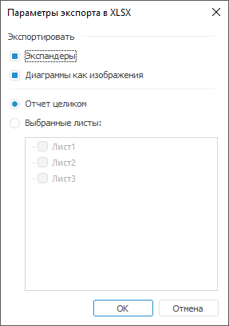

# Экспорт рабочей книги

Экспорт рабочей книги
-

# Экспорт рабочей книги

Для экспорта рабочей книги выберите формат в раскрывающемся меню команды
 «Рабочая книга > 
 Экспорт» [главного меню](../Getting_Started.htm#elements):

	- книга Excel (*.xlsx);

	- книга Excel 97 - 2003 (*.xls);

	- документ PDF (*.pdf);

	- документ в формате RTF (*.rtf);

	- веб-страница (*.html);

	- веб-страница, архив в одном файле (*.mht);

	- изображение (*.emf);

	- изображение (*.png);

Примечание.
 Экспорт в формат *.png доступен только в веб-приложении.

	- презентация PowerPoint (*.pptx).

Рабочая книга будет экспортирована в указанный формат.

Примечание.
 [Сноски](UiDw_Series.htm#footnote) в таблице данных экспортируются
 только в следующие форматы: PDF, EMF, RTF, XLS, XLSX. При экспорте в формат
 RTF нумерация сносок в документе будет упорядочена по листам: от первого
 к последнему. [Спарклайны](Sparklines.htm) экспортируются только
 в следующие форматы: PDF, EMF.

[Экспорт
 в файл формата XLSX или XLS](javascript:TextPopup(this))

	При экспорте в формат XLS или XLSX будет открыт диалог «Параметры
	 экспорта в <формат>»:

	

	Параметры экспорта:

		- Экспандеры. По умолчанию
		 флажок снят. При установленном флажке экспортируются отображаемые
		 экспандеры в текущем виде таблицы рабочей книги. Если экспандеры
		 свёрнуты, то экспортируются все вложенные элементы таблицы и содержащиеся
		 в ней свёрнутые/развёрнутые экспандеры. Экспандеры доступны для
		 работы средствами Microsoft Excel;

	Примечание.
	 Параметр доступен только при экспорте в формат XLSX.

		- Диаграммы как изображения.
		 По умолчанию флажок установлен и диаграммы экспортируются как
		 изображения в формате EMF. С ними можно будет работать как
		 с изображениями средствами Microsoft Excel. Если флажок снят,
		 то диаграммы экспортируются как объекты, работа с которыми осуществляется
		 как с диаграммами средствами Microsoft Excel;

	Примечание.
	 Диаграммы, которые не поддерживают форматы XLS и XLSX, экспортируются
	 в виде изображений. При экспорте [каскадной
	 диаграммы](uidiagrams.chm::/Type_diagrams/WaterFall_chart.htm) в формат XLSX вид диаграммы будет отличаться
	 от исходного из-за несоответствия настроек; при экспорте в формат
	 XLS будет рекомендовано использовать формат XLSX.

		- Отчет целиком. По
		 умолчанию переключатель установлен и экспортируются все листы
		 рабочей книги;

		- Выбранные листы.
		 Для экспорта отдельных листов установите данный переключатель
		 и установите флажки, соответствующие требуемым листам.

	В результирующем файле каждое [представление
	 данных](UiDw_Mode.htm) будет расположено на отдельном листе.

	Особенности экспорта в Excel:

		- в результирующем файле текстура ячеек может не совпадать
		 с текстурой, настроенной в рабочей книге;

		- условное форматирование поддерживается только в Microsoft
		 Excel 2007 и выше. Некоторые обозначения в результирующем
		 файле могут не совпадать с обозначениями в рабочей книге;

		- если в таблице используются ячейки, формат которых настроен
		 с помощью [редактора
		 ячейки](UiNav.chm::/GUI/Format/UiReport_Table_Attribute_Format.htm#cell_editor), то будет экспортировано текущее значение,
		 заданное в ячейке в момент экспорта;

		- если в таблице отображаются экспандеры, то экспорт выполняется
		 с учетом условий:

			- если в шапке или боковике таблицы содержится более одного
			 иерархического измерения, то экспандеры будут экспорироваться
			 только для первого измерения, расположенного в первом столбце
			 или строке таблицы. Если для первого измерения экспандеры
			 [скрыты](UiAnalyticalArea.chm::/TableView/Layout/Layout_Dim.htm#expander),
			 то экспортируются отображаемые экспандеры у следующего измерения;

			- если в шапке или боковике таблицы содержится несколько
			 [объединённых
			 измерений](UiAnalyticalArea.chm::/TableView/Layout/Merging_Dimensions.htm), то экспортируются экспандеры
			 только для первого столбца или строки с учётом объединения.
			 Если первое измерение содержит несколько [уровней](UiNavObj.chm::/reference_book/Master_Table_reference_book/UiMd_reference_book_Master_Table_page4.htm),
			 которые размещены по нескольким столбцам или строкам, то экспортируются
			 экспандеры только нулевого уровня;

		- если в таблице есть [сноски](UiDw_Series.htm#footnote),
		 то:

			- по умолчанию сноски не экспортируются. Номера сносок
			 экспортируются, если с помощью Fore
			 заданы соответствующие настройки. Текст сносок не экспортируется;

			- формат ячеек, содержащих сноски, будет изменен на текстовый.
			 В связи с этим:

				- вид диаграммы может отличаться от вида в исходной
				 рабочей книге;

				- формулы, для которых были заданы сноски, будут отображаться
				 в виде текста;

				- не будут рассчитаны формулы, которые ссылаются на
				 ячейки со сносками.

[Экспорт
 в файл формата PPTX](javascript:TextPopup(this))

	При экспорте рабочей книги, содержащей оформление ячеек, в презентацию
	 PowerPoint будет выгружен только один тип оформления со следующим
	 приоритетом:

		- Изображение.

		- Условное форматирование.

		- Заливка ячейки.

[Экспорт
 в файл формата PNG](javascript:TextPopup(this))

	Экспорт в формат *.png доступен только в веб-приложении. Для этого
	 в файле [PP.xml](Setup.chm::/UiWebSetup/03_setup_web/PP_config_Java.htm)
	 установите значение true для
	 атрибута [ClientExportPng](Setup.chm::/UiWebSetup/03_Setup_Web/PP_config_Java.htm#export)
	 в разделе <export>.

	При экспорте рабочей книги в файл формата *.png в результирующем
	 файле содержимое рабочей книги будет отображаться так же, как в веб-приложении
	 в момент экспорта.

См. также:

[Операции с рабочей книгой и листами](UiDw_Woorkbook.htm)

		Справочная
		 система на версию 10.9
		 от 18/08/2025,
		 © ООО «ФОРСАЙТ»,
