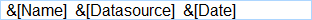
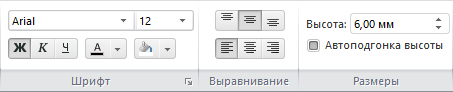
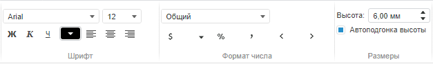

# Настройка заголовка листа

Настройка заголовка листа
-

# Настройка заголовка листа

Для отображения заголовка листа нажмите кнопку  «Заголовок» на вкладке «Главная»
 ленты инструментов. Заголовок будет отображен в верхней части листа.

Для редактирования текста заголовка дважды по нему щелкните. Заголовок
 будет переведен в режим редактирования. Измените текст заголовка и щелкните
 мышью за пределами заголовка.

[Для отображения
 вкладки](javascript:TextPopup(this))

		- Убедитесь, что заголовок листа отображается.

		- Перейдите на вкладку «Заголовок».

## Настройка структуры заголовка

Для настройки структуры заголовка:

	- Переведите заголовок в режим редактирования. Для этого дважды
	 щёлкните в пустое место заголовка. Составляющие
	 части заголовка будут представлены в виде шаблонов:

	- Добавьте текст вручную или с помощью подстановок. Подстановки
	 позволяют быстро вставить в заголовок определенный текст. Для вставки
	 подстановок используйте кнопки в группе «Вставка»
	 на вкладке «Заголовок» ленты
	 инструментов:

Совет.
 Для получения более подробной информации о работе с подстановками см. раздел
 «[Использование подстановок в заголовке](Substitution.htm)».

Для сохранения изменений и выхода из режима редактирования щёлкните вне панели заголовка.

## Настройка оформления заголовка

В настольном приложении для настройки оформления заголовка используйте
 группы команд «Шрифт», «Выравнивание», «Размеры»
 расположенные на вкладке «Заголовок»
 ленты инструментов:

В веб-приложении для настройки оформления заголовка используйте группа
 команд «Шрифт», «Формат
 числа», «Размеры» расположенные
 на вкладке «Заголовок» ленты инструментов:

Доступны следующие настройки:

[Шрифт заголовка](javascript:TextPopup(this))

	Для настройки шрифта используйте элементы, расположенные в группе
	 «Шрифт».

		- Шрифт.
		 Выберите один из шрифтов, установленных в операционной системе;

		- Размер
		 шрифта. Установите требуемый размер шрифта. Размер задаётся
		 в пунктах, и его можно выбрать из раскрывающегося списка или ввести
		 вручную. Диапазон допустимых значений: [1, 72];

		- Начертание
		 шрифта. Нажмите кнопки, задающие начертание шрифта:

			- Ж. Полужирное
			 начертание;

			- К.
			 Курсивное начертание;

			- Ч.
			 Подчеркивание текста.

	При нажатой кнопке будет использоваться
	 соответствующий стиль начертания. Доступно использование нескольких
	 стилей одновременно, например, нажатие кнопок «Ж»
	 и «К»
	 даёт полужирное курсивное начертание;

		- Цвет шрифта. Выберите
		 цвет шрифта в раскрывающейся палитре цветов;

		- Цвет фона. Выберите
		 цвет фона в раскрывающейся палитре цветов. Возможность доступна
		 только в настольном приложении.

	Совет. В настольном
	 приложении для дополнительной настройка шрифта заголовка возможна
	 используйте вкладку «[Шрифт](UiNav.Chm::/GUI/Format/UiReport_Table_Attribute_Type.htm)» в диалоге
	 «Формат». Для отображения
	 диалога нажмите кнопку ,
	 расположенную в правом нижнем углу группы «Шрифт»
	 на вкладке ленты инструментов, или выполните команду «Формат»
	 в контекстном меню заголовка, находящегося в режиме редактирования.

[Выравнивание
 текста заголовка](javascript:TextPopup(this))

	Для настройки выравнивания:

		- в настольном приложении.
		 Используйте кнопки в группе команд «Выравнивание»
		 для настройки горизонтального и вертикального выравнивания текста
		 заголовка;

		- в веб-приложении.
		 Используйте кнопки в группе команд «Шрифт»
		 для настройки горизонтального выравнивания текста заголовка.

[Высота заголовка](javascript:TextPopup(this))

		- Для задания точной высоты заголовка:

			- Снимите флажок «Автоподгонка
			 высоты».

			- Задайте значение высоты в поле «Высота».

		- Для настройки автоматического подбора высоты:

			- Установите флажок «Автоподгонка
			 высоты».

			- Задайте максимальное значение для высоты заголовка в
			 поле «Высота».

[Формат числа](javascript:TextPopup(this))

	Примечание.
	 Возможность доступна только в веб-приложении.

	Для настройки формата числа используйте группу «Формат
	 числа». Настройка формата числа в заголовке аналогична [настройке
	 формата числа](UiDw_Series.htm#configure_format_of_displayed_values) с таблице данных.

См. также:

[Операции с рабочей книгой и листами](UiDw_Woorkbook.htm)

		Справочная
		 система на версию 10.9
		 от 18/08/2025,
		 © ООО «ФОРСАЙТ»,
