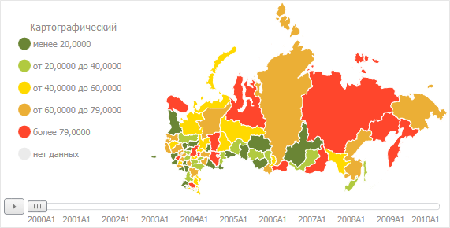

# Настройка карты

Настройка карты
-

# Настройка карты

Карта предназначена для картографического
 представления данных, содержащихся в [таблице](UiDw_Series.htm).

Перед работой с картой убедитесь, что выполняются [требования для работы
 с картой](UiMaps.chm::/Common/Requirements.htm).

Для отображения данных используется карта, [заданная по умолчанию](UiNav.chm::/02_Navigator/Repo_Default.htm)
 в текущем репозитории. Пример карты:

## Основные возможности карты

Карты в составе «Форсайт. Аналитическая платформа»
 имеют широкие функциональные возможности:

	- [детализация/обобщение
	 данных](UiMaps.chm::/Configure/Advanced_Features.htm#drilldown);

	- [выбор данных](Chart_work.htm#select_data), по которым
	 строится карта. Выполняется аналогично выбору данных для построения
	 диаграммы;

	- работа в [3D-режиме](UiMaps.chm::/Configure/MapConfigure.htm#3d);

	- отображение [временной
	 шкалы](UiMaps.chm::/Configure/MapConfigure.htm#timeline_animation) и воспроизведение анимации на карте;

	- подключение [внешних
	 картографических сервисов](UiMaps.chm::/Configure/Advanced_Features.htm#externalservices);

	- гибкая настройка [легенды цвета](UiMaps.chm::/Legend/SetupLegend.htm)
	 и [легенды
	 объема](UiMaps.chm::/Configure/Panel_Height.htm);

	- [заливка
	 территорий](UiMaps.chm::/Configure/MapConfigure.htm#fill)
	 карты по различным метрикам и другие возможности.

Более подробное описание возможностей
 приведено в разделе «[Настройка карты](UiMaps.chm::/Configure/MapConfigure.htm)».

См. также:

[Описание
 интерфейса анализа временных рядов](../Purpose/UiDw_Purpose_Basic_Window.htm)

		Справочная
		 система на версию 10.9
		 от 18/08/2025,
		 © ООО «ФОРСАЙТ»,
