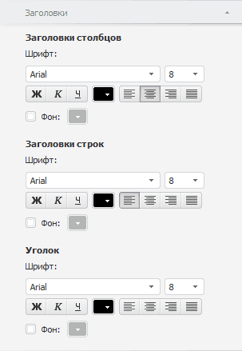

# Настройка оформления шапки таблицы

Настройка оформления шапки таблицы
-

# Настройка оформления шапки таблицы

Для настройки шапки таблицы используйте вкладку «Заголовки»
 на боковой панели. Шапка состоит из заголовков столбцов, строк и уголка
 таблицы.

Примечание.
 Вкладка доступна только в настольном приложении.

[Для отображения
 вкладки](javascript:TextPopup(this))

		- Убедитесь, что боковая панель отображается.

		- Щелкните по таблице данных.

		- Установите переключатель «Формат»
		 на боковой панели.

		- Перейдите на вкладку «Заголовки».

Для всех элементов шапки доступны следующие настройки оформления:

	- Шрифт.
	 Выберите один из шрифтов, установленных в операционной системе;

	- Размер
	 шрифта. Установите требуемый размер шрифта. Размер задаётся
	 в пунктах, и его можно выбрать из раскрывающегося списка или ввести
	 вручную. Диапазон допустимых значений: [1, 72];

	- Начертание
	 текста. Нажмите кнопки, задающие начертание шрифта:

		- Ж. Полужирное начертание;

		- К.
		 Курсивное начертание;

		- Ч.
		 Подчеркивание текста.

При нажатой кнопке будет использоваться соответствующий
 стиль начертания. Доступно использование нескольких стилей одновременно,
 например, нажатие кнопок «Ж» и
 «К» даёт полужирное
 курсивное начертание;

	- Цвет шрифта. Выберите
	 цвет шрифта в раскрывающейся палитре цветов;

	- Выравнивание текста в ячейке.
	 Задайте выравнивание текста относительно ячейки:

	-

		- . По левому краю.
		 Используется по умолчанию;

		- . По центру;

		- . По правому краю;

		- . По ширине;

	- Цвет
	 фона. Если флажок установлен, то доступно изменение цвета фона
	 ячейки в шапке таблицы. Для выбора цвета используйте раскрывающуюся
	 палитру цветов.

См. также:

[Работа с таблицей данных](../UiDw_Series.htm)

		Справочная
		 система на версию 10.9
		 от 18/08/2025,
		 © ООО «ФОРСАЙТ»,
