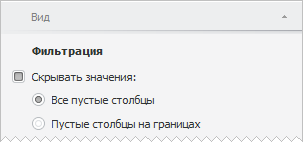

# Фильтрация данных

Фильтрация данных
-

# Фильтрация данных

Для фильтрации данных временных рядов, отображаемых в таблице, используйте
 группу «Фильтрация» на вкладке
 боковой панели «Вид» или кнопку
  «Фильтрация»
 на вкладке «Главная» или «Данные» на ленте инструментов.

[Для отображения
 вкладки «Вид»](javascript:TextPopup(this))

		- Убедитесь, что боковая панель отображается.

		- Установите на боковой панели переключатель «Данные».

		- Перейдите на вкладку «Вид».

Для включения фильтрации:

	- выберите режим фильтрации в раскрывающемся меню кнопки  «Фильтрация»
	 на вкладке «Главная» или «Данные» на ленте инструментов;

	- установите флажок «Скрывать
	 значения» и выберите режим фильтрации на вкладке боковой панели
	 «Вид»:

		- Все
		 пустые столбцы. Скрывает все пустые столбцы в таблице;

		- Пустые
		 столбцы на границах. Скрывает все пустые столбцы в
		 таблице только справа и слева от временного ряда.

Для выключения фильтрации:

	- переведите кнопку  «Фильтрация»
	 на вкладке «Главная» или «Данные» на ленте инструментов в
	 ненажатое состояние или установите переключатель «Нет»
	 в раскрывающемся меню данной кнопки;

	- снимите флажок «Скрывать значения»
	 на вкладке боковой панели «Вид».

См. также:

[Работа с таблицей данных](../UiDw_Series.htm)

		Справочная
		 система на версию 10.9
		 от 18/08/2025,
		 © ООО «ФОРСАЙТ»,
