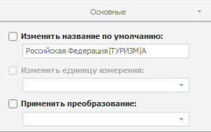

# Настройка базовых параметров временного ряда

Настройка базовых параметров временного ряда
-

# Настройка базовых параметров временного ряда

Для настройки базовых параметров временного ряда, выбранного в таблице
 данных, используйте вкладку «Основные»
 на боковой панели.

[Для отображения
 вкладки](javascript:TextPopup(this))

		- Убедитесь, что отображаются боковая
		 панель и [табличное представление](../UiDw_Mode.htm)
		 данных.

		- Выберите временной ряд в таблице данных.

		- Установите переключатель «Ряд» на
		 боковой панели.

		- Перейдите на вкладку «Основные».

	Совет. Для быстрого
	 отображения вкладки «Основные»
	 на боковой панели выполните команду «Показать
	 параметры» в контекстном меню выбранного ряда.

Задайте на вкладке следующие параметры:

[Изменить название
 по умолчанию](javascript:TextPopup(this))

	Если флажок «Изменить название
	 по умолчанию» установлен, доступно редактирование наименования
	 временного ряда.

[Изменить единицу
 измерения](javascript:TextPopup(this))

	Если флажок «Изменить единицу измерения»
	 установлен, то доступна смена [единиц измерения](uinavobj.chm::/Units/Units_dbts.htm)
	 для значений наблюдений временного ряда. Выберите требуемую единицу
	 измерения в раскрывающемся списке.

	Если флажок снять, то текущая единица измерения будет сброшена.

[Применить преобразование](javascript:TextPopup(this))

	Если флажок «Применить преобразование»
	 установлен, то доступно [преобразование
	 значений ряда](../UiDw_Series_Inversion.htm). Выберите требуемое преобразование из раскрывающегося
	 списка.

	Если флажок снят, то для ряда отображаются исходные данные.

См. также:

[Работа
 с временными рядами](../../Object_Index/UiDw_Factor_New.htm)

		Справочная
		 система на версию 10.9
		 от 18/08/2025,
		 © ООО «ФОРСАЙТ»,
