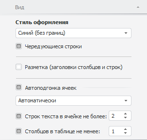

# Настройка общих параметров оформления таблицы

Настройка общих параметров оформления таблицы
-

# Настройка общих параметров оформления таблицы

Для настройки общих параметров оформления таблицы используйте вкладку
 «Вид» на боковой панели.

[Для отображения
 вкладки](javascript:TextPopup(this))

		- Убедитесь, что боковая панель отображается.

		- Щелкните по таблице данных.

		- Установите переключатель «Формат»
		 на боковой панели.

		- Перейдите на вкладку «Вид».

Параметры оформления:

	- Стиль оформления. Выберите
	 цветовую схему, применяемую для оформления данных в таблице;

	-

		- Чередующиеся строки.
		 Если флажок установлен, то для выбранной цветовой схемы применяется
		 чередование цвета строк.

Совет.
 Выбрать цветовую схему можно также в группе «Стиль
 и оформление» на вкладке «Таблица»
 на ленте инструментов.

	- Разметка (заголовки строк и
	 столбцов). Если флажок установлен, то в таблице данных отображается
	 разметка. Для включения/выключения разметки используйте кнопку  «Разметка»
	 на вкладке «Таблица»
	 на ленте инструментов.

[Пример
 включенной/выключенной разметки](javascript:TextPopup(this))

	В таблице слева разметка отображается,
	 в таблице справа - нет:

	

	- Автоподгонка ячеек.
	 Установите флажок для применения автоматического подбора размера ячеек,
	 чтобы их содержимое отображалось наилучшим образом. Доступны следующие
	 режимы автоподгонки:

	-

		- Только по высоте.
		 Высота строки таблицы подбирается таким образом, чтобы полностью
		 отображался самый высокий текст в строке;

		- Только по ширине.
		 Ширина столбца таблицы подбирается таким образом, чтобы полностью
		 отображался самый широкий текст в столбце;

		- Сначала по ширине, затем
		 по высоте. Сначала выполняется автоподбор ширины столбцов,
		 затем высоты строк;

		- Сначала по высоте, затем
		 по ширине. Сначала выполняется автоподбор высоты строк,
		 затем ширины столбцов;

		- Автоматически. Данный
		 режим установлен по умолчанию. Автоподгонка выполняется автоматически
		 согласно установленным параметрам:

			- Строк текста в ячейке
			 не более. Если флажок установлен, то высота строки
			 подбирается таким образом, чтобы для отображения самого высокого
			 текста в строке таблицы требовалось не более N
			 строк в ячейке. Значение N
			 указывается в соответствующем редакторе чисел. Если подобрать
			 необходимую ширину столбца невозможно, то текст обрезается
			 после указанного количества строк.

			Если флажок снят, то отсутствует ограничение на количество
			 строк текста в ячейке.

			По умолчанию флажок установлен, максимальное количество строк
			 - 2;

			- Столбцов в таблице
			 не менее. Если флажок установлен, то ширина столбцов
			 подбирается таким образом, чтобы в таблице отображалось минимум
			 N столбцов с данными.
			 Значение N указывается
			 в соответствующем редакторе чисел.

			Если флажок снят, то отсутствует ограничение на видимое количество
			 столбцов.

			По умолчанию флажок установлен, количество столбцов - 1;

		- Упрощенная. Одновременная
		 автоподгонка ширины, высоты и видимых данных.

См. также:

[Работа
 с таблицей данных](../UiDw_Series.htm)

		Справочная
		 система на версию 10.9
		 от 18/08/2025,
		 © ООО «ФОРСАЙТ»,
