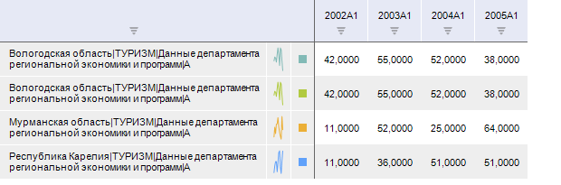

# Отображение спарклайнов

Отображение спарклайнов
-

# Отображение спарклайнов

Спарклайны - небольшие диаграммы,
 которые помещаются внутри отдельных ячеек.

Спарклайны применяются:

	- для более наглядного представления больших наборов данных;

	- для отображения тенденции в рядах данных.

Спарклайны могут отображаться только для строк таблицы:

## Отображение/скрытие спарклайнов

Для отображения/скрытия спарклайнов нажмите кнопку 
 «Линии», расположенную в группе
 «Спарклайны» на вкладке «Таблица» ленты инструментов.

См. также:

[Работа с таблицей данных](UiDw_Series.htm)

		Справочная
		 система на версию 10.9
		 от 18/08/2025,
		 © ООО «ФОРСАЙТ»,
