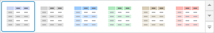
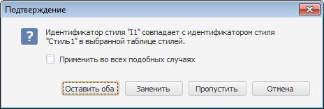

# Настройка стиля таблицы

Настройка стиля таблицы
-

# Настройка стиля таблицы

Для оформления таблиц в рабочей книге можно использовать:

	- [стили таблицы](#standard_style);

	- [стили ячеек таблицы](#cells_style);

	- [подключенные таблицы стилей](#styles_table).

## Оформление таблиц

Для работы со стилями оформления таблицы используйте стандартные цветовые
 схемы, расположенные на вкладке «Таблица»
 ленты инструментов:

Для применения стиля таблицы:

	- В группе «Стиль таблицы»
	 выберите одну из представленных цветовых схем.

	- Щелкните левой кнопкой мыши по выбранной цветовой схеме.

Выбранный стиль будет применён ко всей таблице рабочей книги.

Для настройки пользовательского стиля таблицы:

	- Нажмите кнопку , расположенную в группе
	 «Стиль таблицы».

	- Выберите пункт «Настроить стиль».

Будет открыт диалог «[Свойства чередующегося стиля таблицы](UiAnalyticalArea.chm::/TableView/Formatting/Custom_styles.htm)»,
 в котором задайте пользовательские настройки стиля.

Примечание.
 Настройка пользовательского стиля таблицы доступна только в настольном
 приложении.

## Настройка стиля ячеек

Для единого оформления таблиц, применяемого в пределах одной рабочей
 книги, используйте стиль ячеек таблицы:

[Создание
 стиля](javascript:TextPopup(this))

	Для создания стиля оформления таблицы:

		- Перейдите на вкладку «Таблица»
		 ленты инструментов.

		- Нажмите кнопку , расположенную в группе
		 «Стиль ячейки».

		- Выберите пункт «Создать
		 новый стиль».

		- В открывшемся окне введите наименование стиля.

	В группу «Стиль ячейки» будет
	 добавлен шаблон стиля. Например:

	

	Совет. Для использования
	 единого оформления таблиц в нескольких рабочих книгах [экспортируйте](#export_style)
	 созданный стиль во внешние стили.

[Применение
 стиля](javascript:TextPopup(this))

	Для применения к таблице стиля, выбранного на вкладке «Таблица»:

		- щёлкните по стилю в группе «Стиль ячейки»;

		- выполните команду «Применить»
		 в контекстном меню стиля.

	Примечание.
	 В веб-приложении для применения стиля к оформлению таблицы щёлкните
	 по шаблону стиля.

	Выбранный стиль будет применён к оформлению таблицы.

[Редактирование
 стиля](javascript:TextPopup(this))

	Для редактирования стиля ячеек:

		- Выберите стиль ячеек в группе «Стиль
		 ячейки» на вкладке «Таблица»
		 ленты инструментов.

		- Выполните команду «Редактировать»
		 в контекстном меню стиля.

	Будет открыт [диалог
	 форматирования](UiNav.Chm::/GUI/Format.htm)
	 для ячейки.

[Переименование
 стиля](javascript:TextPopup(this))

	Примечание.
	 Операция доступна только в настольном приложении.

	Для переименования стиля таблицы:

		- Перейдите на вкладку «Таблица»
		 ленты инструментов.

		- Выберите необходимый стиль в группе «Стиль
		 ячейки».

		- Выполните команду «Переименовать»
		 в контекстном меню стиля.

	В открывшемся окне введите новое наименование стиля.

[Экспорт
 во внешние стили](javascript:TextPopup(this))

	Для экспорта созданного стиля таблицы во внешние стили:

		- Перейдите на вкладку «Таблица»
		 ленты инструментов.

		- Выберите стиль в группе «Стиль
		 ячейки», затем:

			- нажмите кнопку  и выберите пункт
			 «Экспорт во внешние стили»;

			- выполните команду «Экспорт
			 во внешние стили» в контекстном меню стиля.

		- В открывшемся окне выберите [таблицу
		 стилей](UiNav.chm::/StylesTable/StylesTablePurpose.htm).

	Выбранный стиль будет экспортирован в заданную [таблицу
	 стилей](UiNav.chm::/StylesTable/StylesTablePurpose.htm).

	Если идентификатор экспортируемого стиля совпадает с идентификатором
	 стиля из [таблицы
	 стилей](UiNav.chm::/StylesTable/StylesTablePurpose.htm), будет выдано сообщение для выбора действия:

	

	Установите флажок «Применить во
	 всех подобных случаях», чтобы выбранное действие применялось
	 во всех подобных ситуациях.

	Нажмите одну из кнопок:

		- Оставить оба. Экспортируемый
		 стиль будет добавлен в таблицу стилей с новым уникальным идентификатором;

		- Заменить. Стиль
		 в текущей таблице стилей будет заменён на экспортируемый;

		- Пропустить. Стиль
		 не будет экспортирован в таблицу стилей;

		- Отмена. Операция
		 экспорта стиля будет отменена.

[Удаление
 стиля](javascript:TextPopup(this))

	Примечание.
	 Операция доступна только в настольном приложении.

	Для удаления стиля таблицы:

		- Перейдите на вкладку «Таблица»
		 ленты инструментов.

		- Выберите необходимый стиль в группе «Стиль
		 ячейки».

		- Выполните команду «Удалить»
		 в контекстном меню стиля.

	Будет запрошено подтверждение об удалении выбранного стиля.

## Использование таблицы стилей

Для единого оформления таблиц в нескольких рабочих книгах используйте
 подключенную [таблицу
 стилей](UiNav.chm::/StylesTable/StylesTablePurpose.htm):

[Подключение
 таблицы стилей](javascript:TextPopup(this))

	Примечание.
	 Подключение [таблицы
	 стилей](UiNav.chm::/StylesTable/StylesTablePurpose.htm) доступно только в настольном приложении.
	 Стили из подключенной таблицы стилей доступны из веб-приложения и
	 настольного приложения.

	Для оформления таблицы можно использовать внешние стили, сохранённые
	 в [таблице
	 стилей](UiNav.chm::/StylesTable/StylesTablePurpose.htm):

		- Перейдите на вкладку «Таблица»
		 ленты инструментов.

		- Нажмите кнопку , расположенную в группе
		 «Стиль ячейки».

		- Выполните команду «Настроить
		 внешние стили».

		- Будет открыт диалог «[Параметры](../Purpose/TimeSeries_Setup.htm)».
		 На вкладке «Общее» в раскрывающемся
		 списке «Набор стилей оформления»
		 выберите необходимую [таблицу
		 стилей](UiNav.chm::/StylesTable/StylesTablePurpose.htm).

	Таблица стилей будет подключена. Стили из таблицы стилей, которые
	 можно применить для оформления таблицы, будут добавлены в отдельную
	 категорию.

	Примечание.
	 К одной рабочей книге можно подключить только одну таблицу стилей.

[Отключение
 таблицы стилей](javascript:TextPopup(this))

	Примечание.
	 Отключение [таблицы
	 стилей](UiNav.chm::/StylesTable/StylesTablePurpose.htm) доступно только в настольном приложении.

	Для отключения внешней таблицы стилей:

		- Перейдите на вкладку «Таблица»
		 ленты инструментов.

		- Нажмите кнопку , расположенную в группе
		 «Стиль ячейки».

		- Выберите пункт «Отключить
		 внешние стили».

	Внешняя таблица стилей будет отключена. Перед отключением будет
	 предложено скопировать стили из неё в текущую рабочую книгу. Если
	 в рабочей книге есть одноимённые стили, они будут замещены.

См. также:

[Работа с таблицей данных](UiDw_Series.htm)

		Справочная
		 система на версию 10.9
		 от 18/08/2025,
		 © ООО «ФОРСАЙТ»,
