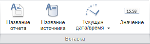

# Использование подстановок в заголовке: анализ временны рядов

Использование подстановок в заголовке: анализ временны рядов
-

# Использование подстановок в заголовке

Подстановки в заголовок могут быть вставлены с помощью кнопок на ленте
 инструментов или введены вручную с помощью шаблонов.

## Вставка подстановок с помощью ленты инструментов

Подстановки находятся на вкладке «Заголовок»
 ленты инструментов в группе «Вставка».

[Для отображения
 вкладки](javascript:TextPopup(this))

		- Убедитесь, что заголовок листа отображается.

		- Перейдите на вкладку «Заголовок».

Доступные подстановки:

	- название отчета;

	- название источника;

	- текущая дата/время.
	 Для вставки текущей даты нажмите кнопку  «Текущая дата/время». Для вставки
	 текущего времени нажмите нижнюю часть кнопки  «Текущая дата/время» и выполните
	 команду «Текущее время»;

	- значение. Значение,
	 полученное при фиксации всех измерений в источнике данных рабочей
	 книги. Подстановка доступна только в веб-приложении.

## Вставка подстановок с помощью шаблонов

Шаблоны вводятся с помощью клавиатуры.

Доступные шаблоны:

	- &[Name]. Наименование
	 рабочей книги;

	- &[Datasource]. Наименование
	 источника данных;

	- &[Date]. Текущая
	 дата;

	- &[Time]. Текущее
	 время;

	- &[Value]. Значение,
	 полученное при фиксации всех измерений в источнике данных рабочей
	 книги;

	- &[EXPRESSION:<e>].
	 Значение, вычисленное по заданному выражению, где e
	 - это выражение. В качестве выражения могут выступать:

		- формула. Допускается
		 использование арифметических и логических функций, аналогичных
		 используемым в [редакторе
		 выражения](UiNav.chm::/GUI/Expression_editor_func.htm).
		 Например: &[EXPRESSION:Average(1,2,3)];

		- функция, рассчитываемая
		 модулем Fore. Функция указывается в следующем формате:
		 <Идентификатор модуля>.<Идентификатор
		 функции>. Например, функция «Func»,
		 содержащаяся в модуле «TESTEXPR»:
		 &[EXPRESSION:TESTEXPR.Func];

См. также:

[Настройка
 заголовка листа](List_caption.htm)

		Справочная
		 система на версию 10.9
		 от 18/08/2025,
		 © ООО «ФОРСАЙТ»,
