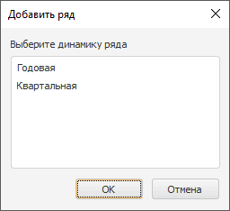
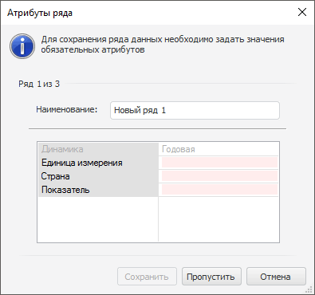

# Создание временного ряда

Создание временного ряда
-

# Создание временного ряда

Для создания временного ряда:

	- Нажмите кнопку  «Добавить
	 ряд», расположенную в группе «Ряды
	 данных» на вкладке «Главная»
	 ленты инструментов.

	Если источник данных листа содержит несколько уровней календаря, то
	 будет открыт диалог «Добавить ряд».
	 Укажите в нём уровень календарной динамики создаваемого временного
	 ряда. Например:

Пустой временной ряд будет добавлен на текущий
 лист рабочей книги.

	- Задайте значения обязательных атрибутов ряда, используя:

		- вкладку «[Атрибуты
		 ряда](TimeSeries_Attr_Edit.htm)» на боковой панели;

		- окно «[Атрибуты
		 ряда](TimeSeries_Attr_Edit.htm)». Доступно только в настольном приложении.

Примечание.
 Если в источнике данных уже содержится временной ряд с указанными значениями
 атрибутов, то значения наблюдений ряда будут отображены в таблице данных.

	- Задайте наименование ряда. Для этого:

		- дважды щелкните по текущему наименованию ряда в области
		 представления данных. Наименование будет переведено в режим редактирования.
		 Внесите требуемые изменения и нажмите клавишу ENTER;

		- введите наименование ряда в поле «Наименование»
		 на вкладке «[Основные](SidePanel/UiDw_sp_Primary.htm)»
		 боковой панели;

		- введите наименование ряда в поле «Наименование»
		 в диалоге «[Атрибуты
		 ряда](TimeSeries_Attr_Edit.htm)». Доступно только в настольном приложении.

	- [Введите
	 значения](../Object_Index/UiDw_Factor_New.htm#edit_data) наблюдений ряда.

	- [Сохраните
	 временной ряд](../Object_Index/UiDw_Factor_New.htm#save_data).

## Особенности сохранения ряда в настольном приложении

Пользовательские временные ряды сохраняются в рабочую книгу без привязки
 к измерениям базы данных временных рядов.

Если при сохранении нового временного ряда не заданы значения всех обязательных
 атрибутов, то будет отображен диалог «Атрибуты
 ряда»:

Задайте наименование ряда, значения всех обязательных атрибутов и нажмите
 кнопку «Сохранить».

Если сохраняется один временной ряд, то диалог будет закрыт. Если сохраняются
 несколько временных рядов, то диалог будет обновлен для ввода значений
 атрибутов следующего ряда. Для перехода к сохранению следующего ряда без
 сохранения текущего нажмите кнопку «Пропустить».

См. также:

[Работа с временными рядами](../Object_Index/UiDw_Factor_New.htm)

		Справочная
		 система на версию 10.9
		 от 18/08/2025,
		 © ООО «ФОРСАЙТ»,
