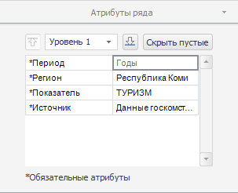
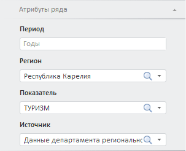
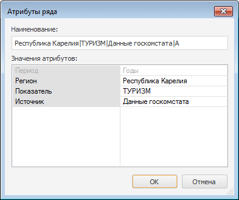
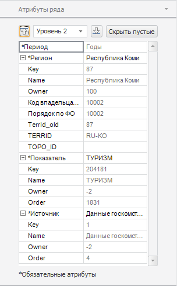

# Редактирование значений атрибутов ряда

Редактирование значений атрибутов ряда
-

# Редактирование значений атрибутов ряда

Атрибуты ряда - это набор характеристик, совокупность значений которых
 однозначно идентифицирует временной ряд в базе данных. Набор атрибутов
 ряда задаётся при [создании
 БД временных рядов](UiNavObj.chm::/TimeSeriesDatabase/TS_Attributes.htm).

Примечание.
 Все системные атрибуты ряда, создаваемые по умолчанию, недоступны для
 редактирования.

Для редактирования и просмотра значений атрибутов ряда используйте:

	- вкладку «Атрибуты ряда»
	 на боковой панели.

[Для
 отображения вкладки](javascript:TextPopup(this))

		-

			- Убедитесь, что отображаются боковая панель и [табличное
			 представление](UiDw_Mode.htm) данных;

			- Выберите временной ряд в таблице данных;

			- Установите переключатель «Ряд» на
			 боковой панели;

			- Перейдите на вкладку «Атрибуты
			 ряда».

Пример вкладки в настольном приложении (слева)
 и в веб-приложении (справа):

	- диалог «Атрибуты ряда»,
	 доступный только в настольном приложении.

[Для
 отображения диалога](javascript:TextPopup(this))

		-

			- Убедитесь, что [табличное представление](UiDw_Mode.htm)
			 данных отображается;

			- Выберите временной ряд в таблице данных;

			- Выполните команду «Атрибуты
			 ряда» в контекстном меню ряда.

Пример диалога:

Отредактируйте значения атрибутов ряда.

Примечание.
 Если в источнике данных уже содержится временной ряд с указанными значениями
 атрибутов, то значения наблюдений ряда будут отображены в таблице данных.

Для сохранения изменений нажмите кнопку «Сохранить
 изменения»  на вкладке
 ленты «Данные».

## Возможности, доступные только в настольном приложении

[Скрытие атрибутов,
 имеющих пустые значения](javascript:TextPopup(this))

	Используйте вкладку «Атрибуты ряда»
	 на боковой панели. Нажмите кнопку «Скрыть
	 пустые». Атрибуты, значения которых не заданы, будут скрыты.

	Для отображения всех атрибутов временного ряда переведите кнопку
	 «Скрыть пустые» в ненажатое
	 состояние.

[Просмотр значений
 атрибутов в расширенном виде](javascript:TextPopup(this))

	Если значение атрибута ряда является [ссылкой
	 на элемент](UiNavObj.chm::/TimeSeriesDatabase/TS_Attributes.htm) справочника, то доступен просмотр значений
	 всех атрибутов элемента.

	Для изменения глубины просмотра значений, элементы используйте вкладки
	 «Атрибуты ряда» на боковой
	 панели:

		- раскрывающийся список, расположенный в верхней части вкладки;

		- кнопки:

		-

			- . Увеличивает
			 глубину просмотра;

			- . Уменьшает
			 глубину просмотра.

	Чем больше значение уровня, тем больше глубина просмотра.

	Пример глубины просмотра второго уровня:

	

См. также:

[Работа с временными рядами](../Object_Index/UiDw_Factor_New.htm)

		Справочная
		 система на версию 10.9
		 от 18/08/2025,
		 © ООО «ФОРСАЙТ»,
