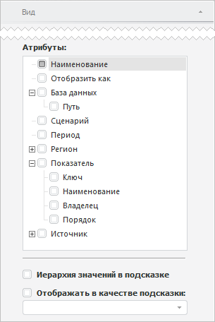
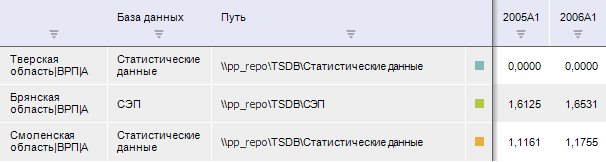
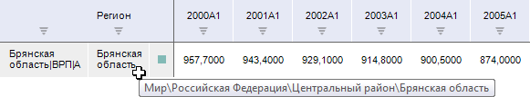

# Выбор отображаемых атрибутов

Выбор отображаемых атрибутов
-

# Выбор отображаемых атрибутов

Для выбора атрибутов, значения которых будут отображаться на листе рабочей
 книги наряду с данными, используйте группу «Атрибуты»
 на вкладке боковой панели «Вид».

[Для отображения
 вкладки](javascript:TextPopup(this))

		- Убедитесь, что боковая панель отображается.

		- Установите переключатель «Данные» на
		 боковой панели.

		- Перейдите на вкладку «Вид».

На вкладке содержится список всех атрибутов временных рядов, значения
 которых можно отобразить. Если атрибут является ссылкой на справочник,
 то в качестве дочерних элементов перечислены атрибуты этого справочника.
 Элементы «Отобразить как» и «База данных» не являются атрибутами
 и предназначены для управления отображением дополнительной информации
 и о временных рядах.

Пример вкладки:

Для настройки дополнительных данных, отображаемых в таблице, используйте
 список «Атрибуты». Доступно отображение:

	- значения атрибута. Установите
	 флажок, соответствующий атрибуту. В таблицу данных будет добавлен
	 столбец для отображения значений выбранного атрибута.

	По умолчанию отображается только атрибут «Наименование».
	 Если дополнительные атрибуты не отображаются, то флажок атрибута
	 «Наименование» недоступен
	 для снятия;

	- наименования преобразования
	 ряда. Установите флажок «Отобразить
	 как». В таблицу данных будет добавлен столбец «Формат
	 отображения» для отображения наименования [преобразования](UiDw_Series_Inversion.htm),
	 применяемого к ряду данных;

	- источника данных ряда.
	 Установите флажок:

	-

		- База данных. В таблицу
		 данных будет добавлен столбце «База
		 данных» для отображения наименования источника данных временного
		 ряда;

		- База данных > Путь.
		 В таблицу данных будет добавлен столбец «Путь»,
		 содержащий путь до источника данных временного ряда.

Например, таблица данных со столбцами для
 отображения информации об источнике данных временных рядов:

Для настройки всплывающей подсказки временных рядов используйте флажки:

	- Иерархия значений в подсказке.
	 По умолчанию флажок снят. Если флажок установлен, то для отображаемых
	 атрибутов ряда во всплывающей подсказке отображается полная иерархия
	 значений. Например:

	- Отображать в качестве подсказки.
	 По умолчанию флажок снят. Если флажок установлен, то для наблюдений
	 временных рядов во всплывающей подсказке отображается значение указанного
	 атрибута наблюдения. Для выбора атрибута используйте раскрывающийся
	 список, расположенный ниже. Если значение указанного атрибута задано,
	 то для наблюдения ряда в углу ячейки отображается красный уголок и
	 доступна всплывающая подсказка.

См. также:

[Работа
 с временными рядами](../Object_Index/UiDw_Factor_New.htm)

		Справочная
		 система на версию 10.9
		 от 18/08/2025,
		 © ООО «ФОРСАЙТ»,
