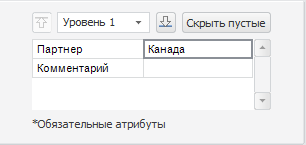
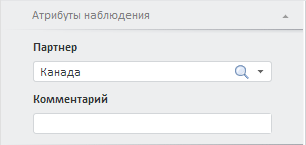
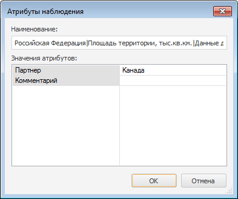

# Редактирование атрибутов наблюдений

Редактирование атрибутов наблюдений
-

# Редактирование значений атрибутов наблюдения

Атрибуты наблюдения - это набор характеристик, которые есть у каждого
 наблюдения (точки) временного ряда. Набор атрибутов ряда задаётся при
 [создании
 БД временных рядов](UiNavObj.chm::/TimeSeriesDatabase/TS_Attributes.htm).

Примечание.
 Все системные атрибуты наблюдения, создаваемые по умолчанию, недоступны
 для редактирования.

Для редактирования и просмотра значений атрибутов наблюдения используйте:

	- вкладку «Атрибуты наблюдения»
	 на боковой панели.

[Для
 отображения вкладки](javascript:TextPopup(this))

		-

			- Убедитесь, что отображаются боковая панель и [табличное
			 представление](UiDw_Mode.htm) данных;

			- Выделите наблюдение временного ряда в таблице данных;

			- Установите переключатель «Наблюдение» на
			 боковой панели;

			- Перейдите на вкладку «Атрибуты
			 наблюдения».

Пример вкладки в настольном приложении (слева)
 и в веб-приложении (справа):

	- диалог «Атрибуты наблюдения»,
	 доступный только в настольном приложении.

[Для
 отображения диалога](javascript:TextPopup(this))

		-

			- Убедитесь, что [табличное представление](UiDw_Mode.htm)
			 данных отображается;

			- Выделите наблюдение временного ряда в таблице данных;

			- Выполните команду «Атрибуты
			 наблюдения» в контекстном меню.

Пример диалога:

Отредактируйте значения атрибутов наблюдения.

Для сохранения изменений нажмите кнопку «Сохранить
 изменения»  на вкладке
 ленты «Данные».

## Возможности, доступные только в настольном приложении

[Скрытие атрибутов,
 имеющих пустые значения](javascript:TextPopup(this))

	Используйте вкладку «Атрибуты наблюдения»
	 на боковой панели. Нажмите кнопку «Скрыть
	 пустые». Атрибуты, значения которых не заданы, будут скрыты.

	Для отображения всех атрибутов наблюдения переведите кнопку «Скрыть пустые» в ненажатое состояние.

[Просмотр значений
 атрибутов в расширенном виде](javascript:TextPopup(this))

	Если значение атрибута ряда является [ссылкой
	 на элемент](UiNavObj.chm::/TimeSeriesDatabase/TS_Attributes.htm) справочника, то доступен просмотр значений
	 всех атрибутов элемента.

	Для изменения глубины просмотра значений, элементы используйте вкладки
	 «Атрибуты наблюдения» на боковой
	 панели:

		- раскрывающийся список, расположенный в верхней части вкладки;

		- кнопки:

		-

			- . Увеличивает
			 глубину просмотра;

			- . Уменьшает
			 глубину просмотра.

	Чем больше значение уровня, тем больше глубина просмотра.

См. также:

[Рабочая книга](UiDw_Workbook.htm)

		Справочная
		 система на версию 10.9
		 от 18/08/2025,
		 © ООО «ФОРСАЙТ»,
