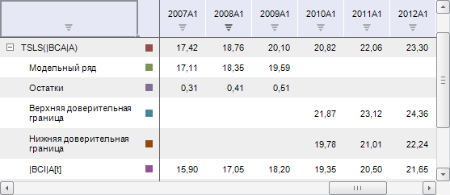
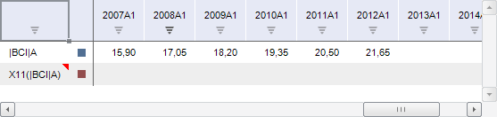

# Работа с вычисляемыми рядами

Работа с вычисляемыми рядами
-

# Создание и настройка вычисляемых
 рядов

Вычисляемый ряд - это ряд, рассчитанный с помощью какого-либо метода
 на основе данных временных рядов.

Порядок создания вычисляемого ряда:

	- Выделите временной ряд в таблице данных.

	- Выберите метод расчёта. Используйте команды на вкладке ленты
	 инструментов «Вычисления».

	- Задайте [параметры
	 метода расчёта](CalculatedSeries/UiDw_cs_common.htm) вычисляемого ряда.

[Особенности
 создания вычисляемых рядов с учётом календарной динамики](javascript:TextPopup(this))

	Если выбранный метод расчёта требует одинаковых динамик рядов, то
	 проверяется соответствие:

		- динамик рядов;

		- начальных дат рядов;

		- длин рядов;

		- дней начала недели (для недельной и дневной динамик);

		- выходных дней (для дневной динамики).

	Расчёт производится, если динамики рядов совпадают, иначе отображается
	 сообщение об ошибке.

На лист рабочей книги будет добавлен вычисляемый ряд с результатами
 расчёта. Вычисления будут выполнены на [масштабированных
 значениях](../FAQ/UnitsScale.htm), то есть на значениях, приведённых к одному масштабу единиц
 измерения.

В зависимости от метода преобразования, вычисляемый ряд может содержать
 различный набор дочерних рядов: факторы, модельный ряд с прогнозными значениями,
 остатки, доверительные границы и т.д. Например:

## Операции с вычисляемыми рядами

[Просмотр сообщений
 об ошибках](javascript:TextPopup(this))

	Если при вычислении ряда возникли ошибки, то расчет прерывается.
	 Вычисляемый ряд будет заполнен пустыми значениями, в ячейке с заголовком
	 будет отображен красный уголок:

	

	Для прочтения сообщения об ошибке наведите мышь на заголовок ряда.
	 Сообщение отображается в виде всплывающей подсказки.

[Просмотр статистических
 характеристик](javascript:TextPopup(this))

	Для просмотра статистических характеристик:

		- Выделите вычисляемый ряд в таблице данных.

		- Перейдите на [панель статистик](UiDw_Description.htm).

[Блокировка
 вычисляемого ряда](javascript:TextPopup(this))

	Блокировка позволяет «зафиксировать» выделение на вычисляемом ряде.
	 В результате независимо от текущего выделения в таблице на боковой
	 панели всегда отображаются вкладки, предназначенные для работы с заблокированным
	 рядом, а на ленте инструментов блокируются кнопки в группе «Ряды данных» на вкладке «Данные».

	Для блокировки:

		- Выделите вычисляемый ряд в таблице данных.

		- Нажмите кнопку  «Блокировать» на ленте инструментов
		 «Данные».

	Выделенный ряд будет заблокирован.

	Для снятия блокировки переведите кнопку  «Блокировать» в ненажатое состояние.

Операции, доступные только в настольном приложении:

[Преобразование
 временного ряда в вычисляемый](javascript:TextPopup(this))

	Возможность доступна только для методов преобразования, в которых
	 входной и моделируемый ряды совпадают.

	Для выполнения преобразования:

		- Выделите временной ряд в таблице данных.

		- Зажмите клавишу CTRL.

		- Выполните команду, соответствующую требуемому методу расчёта,
		 на вкладке ленты инструментов «Вычисления».

	Временной ряд будет преобразован в вычисляемый.

	Для отмены преобразования выполните команду «Отменить
	 преобразования» в контекстном меню ряда в таблице данных.

	Примечание.
	 Преобразование и отмена преобразования доступны для рядов, преобразованных
	 всеми методами, кроме метода «[Калькулятор](CalculatedSeries/UiDw_cs_Calculator.htm)».

[Сохранение вычисляемого
 ряда в БД временных рядов](javascript:TextPopup(this))

		- Выделите вычисляемый ряд в таблице данных.

		- Задайте [значения атрибутов
		 ряда](TimeSeries_Attr_Edit.htm).

		- Выполните команду «Сохранить
		 выбранные ряды» в контекстном меню вычисляемого ряда.

	При сохранении в БД временных рядов вычисляемый ряд преобразуется
	 во временной ряд.

[Сохранение вычисляемого
 ряда в виде модели](javascript:TextPopup(this))

	Вычисляемый ряд можно сохранить в виде модели во внутренний контейнер
	 моделирования БД временных рядов. Порядок сохранения:

		- Выделите вычисляемый ряд в таблице данных.

		- Задайте [значения атрибутов
		 ряда](TimeSeries_Attr_Edit.htm).

		- Выполните команду «Сохранить
		 как модель» в контекстном меню вычисляемого ряда.

	Дальнейшая работа с полученной моделью выполняется в рамках [контейнера моделирования](UiModelling.chm::/UiModelling_TitlePage.htm).

	Совет. Для открытия
	 внутреннего контейнера моделирования выполните команду «Открыть
	 "Контейнер моделирования"» в контекстном меню
	 БД временных рядов в навигаторе объектов.

[Настройка параметров
 нескольких вычисляемых рядов](javascript:TextPopup(this))

	При работе в настольном приложении доступна настройка параметров
	 нескольких вычисляемых рядов. Для этого:

		- Выделите в рабочей книге вычисляемые ряды, для которых требуется
		 задать настройки параметров.

		- Перейдите в группу вкладок «Ряд»
		 на боковой панели.

	В данной группе вкладок будут отображаться вкладка «[Основные](SidePanel/UiDw_sp_Primary.htm)» боковой
	 панели и вкладки, содержащие общие настройки рядов.

	Значения параметров на вкладках будут устанавливаться следующим
	 образом:

		- в поле «Наименование»
		 будет отображаться значение «Несколько
		 рядов»;

		- если для выделенных вычисляемых рядов были заданы разные
		 настройки, для которых предполагается установка флажка, например,
		 «Изменить единицу измерения»
		 и «Применить преобразование»,
		 флажок сменит вид на , в полях будут отображаться
		 значения «Разные единицы»
		 и «Разные преобразования»
		 соответственно.

		При нажатии на флажок значение параметра сбрасывается.

		Для задания одинаковых параметров установите флажок и определите
		 необходимое значение параметра.

		Если для выделенных рядов не были заданы параметры, флажки напротив
		 наименований параметров будут сняты;

		- если для задания параметров не требуется устанавливать флажки,
		 то при несовпадении значений будет отображаться «Несколько
		 значений».

		Подобные значения могу отображаться на вкладке «[Атрибуты ряда](TimeSeries_Attr_Edit.htm)» боковой
		 панели напротив атрибутов рядов;

		- если наличие параметров для различных вычисляемых рядов
		 отличается, то при выделении данных рядов вкладки с настройками
		 таких параметров не отображаются.

		Например, для рядов, вычисленных различными [методами](CalculatedSeries/UiDw_cs_common.htm),
		 не будет отображаться вкладка «Параметры»;

		- если для вычисляемых рядов разных типов не настроен период
		 прогнозирования или настроен одинаковый период прогнозирования,
		 то будет отображаться вкладка «[Периоды
		 расчета](CalculatedSeries/Forecast/UiDw_cs_calc_param.htm)».

См. также:

[Настройка
 параметров метода расчёта](CalculatedSeries/UiDw_cs_common.htm) | [Работа
 с временными рядами](../Object_Index/UiDw_Factor_New.htm)

		Справочная
		 система на версию 10.9
		 от 18/08/2025,
		 © ООО «ФОРСАЙТ»,
