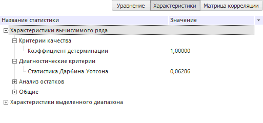
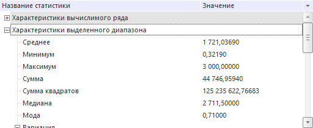
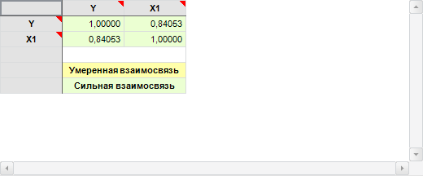
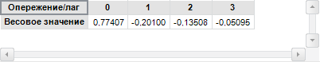

# Панель статистик

Панель статистик
-

# Панель статистик

Панель предназначена для просмотра характеристик объекта, выделенного
 в [области представления данных](UiDw_Mode.htm).

[Для скрытия/отображения
 панели](javascript:TextPopup(this))

	Для отображения панели статистик:

		- нажмите кнопку  «Статистика», расположенную в
		 группе «Рабочая область»
		 на вкладке «Вид» ленты
		 инструментов;

		- установите флажок «Статистика»
		 в контекстном меню [области представления
		 данных](UiDw_Mode.htm).

	Отобразится панель, содержащая характеристики объекта, выделенного
	 в области представления данных.

	Для скрытия панели статистик:

		- переведите кнопку  «Статистика» в ненажатое состояние;

		- снимите флажок «Статистика»
		 в контекстном меню [области представления
		 данных](UiDw_Mode.htm).

	Панель статистик будет скрыта.

В зависимости от диапазона выделенных данных панель может содержать
 различный набор вкладок. Переключение между вкладками выполняется с помощью
 соответствующих переключателей:

[Уравнение](javascript:TextPopup(this))

	Вкладка доступна только для [вычисляемых
	 рядов](UiDw_ComputedSeries.htm), рассчитанных с помощью методов моделирования (сглаживание,
	 прогноз, регрессия).

	

	На вкладке содержится идентифицированное
	 уравнение с оцененными коэффициентами и таблица коэффициентов, содержащая:

		- Фактор. Наименование
		 фактора, при котором оценивался коэффициент. Отображается только
		 для факторных методов моделирования;

		- Коэффициент. Наименование
		 оцениваемого коэффициента;

	Примечание.
	 Если для метода «[ARIMA](CalculatedSeries/Forecast/UiDw_cs_ARIMA.htm)» на вкладке
	 «[Параметры](CalculatedSeries/Forecast/UiDw_cs_ARIMA.htm)»
	 боковой панели включены опции учёта порядка несезонной/сезонной авторегрессии
	 и/или несезонного/сезонного скользящего среднего, то для данного метода
	 будут отображаться коэффициенты при AR/MA и/или SAR/SMA соответственно.

		- Начальное приближение.
		 Рассчитанное начальное приближение;

	Примечание.
	 Отображается только для метода расчета «[Нелинейная
	 регрессия](CalculatedSeries/Regression/UiDw_cs_NonLinearRegression.htm)».

		- Значение. Оцененное
		 значение коэффициента;

		- Стандартная ошибка.
		 Приближённая величина отклонения (вызванного случайностью выборки)
		 оценки коэффициента от истинного значения. Чем больше значение
		 [стандартной
		 ошибки](Lib.chm::/05_Statistics/UiModelling_StdError.htm), тем менее достоверной является оценка
		 коэффициента;

		- t-статистика. Вычисляется
		 как отношение оценки коэффициента к его стандартной ошибке. Используется
		 для проверки нулевой гипотезы о том, что коэффициент равен нулю,
		 то есть не значим в рассматриваемой модели регрессии. Гипотеза
		 проверяется в предположении, что остатки имеют нормальное распределение.
		 Проводить интерпретацию значения [t-статистики](Lib.chm::/05_Statistics/UiModelling_t_stat.htm)
		 легче с помощью значения вероятности, которое приводится рядом;

		- Вероятность. Значение
		 вероятности для [t-статистики](Lib.chm::/05_Statistics/UiModelling_t_stat.htm).
		 Нулевая гипотеза о равенстве нулю оценки коэффициента отклоняется
		 на выбранном уровне значимости (как правило, 0.1, 0.05, 0.01),
		 если вероятность меньше уровня значимости.

	Особенности отображения данных

		- Для трендовых методов прогнозирования на вкладке дополнительно
		 отображается наименование [вида
		 зависимости](CalculatedSeries/Forecast/UiDw_cs_Exponential_Trend.htm). Например:

	

		- Для метода «[Экспоненциальное
		 сглаживание](CalculatedSeries/Forecast/UiDw_cs_ExponentialSmoothing.htm)» на вкладке отображается только идентифицированное
		 уравнение с оцененными коэффициентами и таблица коэффициентов,
		 содержащая только их значения.

[Характеристики](javascript:TextPopup(this))

	Вкладка отображает статистические характеристики выделенного ряда.
	 Для разных рядов может отображаться различный набор характеристик.
	 Если выделенный диапазон данных принадлежит только [вычисляемому
	 ряду](UiDw_ComputedSeries.htm) и получен с помощью методов моделирования (сглаживание, прогноз,
	 регрессия), то набор характеристик подобен [статистическим
	 характеристикам](UiModelling.chm::/2_Container_of_Modeling/2_3_Work_object/2_3_2_Model/Standart_Model/statistical_features.htm), отображаемым в контейнере моделирования:

	

	Более подробное описание статистических
	 характеристик приведено в разделе «[Библиотека методов и моделей](Lib.chm::/UiModelling_Lib_Common.htm)».

[Матрица
 корреляции](javascript:TextPopup(this))

	Вкладка доступна только для [вычисляемых
	 рядов](UiDw_ComputedSeries.htm), рассчитанных с помощью метода моделирования «[Линейная регрессия](CalculatedSeries/Regression/UiDw_cs_LinearRegression.htm)».

	

	Таблица содержит значения коэффициентов корреляции объясняющих рядов.
	 Ячейки закрашены соответствующими цветами:

		- Желтый. Умеренная
		 взаимосвязь. Абсолютное значение коэффициента корреляции находится
		 в диапазоне от 0,5 до 0,75;

		- Зеленый. Сильная
		 взаимосвязь. Абсолютное значение коэффициента корреляции находится
		 в диапазоне от 0,75 и выше.

[Матрица
 весов](javascript:TextPopup(this))

	Вкладка доступна только для [вычисляемых
	 рядов](UiDw_ComputedSeries.htm), рассчитанных с помощью метода «[Фильтр
	 Бакстера-Кинга](CalculatedSeries/Smoothing/UiDw_cs_BandpassFilter.htm)».

	

	Вкладка содержит матрицу весов, используемую фильтром Бакстера-Кинга.
	 В столбцах расположены рассчитанные значения коэффициентов.

	Размерность матрицы: 1×(q+1),
	 где q - значение
	 параметра «Опережение/лаг»
	 заданное на вкладке «[Параметры](CalculatedSeries/Smoothing/UiDw_cs_BandpassFilter.htm)»
	 боковой панели.

Данные, выделенные на вкладках можно скопировать
 в буфер обмена. Для этого:

	- нажмите сочетание клавиш CTRL+C, CTRL+INSERT;

	- выполните команды «Копировать»,
	 «Копировать все» в контекстном
	 меню выделенных данных. Возможность доступна только в настольном приложении.

См. также:

[Операции
 с рабочей книгой и листами](UiDw_Woorkbook.htm) | [Создание
 вычисляемых рядов](UiDw_ComputedSeries.htm)

		Справочная
		 система на версию 10.9
		 от 18/08/2025,
		 © ООО «ФОРСАЙТ»,
