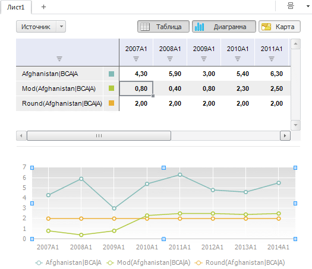

# Область представления данных

Область представления данных
-

# Область представления данных

Представление - это способ отображения
 данных временных рядов.

В рабочей книге доступны следующие представления:

	- [таблица](UiDw_Series.htm).
	 Табличная форма представления данных;

	- [диаграмма](Chart_work.htm).
	 Графическая форма представления данных;

	- [карта](Map_Work.htm).
	 Картографическая форма представления данных.

[Управление набором
 доступных представлений](javascript:TextPopup(this))

	Для управления набором доступных представлений используйте кнопки
	  «Таблица»,  «Диаграмма»,  «Карта», расположенные
	 в группе «Рабочая область»
	 на вкладке «Вид» ленты инструментов.

	Если кнопка нажата, то соответствующее представление доступно для
	 пользователя.

[Смена режима
 размещения представлений](javascript:TextPopup(this))

	Для смены режима расположения данных используйте:

		- кнопку выбора режима размещения представления данных, расположенную
		 в правом верхнем углу [рабочей книги](UiDw_Workbook.htm).
		 Пиктограмма кнопки соответствует используемому режиму размещения
		 представлений;

	Примечание.
	 Кнопка выбора режима размещения представления данных доступна, если
	 включено два и более представления.

		- кнопку  «Раскладка», расположенную в
		 группе «Рабочая область»
		 на вкладке «Вид» ленты
		 инструментов.

	Доступны следующие режимы размещения представлений:

		- . На
		 закладках. Используется одна выбранная форма отображения
		 данных. Например, таблица;

		- . Вертикально.
		 Данные могут быть представлены в нескольких формах одновременно.
		 Для отображения каждой формы используется вертикальная панель;

		- . Горизонтально.
		 Данные могут быть представлены в нескольких формах одновременно.
		 Для отображения каждой формы используется горизонтальная панель.

[Скрытие/отображение
 представлений](javascript:TextPopup(this))

	Для скрытия/отображения представлений используйте группу кнопок,
	 расположенную в правой верхней части листа [рабочей
	 книги](UiDw_Workbook.htm).

	Примечание.
	 Кнопки выбора типа представления данных доступны, если включено два
	 и более представления.

	Принципы работы и расположение кнопок зависит от используемого режима
	 размещения представлений:

		- на закладках. Видимостью
		 представлений управляют переключатели. Если переключатель установлен,
		 то представление отображается. Доступен выбор только одного переключателя,
		 например:

	

		- горизонтально/вертикально.
		 Видимостью представлений управляют кнопки. Если кнопка нажата,
		 то соответствующее представление отображается. Доступен множественный
		 выбор:

	

Пример рабочей книги, содержащей табличное и графическое представление
 данных:

См. также:

[Рабочая книга](UiDw_Workbook.htm)

		Справочная
		 система на версию 10.9
		 от 18/08/2025,
		 © ООО «ФОРСАЙТ»,
