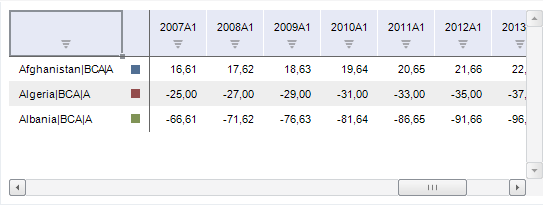
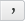
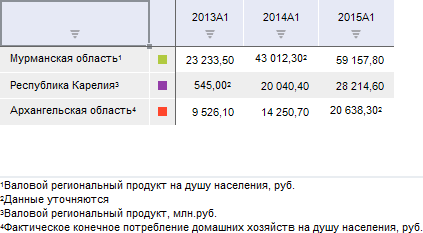

# Работа с таблицей данных

Работа с таблицей данных
-

# Настройка таблицы данных

Таблица данных предназначена для отображения и работы с данными временных
 рядов. Для каждого ряда отображается наименование, цветовое обозначение
 в диаграмме и данные:

## Основные операции с таблицей

### Работа с данными таблицы

[Поворот
 таблицы](javascript:TextPopup(this))

	Поворот таблицы меняет местами столбцы и строки таблицы.

	Для поворота таблицы нажмите кнопку  «Повернуть
	 таблицу», расположенную на вкладке «Таблица»
	 ленты инструментов. Заголовки столбцов и строк поменяются местами,
	 таблица данных перестроится. Выделение элементов в таблице также будет
	 повернуто.

	Параметры сортировки данных при повороте таблицы сбрасываются.

[Фильтрация
 пустых значений](javascript:TextPopup(this))

	Для [фильтрации](SidePanel/UiDw_sp_Data.htm)
	 пустых значений рядов, отображаемых в таблице, используйте:

		- флажок «Скрывать значения»
		 на вкладке «Вид» группы
		 вкладок «Данные» на боковой
		 панели;

		- кнопку  «Фильтрация», расположенную в
		 группе «Данные» на вкладке
		 «Главная» или «Данные»
		 ленты инструментов.

[Сортировка
 значений](javascript:TextPopup(this))

	Для сортировки данных используйте кнопки, расположенные в заголовках
	 столбцов. При нажатии кнопка меняет свой вид в соответствии с действующим
	 режимом сортировки:

		- . Сортировка значений не выполняется;

		- . Сортировка значений по убыванию;

		- . Сортировка значений по возрастанию.

	Особенности сортировки:

		- сортировка недоступна, если элементы календаря располагаются
		 в столбце, то есть был выполнен поворот таблицы;

		- в [вычисляемых рядах](UiDw_ComputedSeries.htm)
		 сортировка дочерних рядов не выполняется.

[Поиск
 и замена данных](javascript:TextPopup(this))

	Примечание.
	 Возможность доступна только в настольном приложении.

	Для поиска или замены данных в таблице:

		- нажмите кнопку 
		 «Найти и заменить» на
		 вкладке «Таблица» ленты
		 инструментов;

		- щелкните по таблице и нажмите сочетание клавиш CTRL+F.

	Будет открыт диалог «[Найти и заменить](../Object_Index/UiDw_Object_Index_Search.htm)».

[Изменение
 периода отображения данных](javascript:TextPopup(this))

	Используйте группу «Период отображения»
	 на вкладке «Главная» или «Вид» ленты инструментов:

		- Начало. Дата, начиная
		 с которой отображаются значения рядов;

		- Окончание. Дата,
		 до которой отображаются значения рядов.

	Дата окончания периода должна быть больше начала периода.

### Анализ данных в таблице

[Условное
 форматирование данных](javascript:TextPopup(this))

	Для наглядности при анализе данных используйте условное форматирование.

	Для работы и настройки условного форматирования данных обратитесь
	 к разделу «[Условное
	 форматирование](UiAnalyticalArea.chm::/analysis/conditional_formatting.htm)».

[Отображение
 спарклайнов](javascript:TextPopup(this))

	Для отображения спарклайнов используйте кнопку «Линии»,
	 расположенную в группе «Спарклайны»
	 на вкладке «Таблица» ленты
	 инструментов.

	Для получения подробного описания обратитесь к разделу «[Отображение спарклайнов](Sparklines.htm)».

[Работа
 с расширенной аналитикой](javascript:TextPopup(this))

	При работе с данными доступно применение следующих возможностей
	 расширенной аналитики:

		- эконометрика;

		- валидация данных;

		- интеллектуальны анализ данных.

	Для получения подробного описания обратитесь к разделу «[Применение
	 расширенной аналитики](AdvancedAnalytics.htm)».

### Настройка внешнего вида таблицы

[Настройка
 оформления таблицы](javascript:TextPopup(this))

	Для настройки оформления таблицы используйте вкладки боковой панели:

		- [Вид](SidePanel/UiDw_sp_view.htm).
		 Настройка общих параметров оформления;

		- [Область
		 данных](SidePanel/Panel_DataArea.htm). Настройка оформления данных в таблице;

		- [Заголовки](SidePanel/Caption.htm).
		 Настройка оформления шапки таблицы.

	Примечание.
	 Вкладки «Область данных» и
	 «Заголовки» доступны только
	 в настольном приложении.

[Настройка
 стиля таблицы](javascript:TextPopup(this))

	Для оформления таблицы в рабочей книге можно использовать следующие
	 стили:

		- стили таблицы;

		- стили ячеек таблицы;

		- внешние таблицы стилей.

	Для получения подробного описания обратитесь к разделу «[Настройка стиля таблицы](Styles_Table.htm)».

[Настройка
 формата отображаемых значений](javascript:TextPopup(this))

	Для настройки формата значений, отображаемых в таблице, используйте
	 группу «Число» на вкладке
	 «Таблица» ленты инструментов.

	Доступные параметры приведены в таблице:

			 Краткое описание

			 
			 Определяет формат значений в ячейках.

			 
			 Устанавливает альтернативный формат денежной единицы. Вид
			 денежной единицы определяется в раскрывающемся меню кнопки.

			 
			 Устанавливает процентный формат значений в таблице.

			 
			 Устанавливает разделитель тысяч при отображении значений
			 в ячейках.

			 
			 Уменьшает разрядность числа. Применяется для отображения
			 менее точных значений.

			 
			 Увеличивает разрядность числа. Применяется для отображения
			 более точных значений.

	Примечание.
	 В настольном приложении настройка формата значений также возможна
	 с помощью вкладки «[Формат числа](UiNav.Chm::/GUI/Format/UiReport_Table_Attribute_Format.htm)»
	 в диалоге «Формат». Для отображения
	 диалога нажмите кнопку ,
	 расположенную в правом нижнем углу группы «Число»
	 на вкладке «Таблица» ленты
	 инструментов.

[Изменение
 масштаба таблицы](javascript:TextPopup(this))

	Примечание.
	 Изменение масштаба таблицы доступно только в настольном приложении.
	 В веб-приложении доступно изменение масштаба всей рабочей книги с
	 помощью браузера.

	Для изменения масштаба:

		- нажмите кнопку 
		 «Масштаб» на вкладке «Таблица» ленты инструментов.
		 В отобразившемся меню укажите требуемый масштаб. Допустимые значения:

		-

			- 200%. 150%. 100%.
			 75%. 50%.
			 25%. Фиксированные
			 значения масштаба;

			- Произвольный.
			 Масштаб, заданный пользователем. Для ввода значения масштаба
			 будет отображен диалог «Масштаб»;

		- установите фокус на таблице, зажмите клавишу CTRL и прокутите
		 колесико мыши вверх для увеличения масштаба или вниз - для уменьшения.

	Масштаб таблицы данных будет изменён. Масштаб остальных элементов
	 рабочей книги останется без изменения.

[Изменение
 порядка календаря](javascript:TextPopup(this))

	Для отображения календаря в обратном порядке, то есть от более
	 поздних дат к более ранним, нажмите кнопку  «Обратный календарь», расположенную
	 на вкладке «Вид» ленты инструментов.

[Отображение
 сносок в таблице](javascript:TextPopup(this))

	В таблице с помощью языка Fore
	 доступны отображение и настройка сносок для рядов и наблюдений.

	Сноски могут быть числовыми, текстовыми или символьными. В качестве
	 значения сноски может использоваться: пользовательская формула, значение
	 одного или нескольких атрибутов рядов или наблюдений. Для сносок может
	 быть отображена расшифровка, расположенная справа, слева, сверху или
	 снизу от таблицы данных.

	Примечание.
	 Сноски экспортируются только в следующие форматы: PDF, EMF, RTF, XLS,
	 XLSX. Подробнее об особенностях экспорта сносок вы можете узнать в
	 разделе «[Экспорт рабочей книги](Export_wbk.htm)».

	Пример таблицы данных со сносками:

	

См. также:

[Работа
 с временными рядами](../Object_Index/UiDw_Factor_New.htm) | [Работа с вычисляемыми
 рядами](UiDw_ComputedSeries.htm) | [Валидация
 данных](UiDw.chm::/Workbook/Data_validation.htm)

		Справочная
		 система на версию 10.9
		 от 18/08/2025,
		 © ООО «ФОРСАЙТ»,
