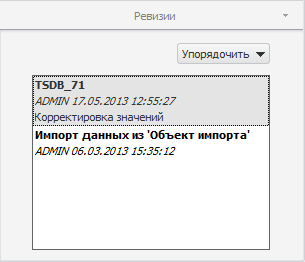
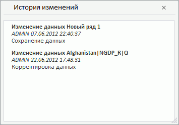

# Просмотр истории изменений

Просмотр истории изменений
-

# Просмотр истории изменений

[Версионная](UiNavObj.chm::/TimeSeriesDatabase/TS_Attributes.htm)
 база данных временных рядов позволяет фиксировать изменения, которые были
 произведены с временными рядами. Информация об изменения временных рядов
 сохраняется в виде ревизий. Ревизии создаются автоматически.

Совет. Как узнать,
 является ли база данных временных рядов версионной?

База данных временных рядов является версионной, если в её свойствах на
 странице «[Атрибуты](UiNavObj.chm::/TimeSeriesDatabase/TS_Attributes.htm)»
 установлен флажок «Вести историю изменений».
 По умолчанию флажок установлен, изменение значения флажка доступно только
 при создании базы данных временных рядов.

## Просмотр истории изменений временного ряда

Используйте вкладку «Ревизии»
 на боковой панели. На вкладке отображается информация обо всех ревизиях
 для выделенного ряда.

[Для отображения
 вкладки](javascript:TextPopup(this))

		- Убедитесь, что отображается боковая панель и выбрано [табличное представление](UiDw_Mode.htm) данных.

		- Выберите временной ряд в таблице данных.

		- Установите переключатель «Ряд» на
		 боковой панели.

		- Перейдите на вкладку «Ревизии».

Для просмотра данных временного ряда по состоянию на требуемую ревизию
 выберите её на вкладке. Изменения будут отражены в рабочей книге.

Для сортировки ревизий используйте раскрывающееся меню кнопки «Упорядочить». Доступна сортировка
 ревизий по наименованию или по дате создания (используется по умолчанию).

## Просмотр истории изменений наблюдения

Используйте диалог «История изменений».

[Для отображения
 диалога](javascript:TextPopup(this))

		- Убедитесь, что выбрано [табличное
		 представление](UiDw_Mode.htm) данных.

		- Выберите в таблице данных наблюдение временного ряда.

		- Выполните команду «История
		 изменений» в контекстном меню наблюдения.

Диалог содержит следующие сведения:

	- дата изменения данных;

	- пользователь, выполнивший изменения;

	- наименование ревизии, в которую вошли изменения;

	- комментарий, оставленный пользователем при изменении данных.

Пример диалога в веб-приложении:

См. также:

[Работа
 с временными рядами](../Object_Index/UiDw_Factor_New.htm)

		Справочная
		 система на версию 10.9
		 от 18/08/2025,
		 © ООО «ФОРСАЙТ»,
