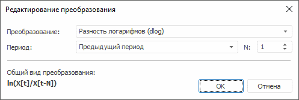
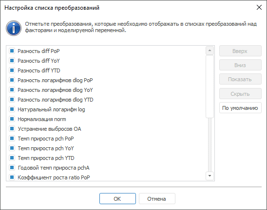

# Преобразование значений ряда

Преобразование значений ряда
-

# Преобразование значений ряда

Преобразование значений ряда позволяет выполнять анализ «Что
 если» путём применения различных преобразований для значений ряда
 и сравнения полученных результатов.

Для выбора метода преобразования значений ряда:

	- установите флажок «Применить
	 преобразование» на вкладке боковой панели «[Основные](SidePanel/UiDw_sp_Primary.htm)» и в раскрывающемся
	 списке укажите требуемое преобразование;

	- используйте раскрывающееся меню кнопки «Отобразить
	 как» на ленте инструментов «Главная»
	 или «Данные»;

	- используйте подменю пункта «Отобразить
	 как» в контекстном меню временного ряда в таблице данных.

Результаты преобразования будут отображены в текущей рабочей книге.

Доступны следующие преобразования:

	- Исходное значение. Преобразование
	 не осуществляется (используется по умолчанию);

	- Натуральный логарифм (log).
	 Логарифмирование точек ряда: ln(X[t]);

	- Разность логарифмов.
	 Расчёт разности логарифмов соседних точек ряда за определенный период
	 (ln(X[t]/X[t-N])):

	-

		- dlog PoP. Предыдущий
		 период;

		- dlog YoY. Соответствующий
		 период предыдущего года;

		- dlog YTD. Конец
		 предыдущего года;

	- Темп прироста. Расчёт
	 темпа прироста в процентах к выбранному периоду (X[t]/X[t-N]-1)*100):

	-

		- pch PoP. Предыдущий
		 период;

		- pch YoY. Соответствующий
		 период предыдущего года;

		- pch YTD. Конец предыдущего
		 года;

	- Разность. Осуществляется
	 преобразование y[t] = X[t] – X[t-N]
	 за определенный период:

	-

		- diff PoP. Предыдущий
		 период;

		- diff YoY. Соответствующий
		 период предыдущего года;

		- diff YTD. Конец
		 предыдущего года;

	- Нормализация (norm).
	 Нормализация точек моделируемой переменной: X[t]/σ(X),
	 где σ -[среднеквадратическое
	 отклонение](Lib.chm::/05_Statistics/UiModelling_ArgSqDev.htm);

	- Стандартизация (std).
	 Стандартизация точек моделируемой переменной: (X[t]-M(X))/σ(X),
	 где σ - [среднеквадратическое
	 отклонение](Lib.chm::/05_Statistics/UiModelling_ArgSqDev.htm), M
	 - [среднее
	 значение](Lib.chm::/05_Statistics/UiModelling_Avg.htm)
	 ряда;

	- Коэффициент роста. Расчёт
	 темпа роста за определенный период (X[t]/X[t-N]):

	-

		- ratio PoP. Предыдущий
		 период;

		- ratio YoY. Соответствующий
		 период предыдущего года;

		- ratio YTD. Конец
		 предыдущего года;

	- Годовой темп прироста (pchA).
	 Расчёт годового темпа прироста в процентах: (((X[t]/X[t-1])^S)-1)*100,
	 где S - число периодов в
	 году.

[Настройка
 дополнительных параметров преобразования](javascript:TextPopup(this))

	Выполните команду «Другое»/«Другое преобразование», расположенную
	 в списке методов преобразования. Будет открыт диалог «Редактирование
	 преобразования» для ввода дополнительных параметров преобразования
	 ряда:

	

	В диалоге отображаются параметры текущего преобразования и общий
	 вид преобразования в виде формулы.

		- Преобразование.
		 Выберите метод преобразования:

		-

			- Нет;

			- Натуральный логарифм
			 (log). Настройка дополнительных параметров не требуется.
			 Параметры «Период»
			 и «N» недоступны;

			- Разность логарифмов
			 (dlog);

			- Темп прироста (pch);

			- Разность (diff);

			- Нормализация (norm).
			 Настройка дополнительных параметров не требуется. Параметры
			 «Период» и «N» недоступны;

			- Стандартизация (std).
			 Настройка дополнительных параметров не требуется. Параметры
			 «Период» и «N» недоступны;

			- Коэффициент роста (ratio);

			- Годовой темп прироста
			 (pchA). Настройка дополнительных параметров не требуется.
			 Параметры «Период»
			 и «N» недоступны.

		- Период. Выберите
		 период преобразования:

		-

			- Предыдущий период (PoP);

			- Соответствующий период
			 предыдущего года (YoY);

			- Конец предыдущего года
			 (YTD).

		- N. Лаг для периода.
		 Минимальное значение и значение по умолчанию - 1.

[Настройка
 списка преобразований](javascript:TextPopup(this))

	Примечание.
	 Возможность доступна только в настольном приложении.

	Выполните команду «Настроить»
	 в подменю пункта «Отобразить как»
	 в контекстном меню временного ряда. Будет открыт диалог «Настройка
	 списка преобразований» для редактирования списка отображаемых
	 преобразований:

	

	Список содержит все доступные преобразования. Если элемент, соответствующий
	 преобразованию, отмечен флажком, то он отображается в списке преобразований
	 в заданном порядке.

	Доступные операции с элементами:

		- Изменение
		 порядка следования преобразования. Используйте кнопки «Вверх»/«Вниз»
		 или одноименные команды в контекстном меню элемента, соответствующего
		 преобразованию;

		- Отображение/скрытие
		 преобразования. Используйте кнопки «Показать»/«Скрыть» или команды «Отметить»/«Снять отметку» в контекстном
		 меню элемента, соответствующего преобразованию;

		- Отображение/скрытие
		 всех преобразований. Используйте команды «Отметить
		 все»/«Снять отметку со
		 всех» в контекстном меню элементов;

		- Восстановление
		 первоначального порядка следования и отображения всех преобразований.
		 Нажмите кнопку «По умолчанию».

См. также:

[Работа
 с временными рядами](../Object_Index/UiDw_Factor_New.htm)

		Справочная
		 система на версию 10.9
		 от 18/08/2025,
		 © ООО «ФОРСАЙТ»,
