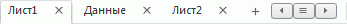

# Создание и настройка рабочей книги и листов

Создание и настройка рабочей книги и листов
-

# Создание и настройка рабочей книги
 и листов

Вся работа с временными рядами выполняется в рабочей книге. Рабочая
 книга может содержать один или несколько листов с различными [представлениями
 данных](UiDw_Mode.htm). Каждый лист имеет свою вкладку, на которой отображено наименование
 листа:

## Основные операции с рабочей книгой

[Создание
 рабочей книги](javascript:TextPopup(this))

	Для создания рабочей книги в главном меню выполните команду:

		- Новая рабочая книга.
		 Будет создана рабочая книга, которая не содержит источника данных;

		- Открыть. Будет открыт
		 диалог выбора объектов. Укажите в нём БД временны́х рядов. Будет
		 создана рабочая книга, использующая указанную БД в качестве источника
		 данных.

[Сохранение
 рабочей книги в репозитории](javascript:TextPopup(this))

	Для сохранения рабочей книги в репозитории выполните команду «Сохранить» в главном меню.

	Если рабочая книга сохраняется впервые, то отобразится диалог для
	 выбора места хранения книги в текущем репозитории.

	Примечание.
	 Сохранение рабочей книги доступно, если у пользователя есть [права](Admin.chm::/03_Admin/Admin_AdminObjects_Discretionary.htm)
	 на изменение объекта репозитория.

[Создание
 копии рабочей книги](javascript:TextPopup(this))

	Выполните команду «Сохранить
	 как» в главном меню. Будет отображен диалог для выбора места
	 хранения копии рабочей книги в текущем репозитории. В настольном приложении
	 по умолчанию объект сохраняется со старым именем и с автоматически
	 сгенерированным идентификатором. В веб-приложении необходимо ввести
	 новое имя объекта и, по желанию, идентификатор. Если идентификатор
	 не указан, он создается автоматически при сохранении.

	Важно.
	 Идентификатор сохраняемого объекта не должен содержать символы русского
	 алфавита и пробелы.

	При создании копии рабочей книги в репозитории создается новая рабочая
	 книга, которая сразу же открывается в том же режиме, в котором была
	 открыта исходная рабочая книга.

[Импорт
 рабочей книги](javascript:TextPopup(this))

	Для импорта рабочей книги предназначен мастер импорта. Работа с
	 мастером импорта подробно описана в разделе «[Импорт
	 данных без подготовки](UiNavOb.chm::/j/Data_import_wizard/Data_import_wizard.htm)».

	Для открытия мастера импорта данных:

		- выполните команду «Рабочая
		 книга >  Импорт данных» [главного
		 меню](../Getting_Started.htm#elements);

		- выполните команду «Источник
		 > Импорт данных» [рабочей
		 области](../Getting_Started.htm#elements).

	Примечание.
	 Работа с мастером импорта доступна только в настольном приложении.

[Экспорт
 рабочей книги](javascript:TextPopup(this))

	Для экспорта рабочей книги выберите формат в раскрывающемся меню
	 команды «Рабочая книга >  Экспорт» [главного
	 меню](../Getting_Started.htm#elements).

	Описание доступных форматов экспорта и его особенности приведены
	 в разделе «[Экспорт рабочей книги](Export_wbk.htm)».

[Открытие
 сохранённой рабочей книги](javascript:TextPopup(this))

	Для открытия сохраненной рабочей книги выполните команду «Открыть» в главном меню. Будет отображен
	 диалог открытия объекта.

[Обновление
 рабочей книги](javascript:TextPopup(this))

	Для рабочей книги доступны следующие виды обновления:

		- однократное обновление.
		 Нажмите кнопку  «Обновить»,
		 расположенную на вкладке «Главная»
		 ленты инструментов;

		- автоматическое обновление.
		 Нажмите кнопку  «Автоматическое обновление» на
		 вкладке «Главная» ленты
		 инструментов.

	Более подробно о возможностях однократного и автоматического обновлений
	 вы можете узнать в разделе «[Обновление рабочей
	 книги](Update.htm)».

[Параметризация
 рабочей книги](javascript:TextPopup(this))

	Для создания параметров в рабочей книге используйте вкладку «Управление параметрами» в диалоге
	 «[Параметры](../Purpose/TimeSeries_Setup.htm)».

	Для редактирования значений параметров используйте вкладку «Параметры источников данных» на
	 боковой панели.

	Подробнее о создании и работе с параметрами рабочей книги см. раздел:
	 «[Параметризация рабочей книги](WBK_Params.htm)».

[Предварительный
 просмотр и печать рабочей книги](javascript:TextPopup(this))

	Выполните команду «Печать»
	 в главном меню.

		- в настольном приложении
		 будет отображено подменю, содержащее команды:

		-

			- [Параметры страницы](UiExpress.chm::/Express/ParamPage/UiExpress_Express_ParamPage.htm).
			 Открывает диалог для настройки параметров разметки и печати
			 страницы;

			- Предварительный просмотр.
			 Отображает рабочую книгу в режиме предварительного просмотра
			 перед выводом на печать. Принципы работы с рабочей книгой
			 в режиме предварительного просмотра приведены в разделе «[Предварительный
			 просмотр и печать объекта](UiNav.Chm::/GUI/Object_preview.htm)»;

		- в веб-приложении
		 будет отображен диалог для настройки параметров печати. Порядок
		 работы с диалогом зависит от используемого браузера.

[Публикация
 рабочей книги](javascript:TextPopup(this))

	В веб-пиложении доступна публикация ссылки на рабочую книгу в социальной
	 сети. Для этого выполните команду «[Поделиться](UiNav.chm::/GUI/Format/Publishing.htm)»
	 в главном меню и в отобразившемся подменю выберите необходимую социальную
	 сеть.

[Закрытие
 рабочей книги](javascript:TextPopup(this))

	Выполните команду «Закрыть»
	 в главном меню. Перед закрытием текущей рабочей книги будет предложено
	 её сохранение.

## Основные операции с листами рабочей книги

[Создание
 листа](javascript:TextPopup(this))

	Для добавления в рабочую книгу нового листа:

		- нажмите кнопку ,
		 расположенную справа от вкладок;

		- выполните команду «Вставить»
		 в контекстного меню любой вкладки листа. Контекстное меню доступно
		 только в настольном приложении.

	В конец рабочей книги будет добавлен новый лист.

[Выбор
 источника данных листа](javascript:TextPopup(this))

	Для выбора источника данных листа используйте [дерево
	 рядов](../Purpose/UiDw_Purpose_Object.htm).

[Обновление
 листа](javascript:TextPopup(this))

	Для обновления текущего листа рабочей книги нажмите кнопку  «Обновить»
	 на ленте инструментов. Кнопка присутствует на каждой вкладке. Лист
	 будет обновлен.

[Удаление
 листа](javascript:TextPopup(this))

	Для удаления листа рабочей книги:

		- нажмите кнопку , расположенную рядом
		 с наименованием удаляемого листа;

		- выполните команду «Удалить»
		 в контекстном меню листа. Контекстное меню доступно только в настольном
		 приложении.

	Будет запрошено подтверждение выполняемого действия.

[Переименование
 листа](javascript:TextPopup(this))

	Для переименования активного листа рабочей книги:

		- дважды щелкните по его наименованию;

		- выполните команду «Переименовать»
		 в контекстном меню листа. Контекстное меню доступно только
		 в настольном приложении.

	Наименование будет переведено в режим редактирования. После изменения
	 наименования нажмите клавишу ENTER.

[Переключение
 между листами](javascript:TextPopup(this))

	Для перехода к нужному листу щёлкните по его вкладке. Если
	 вкладки всех листов не помещаются в окне рабочей книги, то отображаются
	 кнопки навигации:

		- . Прокручивает вкладки листов
		 влево;

		- . Отображает список всех
		 листов. Для перехода к требуемому листу щелкните по его наименованию;

		- . Прокручивает вкладки листов
		 вправо.

[Отображение,
 скрытие и настройка заголовка листа](javascript:TextPopup(this))

	Для отображения заголовка листа нажмите кнопку 
	 «Заголовок», расположенную
	 на вкладке «Главная» или «Вид» ленты инструментов. Заголовок
	 будет отображен в верхней части листа.

	Для скрытия заголовка листа рабочей книги переведите в ненажатое
	 состояние кнопку  «Заголовок», расположенную на
	 вкладке «Главная» или «Вид» ленты инструментов. В веб-приложении
	 также можно использовать одноименную кнопку на вкладке ленты «Заголовок».

	Для настройки [структуры](List_caption.htm#structure)
	 и [оформления заголовка](List_caption.htm#style) используйте
	 вкладку «Заголовок» на ленте
	 инструментов и боковой панели.

См. также:

[Рабочая книга](UiDw_Workbook.htm)

		Справочная
		 система на версию 10.9
		 от 18/08/2025,
		 © ООО «ФОРСАЙТ»,
