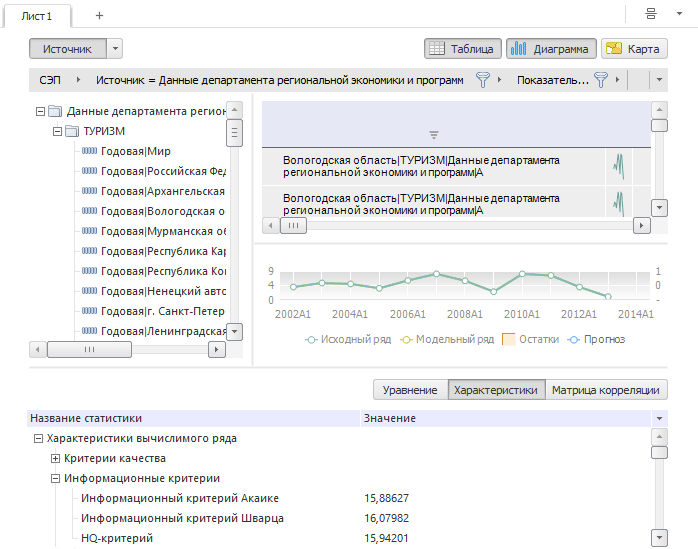

# Рабочая книга

Рабочая книга
-

# Рабочая книга

Рабочая книга является основной функциональной областью БД временных
 рядов и предназначена для работы с временными рядами.

Рабочая книга может содержать несколько [листов](UiDw_Woorkbook.htm).
 Каждый лист содержит следующие элементы:

	- [Дерево
	 рядов](../Purpose/UiDw_Purpose_Object.htm). Отображает древовидную структуру элементов открытого
	 источника данных;

	- [Область
	 представления данных](UiDw_Mode.htm). Предназначена для отображения данных
	 временных рядов в различных формах;

	- [Панель
	 статистик](UiDw_Description.htm). Предназначена для просмотра характеристик объекта,
	 выделенного в области представления данных.

См. также:

[Описание
 интерфейса анализа временных рядов](../Purpose/UiDw_Purpose_Basic_Window.htm)

		Справочная
		 система на версию 10.9
		 от 18/08/2025,
		 © ООО «ФОРСАЙТ»,
