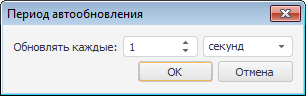

# Обновление рабочей книги

Обновление рабочей книги
-

# Обновление рабочей книги

Обновление данных необходимо после изменения данных в источнике.

В рабочей книге доступно:

	- обновление всей рабочей книги.
	 Нажмите кнопку  «Обновить» на вкладке «Главная»
	 на ленте инструментов;

Примечание.
 Кнопка  «Обновить»
 дублируется на большинстве вкладок ленты инструментов.

	- автоматическое обновление всей
	 рабочей книги. Используйте кнопку  «Автоматическое обновление» на вкладке
	 «Главная» ленты инструментов.

Будут обновлены источники данных. Все настройки обновления данных сохраняются
 вместе с рабочей книгой.

## Автоматическое обновление

Автоматическое обновление позволяет обновлять данные при смене отметки
 и/или с заданным периодом.

[Для
 автоматического обновления вычисляемых рядов](javascript:TextPopup(this))

		- Перейдите на вкладку «Главная»
		 ленты инструментов.

		- Установите флажок «Вычисляемые
		 ряды» в раскрывающемся меню кнопки  «Автоматическое обновление».

	Вычисляемые ряды будут обновляться автоматически при изменении их
	 параметров.

	Для отключения режима автоматического обновления вычисляемых рядов
	 снимите флажок «Вычисляемые ряды»
	 в раскрывающемся меню кнопки  «Автоматическое обновление».

[Для
 периодического обновления данных](javascript:TextPopup(this))

		- Перейдите на вкладку «Главная»
		 ленты инструментов.

		- Установите переключатель «Задать
		 период» в раскрывающемся меню кнопки  «Автоматическое обновление».
		 Будет открыт диалог «Период автообновления»:

	

	В диалоге задайте период обновления данных
	 в рабочей книге. Обновление может выполняться каждые N
	 секунд, минут или часов.

	Примечание.
	 Если для рабочей книги уже настраивался период обновления, то его
	 можно выбрать в раскрывающемся меню кнопки  «Автоматическое обновление».

	Обновление рабочей книги будет выполняться раз в заданный период
	 времени.

	Для отключения периодического обновления данных установите переключатель
	 «Не использовать» в раскрывающемся
	 меню кнопки  «Автоматическое обновление».

[Для
 отключения автоматического обновления](javascript:TextPopup(this))

		- установите период автообновления «Не
		 использовать» и снимите флажок «Вычисляемые
		 ряды» в меню кнопки  «Автоматическое обновление»;

		- переведите кнопку  «Автоматическое обновление» в
		 ненажатое состояние.

	Автоматическое обновление рабочей книги будет отключено. При изменении
	 параметров вычисляемых рядов будет выдаваться запрос на обновление.
	 При повторном нажатии кнопки «Автоматическое
	 обновление» устанавливается ранее настроенный период автоматического
	 обновления.

### Особенности автоматического обновления

При задании автоматического обновления данных учитывайте следующие особенности:

	- при снятом флажке «Вычисляемые
	 ряды» и установленном периоде автоматического обновления данные
	 рабочей книги обновляются только в соответствии с заданным периодом
	 автоматического обновления;

	- при установленном флажке «Вычисляемые
	 ряды» и установленном периоде автоматического обновления «Не использовать» данные рабочей
	 книги обновляются только при смене отметки.

См. также:

[Операции с рабочей книгой и листами](UiDw_Woorkbook.htm)

		Справочная
		 система на версию 10.9
		 от 18/08/2025,
		 © ООО «ФОРСАЙТ»,
