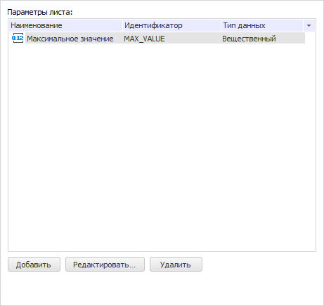
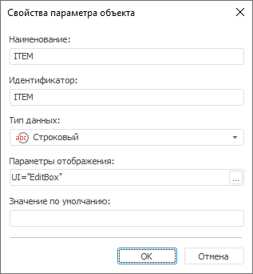
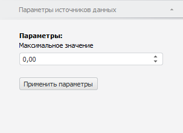

# Параметризация рабочей книги

Параметризация рабочей книги
-

# Параметризация рабочей книги

Параметры предназначены для
 динамического управления данными, отображаемыми в рабочей книге.

Для создания и редактирования параметров рабочей книги используйте вкладку
 «Управление параметрами» в
 окне «[Параметры](../Purpose/TimeSeries_Setup.htm)».

[Для отображения
 вкладки](javascript:TextPopup(this))

		- Выполните команду главного меню «Сервис
		 > Параметры». Будет открыт диалог «[Параметры](../Purpose/TimeSeries_Setup.htm)».

		- Перейдите на вкладку «Управление параметрами».

На вкладке доступны следующие операции с параметрами:

[Добавление параметра](javascript:TextPopup(this))

	Для добавления параметра нажмите кнопку «Добавить».
	 Откроется окно «Свойства параметра
	 объекта»:

	

	Все поля заполнены значениями по умолчанию.

	Задайте атрибуты параметра:

		- Наименование. Введите
		 наименование параметра;

		- Идентификатор. Введите
		 последовательность букв латинского алфавита, цифр и знаков подчёркивания,
		 начинающуюся с буквы. Идентификатор должен быть уникальным в рамках
		 объекта;

		- Тип данных. выберите
		 один из доступных типов данных из раскрывающегося списка;

		- Параметры отображения.
		 Задайте внешний вид и поведение редактора значений параметра.
		 Параметры отображения задаются в виде специально сформированной
		 строки, в которой указывается вид редактора, значение по умолчанию
		 и т.д. Строка может быть отредактирована как непосредственно в
		 поле ввода, так и при помощи специального диалога «[Параметры
		 редактора значений](uinav.chm::/GUI/valueeditorparameters.htm)». Для открытия диалога
		 нажмите кнопку  «Обзор».
		 По умолчанию параметр отображения устанавливается в соответствии
		 с выбранным типом параметра;

		- Значение по умолчанию.
		 Задайте значение параметра по умолчанию при необходимости. Особенности
		 значения по умолчанию для типов данных:

			- Строковый. Может
			 содержать до 2 Гб данных. Текст строки указывается без кавычек;

			- Целый. Допускается
			 целое число в диапазоне [-2147483648; 2147483647];

			- Десятичный.
			 Допускается десятичное число, содержащее не более 28 разрядов
			 после запятой в диапазоне [-179228162514264337593543950335; 179228162514264337593543950335];

			- Вещественный.
			 Допускается вещественное число в диапазоне [-5.0 x 10-324; 1.7 x 10308];

			- Дата. Минимальная
			 дата - 1 января 100 года (н.э.) 00:00:00, максимальная
			 дата - 31 декабря 9999 года (н.э.) 23:59:59;

			- Пользовательский.
			 Допускается набор неструктурированных данных, представляющий
			 массив двоичных или символьных данных. Передача значений параметров,
			 имеющих пользовательский тип данных, доступна только при работе
			 с объектом в прикладном коде.

[Редактирование
 параметра](javascript:TextPopup(this))

	Для редактирования выбранного параметра нажмите кнопку «Редактировать».

	В открывшемся окне «Свойства параметра
	 объекта» измените требуемые настройки параметра.

[Редактирование
 значения параметра](javascript:TextPopup(this))

	Для редактирования значения выбранного параметра перейдите на вкладку
	 «[Параметры
	 источников данных](#edit_parameter_values)» на боковой панели и задайте требуемое
	 значение параметра.

[Удаление параметра](javascript:TextPopup(this))

	Для удаления выбранного параметра нажмите кнопку «Удалить».

	В настольном приложении параметр будет удалён с запросом подтверждения
	 выполняемого действия, в веб-приложении - без запроса подтверждения.

## Редактирование значения параметров

Для редактирования значений параметров рабочей книги используйте вкладку
 «Параметры источников данных»
 на боковой панели. На вкладке отображаются все параметры, существующие
 в рабочей книге.

[Для отображения
 вкладки](javascript:TextPopup(this))

		- Убедитесь, что открыта рабочая книга, содержащая параметры.

		- Убедитесь, что боковая панель отображается.

		- Установите на боковой панели переключатель «Данные».

		- Перейдите на вкладку «Параметры
		 источников данных».

Задайте на вкладке необходимые значения параметров.

Для обновления данных рабочей книги в соответствии с заданными значениями
 нажмите кнопку «Применить параметры».

См. также:

[Операции с рабочей книгой и листами](UiDw_Woorkbook.htm)

		Справочная
		 система на версию 10.9
		 от 18/08/2025,
		 © ООО «ФОРСАЙТ»,
