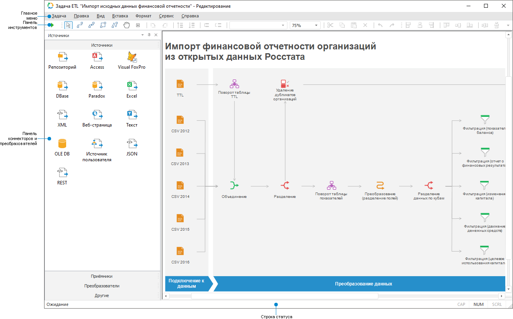

# Начало работы с инструментом «Задача ETL» в настольном приложении

Начало работы с инструментом «Задача ETL» в настольном приложении
-

# Начало работы с инструментом «Задача
 ETL» в настольном приложении

Для начала работы с инструментом создайте новую или откройте готовую
 задачу ETL.

[Создание
 новой задачи ETL](javascript:TextPopup(this))

	Для создания новой задачи ETL в [навигаторе
	 объектов](GetStarted.chm::/Interface/Interface_Navigator.htm):

		- нажмите кнопку «Новый объект
		 > Другие > Задача ETL» в группе «Создать»
		 на вкладке «Главная» ленты
		 инструментов;

		- выполните команду «Создать
		 > Другие > Задача ETL» в контекстном меню навигатора
		 объектов.

[Открытие
 готовой задачи ETL](javascript:TextPopup(this))

	Для открытия на редактирование готовой задачи ETL:

		- выполните команду «Редактировать»
		 в контекстном меню задачи ETL;

		- нажмите кнопку  «Редактировать» на вкладке «Главная» ленты инструментов;

		- выделите задачу ETL и нажмите клавишу F4.

	Для открытия на просмотр готовой задачи ETL:

		- выполните команду «Открыть»
		 в контекстном меню задачи ETL;

		- нажмите кнопку  «Открыть»
		 на вкладке «Главная» ленты
		 инструментов;

		- дважды щёлкните по задаче ETL.

Для построения задачи ETL смотрите
 статью «[Построение
 задачи ETL](../03_ETLObjects/Construction_ETL.htm)».

Для импорта, экспорта и преобразования
 данных смотрите статью «[Выполнение
 задачи ETL](../05_PropertyETL/UIEtl_WorkVisualisation.htm)».

Основное окно инструмента «Задача
 ETL»:

[Элементы окна
 задачи ETL](javascript:TextPopup(this))

	Основное окно задачи ETL состоит из элементов:

		- Главное меню.
		 Содержит список команд, предназначенных для выполнения различных
		 операций над задачей ETL и ее объектов;

		- Панель инструментов.
		 Содержит команды, упорядоченные в логические группы. Команды предназначены
		 для настройки параметров и управления объектами, расположенными
		 в [рабочей области](../04_Work/UiEtl_ObjWork.htm);

		- Панель коннекторов и преобразователей.
		 Отображается только в режиме редактирования задачи ETL. Панель
		 служит для добавления объектов определенного типа в [рабочую
		 область](../04_Work/UiEtl_ObjWork.htm). Данная панель состоит из четырёх вкладок:

			- [Источники](../03_ETLObjects/02_Inputs/UiEtl_Inputs.htm);

			- [Приёмники](../03_ETLObjects/03_Outputs/UiEtl_Outputs.htm);

			- [Преобразователи](../03_ETLObjects/04_Transformers/UiEtl_Trfs.htm);

			- [Другие](../03_ETLObjects/Other/Other_objects_group.htm);

		- [Рабочая
		 область](../04_Work/UiEtl_ObjWork.htm). Контейнер, в котором строится цепочка экспорта/импорта
		 данных задачи ETL.

См. также:

[Начало
 работы с инструментом «Задача ETL» в веб-приложении](../../Web/01_General_Info/UiETL_StartingToWork.htm) | [Построение
 задачи ETL](../03_ETLObjects/Construction_ETL.htm) | [Выполнение
 задачи ETL](../05_PropertyETL/UIEtl_WorkVisualisation.htm)

		Справочная
		 система на версию 10.9
		 от 18/08/2025,
		 © ООО «ФОРСАЙТ»,
