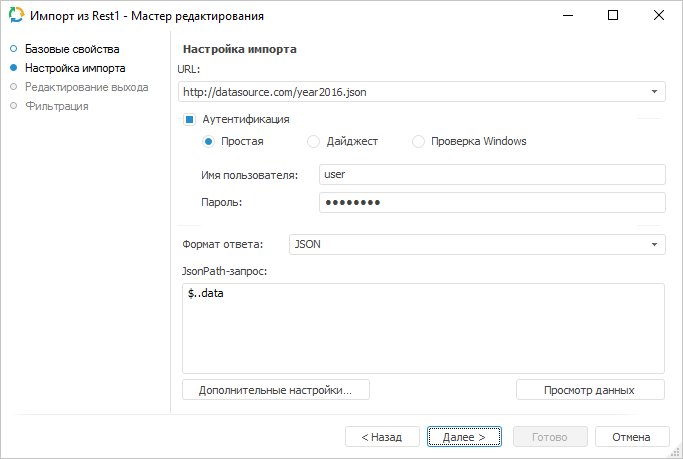

# Источник данных «REST»: Задача ETL, настольное приложение

Источник данных «REST»: Задача ETL, настольное приложение
-

# REST

	Коннектор «REST» - объект,
	 предназначенный для извлечения данных, которые предоставляют различные
	 REST-сервисы.

	После добавления коннектора на рабочее пространство задачи ETL задайте
	 базовые свойства и настройки импорта. Также можно отредактировать
	 выход коннектора и задать параметры фильтрации данных.

	Для работы с REST-сервисом по протоколу HTTPS используйте сертификат
	 безопасности в формате PEM:

		- Запустите встроенное приложение «Управление
		 сертификатами компьютеров» в ОС Windows.

		- Добавьте сертификат в папку «Доверенные
		 корневые центры сертификации > Сертификаты».

## Базовые свойства

В базовых свойствах задаются наименование объекта, идентификатор и примечание.

## Настройка импорта

	На странице «Настройка импорта»
	 указываются параметры подключения к REST-сервису и запрос, в соответствии
	 с которым извлекаются данные:

	

	В поле «URL» укажите адрес
	 REST-сервиса, который предоставляет данные (в текущей реализации поддерживается
	 подключение к REST-сервисам, предоставляющим данные в форматах JSON
	 и XML).

	Примечание.
	 Поддерживается работа с файлами только в кодировке UTF-8.

	Если для подключения к REST-сервису требуется аутентификация пользователя,
	 то установите флажок «Аутентификация»
	 и выберите метод проверки пользователя. В полях «Имя
	 пользователя» и «Пароль»
	 укажите учетные данные пользователя. Указанные параметры будут переданы
	 в ядро, обработаны необходимым образом и использованы при подключении
	 к REST-сервису.

	Важно.
	 Если для доступа к REST-сервису требуется подключение к Internet,
	 а оно осуществляется через прокси-сервер, то предварительно адрес
	 прокси-сервера необходимо указать в [параметрах
	 репозитория](UiNav.chm::/02_Navigator/CommonSettings/ProxyServer.htm).

	В списке «Формат ответа»
	 выберите формат, в котором приходят данные с REST-сервиса. В зависимости
	 от выбранного формата укажите дополнительные настройки:

		- JSON. В поле «JSONPath-запрос» укажите запрос,
		 в соответствии с которым будут отбираться импортируемые данные;

		- XML. В поле «Формат» выберите каким образом
		 организовано хранение данных в XML-файле (поля с данными представлены
		 в виде атрибутов вершин или отдельных дочерних вершин). В поле
		 «XPath-запрос» укажите
		 запрос, в соответствии с которым будут отбираться импортируемые
		 данные.

	Примечание.
	 При формировании различных условий в запросе учитывайте указываемый
	 тип данных. Неявное преобразование типов не поддерживается. Более
	 подробную информацию о формировании JSONPath или XPath-запросов можно
	 найти в специализированной документации, например, в MSDN.

	Для задания [настроек](additional_settings.htm), которые
	 используются при идентификации данных, нажмите кнопку «Дополнительные
	 настройки».

	Для просмотра первых сто записей, отобранных по запросу, нажмите
	 кнопку «Просмотр данных».

## Редактирование выхода

На странице «Редактирование выхода»
 задаётся связь с объектом-приёмником, в который будут выгружаться данные
 при выполнении задачи ETL.

Примечание.
 Страница является общей для всех коннекторов и преобразователей данных,
 кроме преобразователей «[Разделение](../04_Transformers/01_Split/uietl_split.htm)»
 и «[Алгоритм пользователя](../04_Transformers/09_algorithm/UiEtl_Trfs_Algorithm.htm)». Рассмотрим
 настройку списка полей и связи выхода на примере мастера редактирования
 источника данных «[Репозиторий](UiEtl_Inputs_Repo.htm)».

На странице доступны следующие настройки:

[Идентификатор](javascript:TextPopup(this))

	Укажите идентификатор выхода редактируемого объекта. Возможно использование
	 символов латинского алфавита, цифр и специального символа «_».

[Связь с объектом](javascript:TextPopup(this))

	Установите связь с объектом-приёмником, в который будут выгружаться
	 данные. Для этого из раскрывающегося списка выберите объект задачи
	 ETL.

[Поля](javascript:TextPopup(this))

	Поля объекта-приёмника, в которые будут выгружаться данные, предназначены
	 для определения формата вывода данных.

	Примечание.
	 Редактирование списка полей доступно только для коннекторов к источнику
	 данных. Для коннекторов к приёмнику данных список полей заполняется
	 автоматически.

	Для добавления в список всех полей из связанного объекта-приёмника:

		- Нажмите кнопку «Заполнить
		 из».

		- В раскрывающемся меню кнопки выберите пункт «Из приёмника».

	После выполнения действий в список полей будут добавлены все поля
	 из связанного объекта-приёмника данных.

	Для добавления в список всех полей из связанного объекта-источника:

		- Нажмите кнопку «Заполнить
		 из».

		- В раскрывающемся меню кнопки выберите пункт «Из
		 источника».

	После выполнения действий в список полей будут добавлены все поля
	 из связанного объекта-источника данных.

	Для добавления нового поля:

		- Нажмите кнопку «Добавить».
		 Будет открыто окно «Свойства
		 поля»:

	

		- Задайте в открывшемся окне значения атрибутов поля:

			- Идентификатор.
			 Укажите уникальный идентификатор поля. По умолчанию FIELD<Порядковый номер поля>;

			- Наименование.
			 Укажите наименование поля. По умолчанию FIELD<Порядковый
			 номер поля>;

			- Тип. Из раскрывающегося
			 списка выберите тип данных поля: строковый, целый, вещественный,
			 дата, текстовый. По умолчанию установлен строковый тип данных;

			- Вычисляемое поле.
			 Установите данный флажок для задания формулы, по которой будет
			 вычисляться значение поля. После установки флажка введите
			 выражение с помощью клавиатуры или [редактора выражений](UiNav.chm::/GUI/ExpressionEditor.htm),
			 который открывается при нажатии на кнопку 
			 «Обзор».

			Для увеличения значения каждой новой записи на фиксированную
			 величину используйте специальное выражение INCREMENT.

	Примечание.
	 Специальное выражение INCREMENT
	 доступно только для вычисляемого поля целого типа.

	Синтаксис данного выражения: INCREMENT[Value1,
	 Value2], где Value1 - начальное значение, Value2 - шаг, на который
	 значение Value1 должно увеличиваться при каждом вызове выражения.
	 При каждой загрузке данных заполнение будет начинаться с начального
	 значения.

		- Нажмите кнопку «ОК».

	После выполнения действий будет добавлено новое поле.

	Для редактирования поля:

		- дважды щёлкните по полю кнопкой мыши;

		- выделите необходимое поле и нажмите кнопку «Редактировать».

	После выполнения действий будет открыто окно «Свойства
	 поля», приведённое выше.

	Для удаления выбранного поля нажмите кнопку «Удалить».
	 Поле будет удалено без подтверждения выполняемого действия.

	Для изменения порядка выгрузки данных в коннектор выделите необходимое
	 поле и переместите его в списке полей с помощью кнопок 
	 «Вверх» и 
	 «Вниз».

## Фильтрация

На странице «Фильтрация» задаётся
 условие, в соответствии с которым будут отбираться импортируемые данные.

Примечание.
 Страница является общей для всех коннекторов к источникам данных, кроме
 коннектора «[Источник
 пользователя](Uietl_Inputs_User.htm)». Рассмотрим настройку фильтрации данных источника на
 примере мастера редактирования источника данных «[Репозиторий](UiEtl_Inputs_Repo.htm)».

Для формирования условия фильтрации нажмите кнопку 
 «Обзор». Будет открыто окно [редактора выражения](UiNav.Chm::/GUI/ExpressionEditor.htm).
 Для составления выражения доступны все поля источника. Импортированы будут
 те данные, которые удовлетворяют заданному условию.

См. также:

[Начало
 работы с инструментом «Задача ETL» в веб-приложении](../../../Web/01_General_Info/UiETL_StartingToWork.htm) | [Коннекторы к исходным данным](UiEtl_Inputs.htm)

		Справочная
		 система на версию 10.9
		 от 18/08/2025,
		 © ООО «ФОРСАЙТ»,
