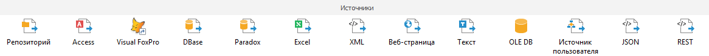

# Создание коннекторов к исходным данным: Задача ETL, настольное приложение

Создание коннекторов к исходным данным: Задача ETL, настольное приложение
-

# Создание коннекторов к исходным
 данным

Все доступные коннекторы располагаются на вкладке «Источники».
 Коннекторы предназначены для подключения к внешним источникам или объектам
 репозитория, импорта из них данных и дальнейшей передачи полученных данных
 другим объектам задачи ETL. Каждый коннектор хранит в себе настройки подключения
 к определённому источнику и связи с другими объектами задачи ETL. Создание
 и редактирование коннекторов осуществляется в настольном приложении.

Доступные коннекторы к источникам данных:

[Создание
 коннектора](javascript:TextPopup(this))

	Для создания коннектора к источнику данных выполните одно из действий:

		- дважды щелкните по выбранному объекту на панели «Источники»;

		- выполните команду главного меню «Вставка
		 > Источник» и выберите необходимый объект.

	Будет открыт мастер создания выбранного коннектора. Все мастера
	 содержат ряд общих страниц, настраиваемых для всех объектов одинаково.

[Редактирование
 коннектора](javascript:TextPopup(this))

	Для редактирования коннектора выполните одно из следующих действий:

		- выполните команду «Редактировать»
		 в контекстном меню;

		- дважды щелкните по выбранному объекту;

		- выделите объект и нажмите клавишу F4.

[Просмотр данных](javascript:TextPopup(this))

	Просмотр данных служит для предварительного просмотра данных источника/приёмника
	 задачи ETL,
	 отобранных с помощью запросов или необходимых параметров.

	Примечание.
	 Для источника «[Репозиторий](UiEtl_Inputs_Repo.htm)»
	 просмотр данных возможен только, если источником данных является объект
	 репозитория «[Документ](UiNavObj.chm::/UiNavObj_document.htm)».

	Подробное описание возможности приведено в разделе «[Просмотр данных](../Page_browse_data.htm)».

См. также:

[Начало
 работы с инструментом «Задача ETL» в веб-приложении](../../../Web/01_General_Info/UiETL_StartingToWork.htm) | [Построение
 задачи ETL](../Construction_ETL.htm)

		Справочная
		 система на версию 10.9
		 от 18/08/2025,
		 © ООО «ФОРСАЙТ»,
