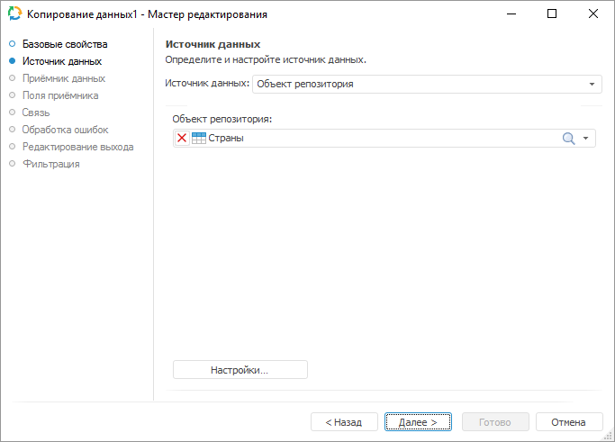
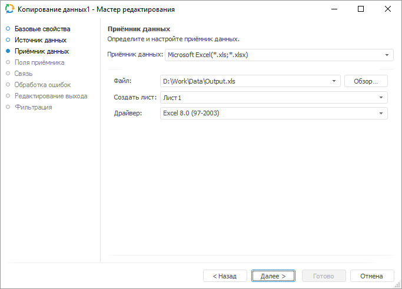
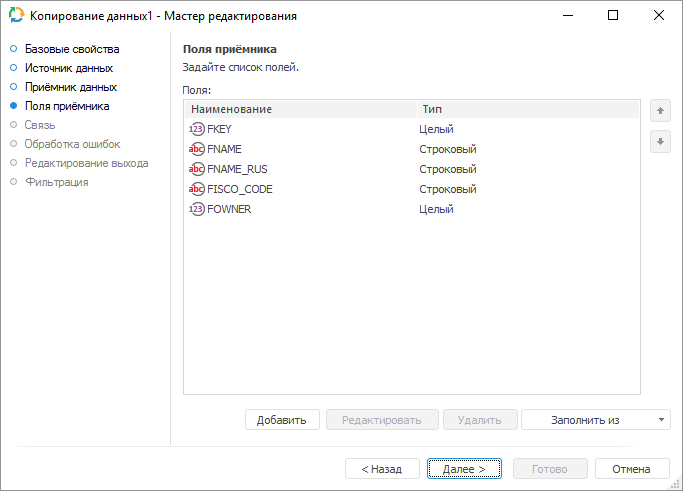
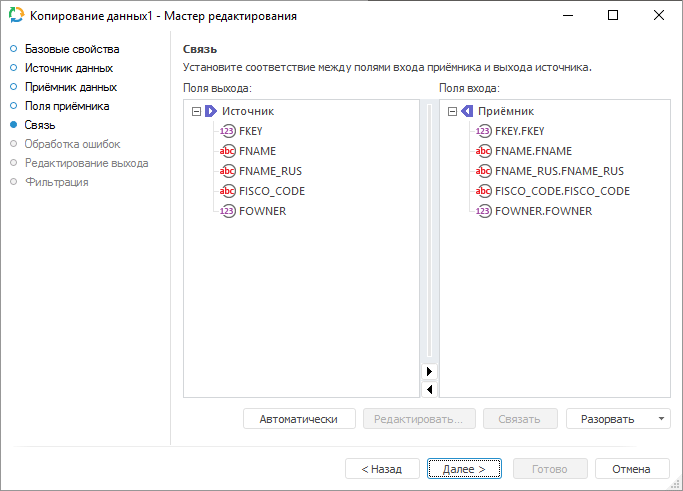
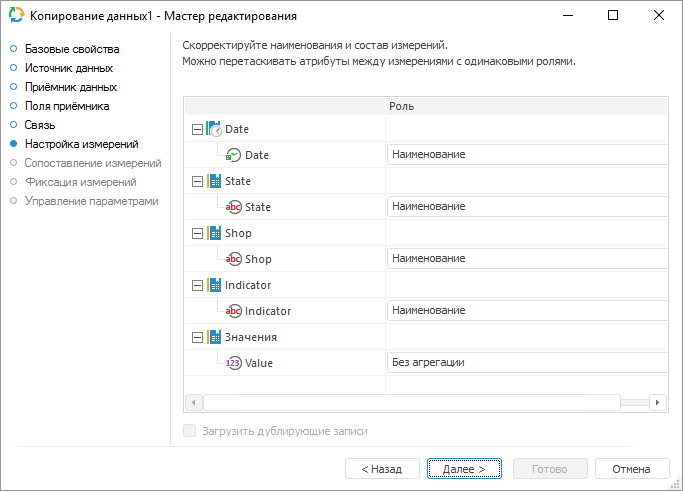
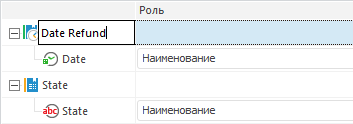
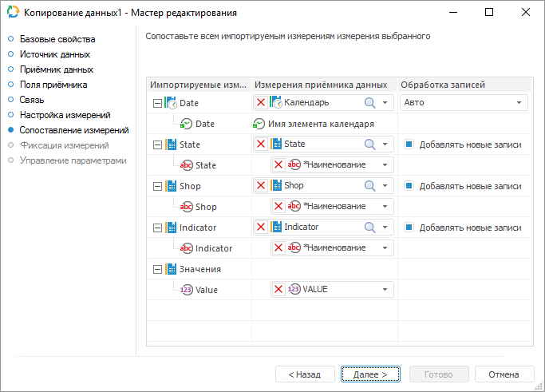
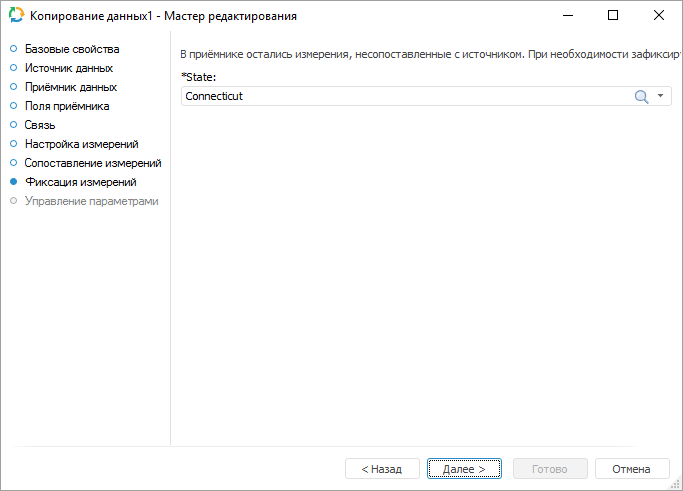

# Копирование данных: Задача ETL, настольное приложение

Копирование данных: Задача ETL, настольное приложение
-

# Копирование данных

	«Копирование данных» - объект,
	 предназначенный для загрузки данных напрямую из источника в приёмник
	 без использования промежуточных объектов-преобразователей и объектов-приёмников.

## Базовые свойства

В базовых свойствах задаются наименование объекта, идентификатор и примечание.

## Источник данных

	На странице «Источник данных»
	 указывается объект с импортируемыми данными (объект репозитория или
	 внешний файл) и параметры, которые используются для определения диапазона
	 с данными.

	

	Настройки на странице «Источник
	 данных» аналогичны настройкам на странице «Настройка
	 импорта» выбранного в раскрывающемся списке источника данных:

		- Объект репозитория;

		- Microsoft Excel;

		- Microsoft Access;

		- Microsoft XML;

		- Microsoft OLE DB;

		- Текстовый файл;

		- Visual FoxPro;

		- DBase.

## Приёмник данных

	На странице «Приёмник данных»
	 указывается объект, в который осуществляется экспорт данных (объект
	 репозитория или внешний файл).

	

	Настройки на странице «Приёмник
	 данных» аналогичны настройкам на странице «Настройка
	 экспорта» выбранного в раскрывающемся списке приёмника данных:

		- Объект
		 репозитория;

		- Microsoft
		 Excel;

		- Microsoft
		 Access;

		- Microsoft
		 XML;

		- Microsoft
		 OLE DB;

		- Текстовый
		 файл;

		- Visual
		 FoxPro;

		- DBase.

## Поля приёмника

	На странице «Поля приёмника»
	 настраиваются поля приёмника, в которые будут скопированы данные.

	

	Если структура приёмника фиксированная (выбран существующий объект
	 репозитория), то доступно только добавление всех полей «Из
	 приёмника» в раскрывающемся меню кнопки «Заполнить
	 из». Кнопка «Добавить»
	 будет недоступна.

	Если выбран существующий файл, в котором можно идентифицировать
	 структуру, то будут доступны все варианты: кнопка «Добавить»
	 или заполнение списка на основании структуры источника/приёмника.

	Если выбран новый файл, то список полей создается вручную. Будет
	 доступна кнопка «Добавить»
	 или возможность заполнить список на основании структуры источника.

## Связь

	На странице «Связь» настраиваются
	 связи между полями источника и приёмника.

	

	На странице доступны следующие операции:

		- Автоматическое создание
		 связей. Для связи полей, имеющих одинаковые идентификаторы,
		 нажмите кнопку «Автоматически»;

		- Редактирование входных
		 полей, не связанных с выходом. Если для входного поля отсутствует
		 связь с выходным полем, то значение входного поля можно формировать
		 автоматически. Для формирования значения выбранного входного поля:

			- Откройте диалог «[Параметры
			 автозаполнения поля](../05_Links/UIEtl_Links_Autolink.htm)». Для этого:

				- нажмите кнопку «Редактировать»;

				- дважды щелкните по наименованию поля;

			- Укажите необходимые параметры.

		- Ручное создание связей.
		 Перетащите поле источника данных на поле приёмника данных или
		 выделите данные поля и нажмите кнопку «Связать»;

		- Удаление связей.
		 Для удаления связи выбранного поля приёмника:

			- в раскрывающемся меню кнопки «Разорвать»
			 выберите пункт «Разорвать
			 выделенную связь»;

			- нажмите клавишу DELETE.

	Для удаления всех связей в раскрывающемся
	 меню кнопки «Разорвать» выберите
	 пункт «Разорвать все связи».

	При переходе к данной странице сразу будет произведена попытка настроить
	 автоматическую связь.

## Настройка измерений

	Если приёмником является стандартный куб, то после страницы «Связь» в мастере будут доступны
	 дополнительные страницы «Настройка
	 измерений», «Сопоставление
	 измерений»:

	

	[Изменение
	 наименования измерения](javascript:TextPopup(this))

		Для переименования выделенного измерения:

			- щелкните в области наименования;

			- нажмите клавишу F2.

		Наименование будет переведено в режим редактирования. Введите
		 новое наименование измерения.

		

	[Изменение
	 состава измерения](javascript:TextPopup(this))

		После установления связи между полями входа приёмника и выхода
		 источника каждое поле связывается с измерением следующим образом:

			- поля, содержащие значения вещественного
			 и целого типа, будут
			 считаться полями с данными. Они будут связаны с измерением
			 фактов. Каждое поле связывается с отдельным фактом;

			- поля, содержащие значения типа Дата
			 или ДатаВремя, будут
			 связаны с календарными измерениями. Параметры календарного
			 измерения будут установлены в зависимости от идентифицированного
			 диапазона дат;

			- все остальные поля будут связаны с отдельными измерениями.
			 Значения полей будут импортироваться как наименования элементов
			 этих измерений. При работе с кросс-таблицей возможна ситуация,
			 когда соседние поля, имеющие разный тип, будут объединены
			 в одно измерение.

		При необходимости поля можно объединить в одно измерение. При
		 этом можно изменить роль полей:

			- Роль «Наименование».
			 Значения полей с ролью «Наименование»
			 импортируются как наименования элементов. Если данная роль
			 установлена для нескольких атрибутов, то создается иерархическое
			 измерение. Используя данную роль, можно организовать произвольные
			 иерархии, например, SHOP-STATE. Объединение с календарным
			 измерением недопустимо;

			- Роль «Атрибут».
			 Значения полей с ролью «Атрибут»
			 рассматриваются как дополнительные характеристики каждого
			 элемента этого измерения. Данные значения будут использоваться
			 для связи фактических данных с определенными элементами измерения;

			- Роль «Код территории».
			 Значения полей с ролью «Код
			 территории» импортируются в атрибут с идентификатором
			 «TERRID», который
			 необходим для отображения данных на картах. В рамках одного
			 измерения только для одного атрибута может быть установлена
			 роль «Код территории».

		Для переноса атрибута выделите его и перетащите в область нужного
		 измерения, после чего в столбце «Роль»
		 укажите как будет использоваться атрибут в измерении.

	[Агрегация
	 фактов](javascript:TextPopup(this))

		Для каждого факта можно выбрать метод агрегации данных. При
		 этом выбранный метод будет установлен для факта в структуре приёмника
		 данных (список доступных методов агрегации совпадает со списком,
		 доступным для [фактов
		 куба](UiNavObj.chm::/Cube/CreateCube/Master_Standart/UiMd_Cube_CreateCube_Master_Standart_2.htm)). Также будет установлен флаг «[Агрегировать данные по измерениям с
		 полной отметкой](UiNavObj.chm::/Cube/CreateCube/Master_Standart/UiMd_Cube_CreateCube_Master_Standart_3.htm)».

		Если выбран метод агрегации, то будет доступен флажок «Загрузить дублирующие записи».
		 По умолчанию он снят. При установленном флажке будут импортированы
		 все записи. Импортированные дублирующие записи в дальнейшем могут
		 использоваться, например, при просмотре детализированной информации
		 по агрегированным данным.

		Если флажок «Загрузить дублирующие
		 записи» снят и во время импорта будут обнаружены дублирующиеся
		 записи (у двух или более записей значения всех полей полностью
		 совпадают), то будет сгенерирована ошибка.

## Сопоставление измерений

	На странице «Сопоставление измерений»
	 осуществляется связь импортируемых измерений с измерениями приёмника
	 данных.

	

	Если в качестве приёмника выбран существующий куб, то импортируемые
	 измерения и измерения приёмника данных будут связаны автоматически
	 в соответствии с заданными связями. Изменить справочник, используемый
	 в качестве измерения, будет нельзя. Использоваться будут те справочники,
	 которые заданы в структуре куба.

	Если создается новый куб, то в раскрывающихся списках можно будет
	 выбрать один из доступных справочников репозитория. Для выбора доступны
	 справочники НСИ и календарные справочники. Для фактов будет создаваться
	 новый отдельный справочник НСИ, поэтому они не будут отображены в
	 общем списке импортируемых измерений.

	Для каждого импортируемого измерения необходимо сопоставить атрибуты
	 выбранного измерения приёмника. Для выбора доступны атрибуты, имеющие
	 такой же тип данных, как и в импортируемом измерении. Календарный
	 справочник создается для полей с типом «Дата»,
	 для него необходимо задать периодичность данных.

	Для дополнения списка элементов справочника из поля источника установите
	 флажок «Добавлять новые записи».
	 При снятом флажке элементы не добавляются и импорт данных будет производиться
	 только по тем элементам, которые присутствуют в источнике и в выбранном
	 справочнике. Если измерение приёмника не выбрано или привязка была
	 сброшена пользователем, то в раскрывающемся списке измерений будет
	 отображён текст «Справочник будет
	 создан». Флажок «Добавлять
	 новые записи» в этом случае будет недоступным.

## Обработка ошибок

На странице «Обработка ошибок»
 определяется поведение объекта экспорта при возникновении ошибочных ситуаций.

Примечание.
 Страница является общей для всех коннекторов к приёмникам данных, кроме
 приёмников «[XML](../03_Outputs/XML/UiEtl_outputs_XML.htm)», «[Текст](../03_Outputs/Text/UiEtl_Outputs_Text.htm)»,
 «[JSON](../03_Outputs/JSON/JSON_Outputs.htm)»
 и «[Приёмник пользователя](../03_Outputs/User/UiEtl_Outputs_User.htm)». Рассмотрим
 настройку параметров для обработки ошибок на примере мастера редактирования
 приёмника данных «[Репозиторий](../03_Outputs/Repositoriy/UiEtl_Outputs_Repo.htm)».

Если в настройках задачи ETL задан [обработчик
 событий](../../06_CreateETL/Event_Handling.htm), то при возникновении ошибок будет генерироваться событие
 OnError. Также можно определить дальнейшее поведение объекта экспорта
 при возникновении ошибочных ситуаций:

	- Действие,
	 выполняемое при возникновении ошибочной ситуации. Выберите
	 в раскрывающемся списке действие, которое будет выполняться при возникновении
	 ошибок во время выгрузки данных:

		- Остановка расчёта задачи.
		 При возникновении ошибки экспорта будет полностью остановлено
		 выполнение задачи ETL;

		- Пропуск только некорректных
		 записей. При возникновении ошибки экспорта будут исключены
		 записи с ошибочными ситуациями. Используйте данное действие, когда
		 наличие всех записей некритично;

		- Пропуск всех записей в
		 рамках одной транзакции. При возникновении ошибки экспорта
		 будут исключены все записи той транзакции, в которой возникнет
		 ошибочная ситуация. Используйте данное действие, когда требуется
		 разделить весь объём записей на транзакции, в рамках которых необходимо
		 получение всех данных без исключения;

При выборе действий «Пропуск
 только некорректных записей» или «Пропуск
 всех записей в рамках одной транзакции» доступно указание файла
 для сохранения пропущенных записей.

	- Сохранить
	 пропущенные записи в файл. Укажите путь до файла для сохранения
	 пропущенных записей или выберите его с помощью кнопки «Обзор».
	 Если файл с указанным названием отсутствует, то он будет создан автоматически.

	Пропущенные записи будут сохранены в указанный файл, если для обработки
	 ошибок задачи установлено действие «Пропуск
	 только некорректных записей» или «Пропуск
	 всех записей в рамках одной транзакции». Перед загрузкой в
	 существующий файл данные в файле стираются.

	Параметры сохранения записей в файл:

		- кодировка: Unicode;

Примечание.
 Если при экспорте не было пропущенных записей, то в файл записывается
 текст «яю». Это означает пустой Unicode-файл в кодировке Win.

		- разделитель строк: {Возврат каретки}{Перевод строки};

		- разделитель полей: ; (точка с запятой);

		- ограничитель текста: "" (двойные кавычки).

Примечание.
 По умолчанию формируется следующее имя файла: «<идентификатор приёмника>_пропущенные
 записи.csv».

По каждой пропущенной записи в [журнале
 ETL](../../04_Work/04_Jurnal/UiEtl_Jurnal.htm) создаётся отдельная запись, содержащая номер пропущенной записи,
 текст ошибки и информацию об ошибочном поле. Если были пропущены все записи
 в рамках транзакции из-за какой-либо одной ошибочной записи, то в журнале
 эта причина выводится в поле «Описание».

	- Остановить
	 выполнение при пропуске указанного числа записей. При необходимости
	 установите флажок и укажите пороговое количество ошибочных записей,
	 при превышении которого экспорт будет остановлен;

	- Количество записей, обрабатываемых
	 в одной транзакции. Укажите количество записей, которые будут
	 обрабатываться в рамках одной транзакции. Механизм транзакций рекомендуется
	 использовать для оптимизации времени, затрачиваемого на экспорт данных.
	 Все записи в рамках одной транзакции обрабатываются как единое целое:
	 если происходит ошибка при выгрузке хотя бы одной записи из транзакции,
	 то неуспешной будет вся транзакция. По умолчанию обрабатывается тысяча
	 записей.

Примечание.
 Если распределять записи по транзакциям не требуется, то укажите количество
 записей, равное нулю. В таком случае все записи из источника будут выгружаться
 по очереди. Данная настройка применяется только в том случае, если в раскрывающемся
 списке «Действие, выполняемое при возникновении
 ошибочной ситуации» выбрано действие «Остановка
 расчёта задачи» или «Пропуск только
 некорректных записей».

	- Вызвать событие, если произошла
	 ошибка. Установка флажка
	 позволяет выбрать пользовательское событие, которое будет генерироваться
	 при возникновении ошибки. В списке отображаются события, созданные
	 в [пользовательских
	 метаданных](UiDevEnv.chm::/04_NavigatorSetting/Classes_Object/Classes_Events.htm) репозитория. Отслеживание события осуществляется
	 в [планировщике
	 задач](UiAppSrv.chm::/UiAppSrv_purpose.htm),
	 задачи должны быть настроены на выполнение [по
	 наступлению настраиваемого события](UiAppSrv.chm::/3_Work_Tasks/UiAppSrv_Work_Tasks_CreateTask_TimeTable.htm#customevent).

После выполнения действий будет настроено поведение объекта экспорта
 при возникновении ошибочных ситуаций во время выгрузки данных.

## Редактирование выхода

На странице «Редактирование выхода»
 задаётся связь с объектом-приёмником, в который будут выгружаться данные
 при выполнении задачи ETL.

Примечание.
 Страница является общей для всех коннекторов и преобразователей данных,
 кроме преобразователей «[Разделение](../04_Transformers/01_Split/uietl_split.htm)»
 и «[Алгоритм пользователя](../04_Transformers/09_algorithm/UiEtl_Trfs_Algorithm.htm)». Рассмотрим
 настройку списка полей и связи выхода на примере мастера редактирования
 источника данных «[Репозиторий](UiEtl_Inputs_Repo.htm)».

На странице доступны следующие настройки:

[Идентификатор](javascript:TextPopup(this))

	Укажите идентификатор выхода редактируемого объекта. Возможно использование
	 символов латинского алфавита, цифр и специального символа «_».

[Связь с объектом](javascript:TextPopup(this))

	Установите связь с объектом-приёмником, в который будут выгружаться
	 данные. Для этого из раскрывающегося списка выберите объект задачи
	 ETL.

[Поля](javascript:TextPopup(this))

	Поля объекта-приёмника, в которые будут выгружаться данные, предназначены
	 для определения формата вывода данных.

	Примечание.
	 Редактирование списка полей доступно только для коннекторов к источнику
	 данных. Для коннекторов к приёмнику данных список полей заполняется
	 автоматически.

	Для добавления в список всех полей из связанного объекта-приёмника:

		- Нажмите кнопку «Заполнить
		 из».

		- В раскрывающемся меню кнопки выберите пункт «Из приёмника».

	После выполнения действий в список полей будут добавлены все поля
	 из связанного объекта-приёмника данных.

	Для добавления в список всех полей из связанного объекта-источника:

		- Нажмите кнопку «Заполнить
		 из».

		- В раскрывающемся меню кнопки выберите пункт «Из
		 источника».

	После выполнения действий в список полей будут добавлены все поля
	 из связанного объекта-источника данных.

	Для добавления нового поля:

		- Нажмите кнопку «Добавить».
		 Будет открыто окно «Свойства
		 поля»:

	

		- Задайте в открывшемся окне значения атрибутов поля:

			- Идентификатор.
			 Укажите уникальный идентификатор поля. По умолчанию FIELD<Порядковый номер поля>;

			- Наименование.
			 Укажите наименование поля. По умолчанию FIELD<Порядковый
			 номер поля>;

			- Тип. Из раскрывающегося
			 списка выберите тип данных поля: строковый, целый, вещественный,
			 дата, текстовый. По умолчанию установлен строковый тип данных;

			- Вычисляемое поле.
			 Установите данный флажок для задания формулы, по которой будет
			 вычисляться значение поля. После установки флажка введите
			 выражение с помощью клавиатуры или [редактора выражений](UiNav.chm::/GUI/ExpressionEditor.htm),
			 который открывается при нажатии на кнопку 
			 «Обзор».

			Для увеличения значения каждой новой записи на фиксированную
			 величину используйте специальное выражение INCREMENT.

	Примечание.
	 Специальное выражение INCREMENT
	 доступно только для вычисляемого поля целого типа.

	Синтаксис данного выражения: INCREMENT[Value1,
	 Value2], где Value1 - начальное значение, Value2 - шаг, на который
	 значение Value1 должно увеличиваться при каждом вызове выражения.
	 При каждой загрузке данных заполнение будет начинаться с начального
	 значения.

		- Нажмите кнопку «ОК».

	После выполнения действий будет добавлено новое поле.

	Для редактирования поля:

		- дважды щёлкните по полю кнопкой мыши;

		- выделите необходимое поле и нажмите кнопку «Редактировать».

	После выполнения действий будет открыто окно «Свойства
	 поля», приведённое выше.

	Для удаления выбранного поля нажмите кнопку «Удалить».
	 Поле будет удалено без подтверждения выполняемого действия.

	Для изменения порядка выгрузки данных в коннектор выделите необходимое
	 поле и переместите его в списке полей с помощью кнопок 
	 «Вверх» и 
	 «Вниз».

Примечание.
 Скриншот сделан на примере мастера редактирования источника данных «Репозиторий».

## Фильтрация

На странице «Фильтрация» задаётся
 условие, в соответствии с которым будут отбираться импортируемые данные.

Примечание.
 Страница является общей для всех коннекторов к источникам данных, кроме
 коннектора «[Источник
 пользователя](Uietl_Inputs_User.htm)». Рассмотрим настройку фильтрации данных источника на
 примере мастера редактирования источника данных «[Репозиторий](UiEtl_Inputs_Repo.htm)».

Для формирования условия фильтрации нажмите кнопку 
 «Обзор». Будет открыто окно [редактора выражения](UiNav.Chm::/GUI/ExpressionEditor.htm).
 Для составления выражения доступны все поля источника. Импортированы будут
 те данные, которые удовлетворяют заданному условию.

	Примечание.
	 Страница «Фильтрация» не отображается
	 в мастере редактирования, если в качестве [приёмника](#receiver)
	 выбран [стандартный
	 куб](UiNavObj.chm::/Cube/CreateCube/Master_Standart/UiMd_Cube_CreateCube_Master_Standart.htm).

## Фиксация измерений приёмника

	На странице «Фиксация измерений
	 приёмника» осуществляется фиксация отметки измерений приёмника,
	 которые не были сопоставлены с измерениями источника. Страница будет
	 доступна, если в качестве приёмника выбран существующий куб и на странице
	 «Сопоставление измерений»
	 была сброшена привязка хотя бы для одного измерения.

	

См. также:

[Начало
 работы с инструментом «Задача ETL» в веб-приложении](../../../Web/01_General_Info/UiETL_StartingToWork.htm) | [Группа
 объектов «Другие»](../Other/Other_objects_group.htm)

		Справочная
		 система на версию 10.9
		 от 18/08/2025,
		 © ООО «ФОРСАЙТ»,
