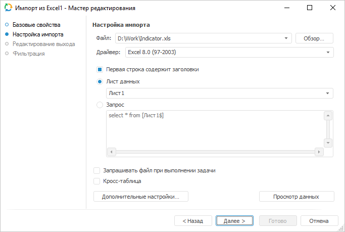
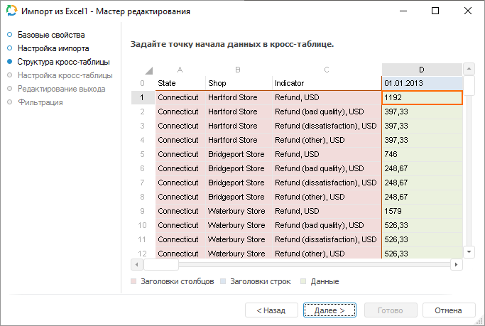
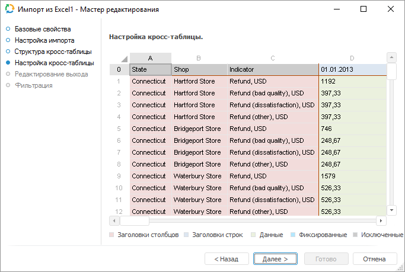

# Источник данных «Excel»: Задача ETL, настольное приложение

Источник данных «Excel»: Задача ETL, настольное приложение
-

# Excel

	Коннектор «Excel» - объект,
	 предназначенный для извлечения данных из файла формата Microsoft Excel
	 (*.xls или *.xlsx). Для импорта данных из файлов Microsoft Excel в
	 операционной системе разрядностью 64 бита «Форсайт. Аналитическая платформа»
	 и Microsoft Office должны иметь такую же разрядность.

	Примечание.
	 Для импорта данных из файлов Excel с большим объёмом данных может
	 потребоваться большое количество оперативной памяти. Для предотвращения
	 такой ситуации перенесите данные из файла Excel в текстовый файл и
	 воспользуйтесь коннектором «[Текст](UiEtl_Inputs_Text.htm)».

	После добавления коннектора на рабочее пространство задачи ETL задайте
	 базовые свойства и настройки импорта. Также можно отредактировать
	 выход коннектора и задать параметры фильтрации данных.

## Базовые свойства

В базовых свойствах задаются наименование объекта, идентификатор и примечание.

## Настройка импорта

	На странице «Настройка импорта»
	 указывается файл с импортируемыми данными и параметры, которые используются
	 для определения диапазона с данными.

	

	В поле «Файл» укажите импортируемый
	 файл Microsoft Excel. Для выбора файла нажмите кнопку «Обзор».

	В зависимости от используемого формата файла и его драйвера, будет
	 доступен различный набор настроек:

	[Файлы в
	 формате XLSX](javascript:TextPopup(this))

		В раскрывающемся списке «Лист
		 данных» выберите лист, с которого будут импортированы данные.

		Для настройки импорта укажите параметры:

			- Пропустить первые N
			 строк. Укажите количество строк, которые необходимо
			 пропустить при импорте. Если указан «0», то данные будут импортированы
			 с начала листа;

			- Строка с заголовками.
			 Укажите, содержит ли лист данных заголовки столбцов. Если
			 на листе присутствуют заголовки, то установите флажок и укажите
			 номер строки, содержащей заголовки (нумерация строк начинается
			 с нуля). Это позволит исключить заголовки из данных для импорта.
			 Если на листе отсутствуют заголовки, то снимите флажок.

	[Файлы в
	 формате XLS](javascript:TextPopup(this))

		В раскрывающемся списке выберите драйвер версии Microsoft Excel,
		 в который был сохранен файл. По умолчанию используется драйвер
		 ExcelEx. Если используется
		 данный драйвер, то будут доступны настройки, аналогичные формату
		 XLSX. Если используется
		 другой драйвер, то будут доступны настройки:

			- Первая строка содержит
			 заголовки. При установленном флажке значения первой
			 строки будут идентифицированы как наименования столбцов. Если
			 флажок снят, то первая строка таблицы будет расценена как
			 строка данных;

			- Способ
			 расположения импортируемых данных:

				- Лист данных.
				 В раскрывающемся списке выберите лист, с которого будут
				 импортированы данные;

				- Запрос.
				 В поле ввода сформируйте запрос, на основе которого будет
				 осуществлена выборка данных из файла.

		Примечание.
		 При импорте данных из файла формата XLS
		 с использованием драйвера Excel
		 8.0 (97-2003) длина записи поля будет определяться автоматически
		 по первым восьми строкам, по которым также определяется тип данных.
		 Если тип данных определен как текст и в этих строках
		 отсутствуют значения, длина которых больше 255 символов, то при
		 импорте все строковые значения будут загружены с ограничением
		 в 255 символов. Это связано с тем, что провайдер [Microsoft
		 Jet OLE DB 4.0](http://www.connectionstrings.com/microsoft-jet-ole-db-4-0/) использует для определения типа данных и вычисления
		 максимальной длины только первые восемь строк.

		Для избежания обрезания записей задайте в ключе [HKEY_LOCAL_MACHINE\SOFTWARE\Microsoft\Jet\4.0\Engines\Excel\TypeGuessRows]
		 необходимое значение. Если установить значение = 0, то определение
		 типа данных и вычисление максимальной длины будет производиться
		 по всем записям строк, что может сказаться на производительности
		 системы.

	Если установить флажок «Запрашивать
	 файл при выполнении задачи», то при выполнении задачи ETL будет
	 открыт диалог для выбора файла Microsoft Excel. По умолчанию флажок
	 снят, при этом работа осуществляется с тем файлом, который указан
	 в поле «Файл».

	Для задания дополнительных настроек, которые используются при идентификации
	 данных, нажмите кнопку «Дополнительные
	 настройки». Будет открыто окно «[Дополнительные
	 настройки](additional_settings.htm)». Для предварительного [просмотра
	 данных](../Page_browse_data.htm), отобранных по запросу, нажмите кнопку «Просмотр
	 данных».

	Примечание.
	 После того, как определены настройки импорта, структура файла не должна
	 изменяться. Если файл запрашивается при выполнении задачи и задача
	 используется несколько раз для загрузки данных из разных файлов, то
	 структура этих файлов должна быть одинаковая и соответствовать тому
	 файлу, который использовался при первичной настройке коннектора в
	 задаче ETL.

## Кросс-таблица

	Кросс-таблица - это сводная
	 таблица, в которой заголовки могут располагаться как по строкам, так
	 и по столбцам, позволяя таким образом отразить взаимосвязь двух и
	 более переменных друг с другом.

	При установке флажка «Кросс-таблица»
	 будут доступны дополнительные страницы, на которых задаются настройки
	 по идентификации данных в кросс-таблице:

		- Структура кросс-таблицы;

		- Настройка кросс-таблицы.

## Структура кросс-таблицы

	Кросс-таблица - это сводная
	 таблица, в которой заголовки могут располагаться как по строкам, так
	 и по столбцам, позволяя таким образом отразить взаимосвязь двух и
	 более переменных друг с другом.

	Для настройки структуры кросс-таблицы для выбранного источника импорта:

		- Нажмите на кнопку «Настройки» на
		 странице «Настройка
		 импорта».

		- В появившемся [окне](additional_settings.htm) установите флажок «Кросс-таблица».

	Перейдите на появившуюся в мастере создания и редактирования источника
	 данных «[Excel](UiEtl_Inputs_Excel.htm)»
	 страницу «Структура кросс-таблицы»:

	

	Мастер редактирования автоматически определяет область начала числовых
	 данных. Если необходимо, то измените область начала данных, выделив
	 нужную ячейку с помощью кнопки мыши или клавиш управления.

	Цвет выделенных ячеек отражает тип данных. Зависимость типа данных
	 от цвета ячеек указана в легенде. Белым цветом выделяются ячейки,
	 которые будут исключены при настройке
	 кросс-таблицы и импортированы не будут. Ячейки, которые были исключены,
	 будут использованы как заголовки столбцов.

## Настройка кросс-таблицы

	Для настройки кросс-таблицы:

		- Настройте её структуру.

		- Перейдите на страницу «Настройка
		 кросс-таблицы»:

	

	На данной странице существует возможность изменить диапазон импортируемых
	 данных:

		- исключение строк/столбцов.
		 Выполните команду «Исключить»
		 в контекстном меню для крайних столбцов и/или строк. Данные этих
		 столбцов импортированы не будут. Нельзя исключить единственную
		 строку или столбец. Для добавления исключённых строк или столбцов
		 в диапазон импортируемых данных выполните команду «Включить»
		 в контекстном меню столбцов и/или строк;

		- фиксация ячеек, которые
		 попали в исключение. Выполните команду «Добавить
		 фиксированную ячейку» в контекстном меню ячейки. Исключёнными
		 считаются ячейки, которые находятся за пределами кросс-таблицы,
		 т.е. исключённые из заголовков строк и столбцов и не являющимися
		 данными. Для удаления фиксированной ячейки выполните команду «Удалить фиксированную ячейку»
		 в контекстном меню ячейки.

## Редактирование выхода

На странице «Редактирование выхода»
 задаётся связь с объектом-приёмником, в который будут выгружаться данные
 при выполнении задачи ETL.

Примечание.
 Страница является общей для всех коннекторов и преобразователей данных,
 кроме преобразователей «[Разделение](../04_Transformers/01_Split/uietl_split.htm)»
 и «[Алгоритм пользователя](../04_Transformers/09_algorithm/UiEtl_Trfs_Algorithm.htm)». Рассмотрим
 настройку списка полей и связи выхода на примере мастера редактирования
 источника данных «[Репозиторий](UiEtl_Inputs_Repo.htm)».

На странице доступны следующие настройки:

[Идентификатор](javascript:TextPopup(this))

	Укажите идентификатор выхода редактируемого объекта. Возможно использование
	 символов латинского алфавита, цифр и специального символа «_».

[Связь с объектом](javascript:TextPopup(this))

	Установите связь с объектом-приёмником, в который будут выгружаться
	 данные. Для этого из раскрывающегося списка выберите объект задачи
	 ETL.

[Поля](javascript:TextPopup(this))

	Поля объекта-приёмника, в которые будут выгружаться данные, предназначены
	 для определения формата вывода данных.

	Примечание.
	 Редактирование списка полей доступно только для коннекторов к источнику
	 данных. Для коннекторов к приёмнику данных список полей заполняется
	 автоматически.

	Для добавления в список всех полей из связанного объекта-приёмника:

		- Нажмите кнопку «Заполнить
		 из».

		- В раскрывающемся меню кнопки выберите пункт «Из приёмника».

	После выполнения действий в список полей будут добавлены все поля
	 из связанного объекта-приёмника данных.

	Для добавления в список всех полей из связанного объекта-источника:

		- Нажмите кнопку «Заполнить
		 из».

		- В раскрывающемся меню кнопки выберите пункт «Из
		 источника».

	После выполнения действий в список полей будут добавлены все поля
	 из связанного объекта-источника данных.

	Для добавления нового поля:

		- Нажмите кнопку «Добавить».
		 Будет открыто окно «Свойства
		 поля»:

	

		- Задайте в открывшемся окне значения атрибутов поля:

			- Идентификатор.
			 Укажите уникальный идентификатор поля. По умолчанию FIELD<Порядковый номер поля>;

			- Наименование.
			 Укажите наименование поля. По умолчанию FIELD<Порядковый
			 номер поля>;

			- Тип. Из раскрывающегося
			 списка выберите тип данных поля: строковый, целый, вещественный,
			 дата, текстовый. По умолчанию установлен строковый тип данных;

			- Вычисляемое поле.
			 Установите данный флажок для задания формулы, по которой будет
			 вычисляться значение поля. После установки флажка введите
			 выражение с помощью клавиатуры или [редактора выражений](UiNav.chm::/GUI/ExpressionEditor.htm),
			 который открывается при нажатии на кнопку 
			 «Обзор».

			Для увеличения значения каждой новой записи на фиксированную
			 величину используйте специальное выражение INCREMENT.

	Примечание.
	 Специальное выражение INCREMENT
	 доступно только для вычисляемого поля целого типа.

	Синтаксис данного выражения: INCREMENT[Value1,
	 Value2], где Value1 - начальное значение, Value2 - шаг, на который
	 значение Value1 должно увеличиваться при каждом вызове выражения.
	 При каждой загрузке данных заполнение будет начинаться с начального
	 значения.

		- Нажмите кнопку «ОК».

	После выполнения действий будет добавлено новое поле.

	Для редактирования поля:

		- дважды щёлкните по полю кнопкой мыши;

		- выделите необходимое поле и нажмите кнопку «Редактировать».

	После выполнения действий будет открыто окно «Свойства
	 поля», приведённое выше.

	Для удаления выбранного поля нажмите кнопку «Удалить».
	 Поле будет удалено без подтверждения выполняемого действия.

	Для изменения порядка выгрузки данных в коннектор выделите необходимое
	 поле и переместите его в списке полей с помощью кнопок 
	 «Вверх» и 
	 «Вниз».

## Фильтрация

На странице «Фильтрация» задаётся
 условие, в соответствии с которым будут отбираться импортируемые данные.

Примечание.
 Страница является общей для всех коннекторов к источникам данных, кроме
 коннектора «[Источник
 пользователя](Uietl_Inputs_User.htm)». Рассмотрим настройку фильтрации данных источника на
 примере мастера редактирования источника данных «[Репозиторий](UiEtl_Inputs_Repo.htm)».

Для формирования условия фильтрации нажмите кнопку 
 «Обзор». Будет открыто окно [редактора выражения](UiNav.Chm::/GUI/ExpressionEditor.htm).
 Для составления выражения доступны все поля источника. Импортированы будут
 те данные, которые удовлетворяют заданному условию.

См. также:

[Начало
 работы с инструментом «Задача ETL» в веб-приложении](../../../Web/01_General_Info/UiETL_StartingToWork.htm) | [Коннекторы к исходным данным](UiEtl_Inputs.htm)

		Справочная
		 система на версию 10.9
		 от 18/08/2025,
		 © ООО «ФОРСАЙТ»,
