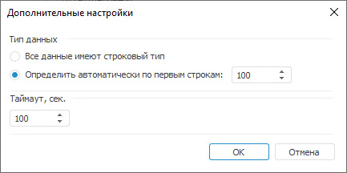

# Дополнительные настройки: Задача ETL, настольное приложение

Дополнительные настройки: Задача ETL, настольное приложение
-

# Дополнительные настройки

Для определения типа данных импортируемых полей и других параметров
 используйте окно «Дополнительные настройки».

[Для открытия
 окна](javascript:TextPopup(this))

		- В мастере редактирования источника данных задачи ETL перейдите
		 на страницу «Настройка импорта».

		- Нажмите на кнопку «Дополнительные
		 настройки».

В группе «Тип данных» выберите
 способ определения типа данных полей:

	- Все данные имеют строковый
	 тип. Все данные будут рассматриваться как строковые и импортироваться
	 будут также в строковые поля;

	- Определить автоматически по
	 первым строкам. Укажите количество строк, по которым будет
	 определяться тип данных.

В области «Таймаут» задайте
 время выполнения запроса в секундах. Если запрос не будет выполнен за
 указанное время, то его выполнение будет остановлено.

См. также:

[Начало
 работы с инструментом «Задача ETL» в веб-приложении](../../../Web/01_General_Info/UiETL_StartingToWork.htm) | [Коннекторы к исходным данным](UiEtl_Inputs.htm)

		Справочная
		 система на версию 10.9
		 от 18/08/2025,
		 © ООО «ФОРСАЙТ»,
