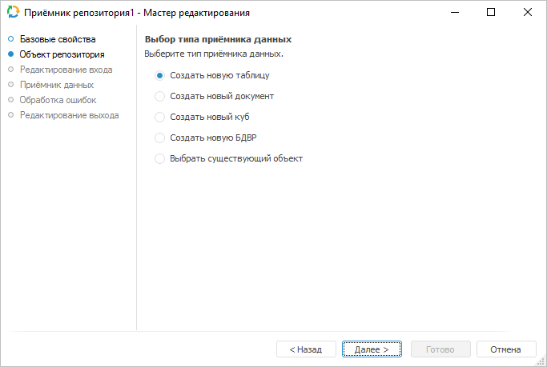
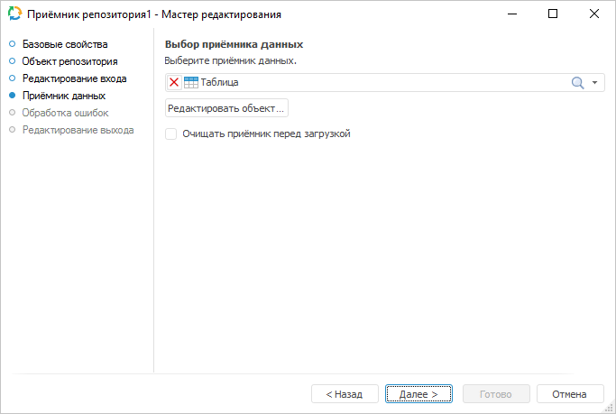
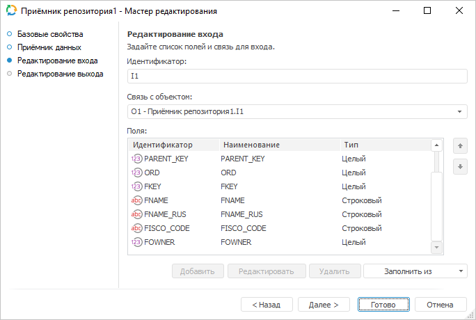
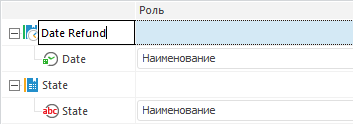
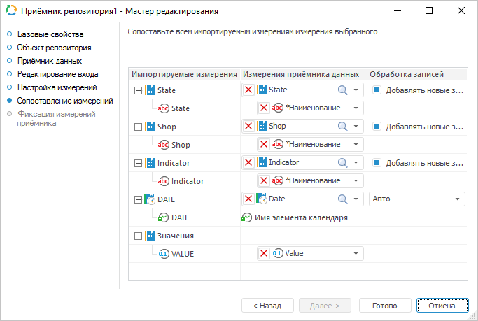
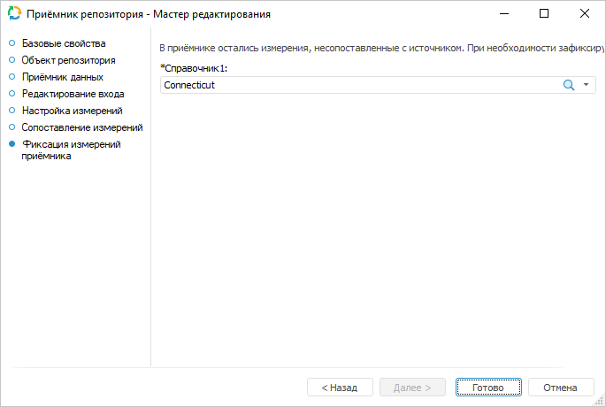
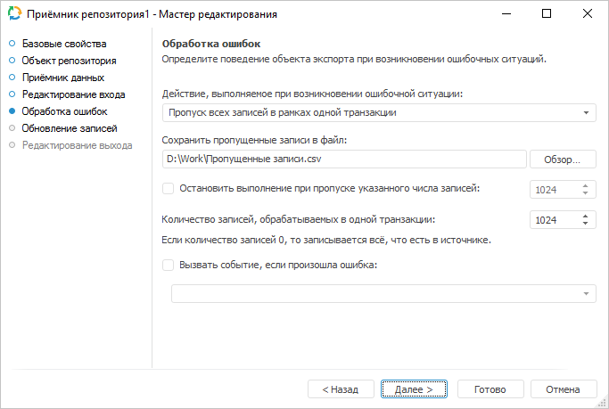
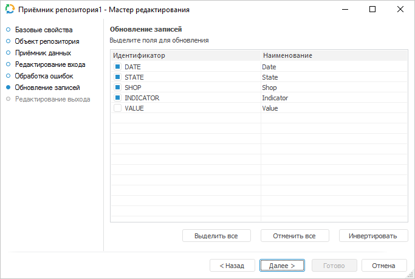

# Приёмник данных «Репозиторий»: Задача ETL, настольное приложение

Приёмник данных «Репозиторий»: Задача ETL, настольное приложение
-

# Репозиторий

	Коннектор «Репозиторий»
	 - объект, предназначенный для загрузки данных в объекты репозитория.

	После добавления коннектора на рабочее пространство задачи ETL задайте
	 базовые свойства, источник данных в репозитории, настройки экспорта.

	В зависимости от объекта репозитория, используемого в качестве приёмника,
	 контекстное меню приёмника будет содержать дополнительные команды:

		- существующий куб или база данных временных рядов:

			- Открыть с помощью.
			 Будет открыт указанный объект репозитория в одном из инструментов
			 продукта «Форсайт. Аналитическая платформа»:
			 «[Аналитические
			 панели](UiAdhoc.chm::/UiAdhoc_Purpose.htm)», «[Отчеты](UiReport.chm::/UiReport_purpose.htm)»,
			 «[Аналитические
			 запросы](UiExpress.chm::/purpose/UiExpress_Purpose.htm)»;

		- таблица:

			- Открыть приёмник данных.
			 Будет открыта таблица, указанная в качестве приёмника данных;

			- Редактировать приёмник
			 данных. Будет открыт мастер редактирования таблицы,
			 указанной в качестве приёмника данных;

		- документ:

			- Просмотр данных.
			 Будет открыто [окно для
			 просмотра данных](../../Page_browse_data.htm) документа.

## Базовые свойства

В базовых свойствах задаются наименование объекта, идентификатор и примечание.

## Объект репозитория

	Страница «Объект репозитория»
	 отображается только при создании нового приёмника:

	

	Выберите тип приёмника, в который будет производиться экспорт. Если
	 создается новый объект, то при переходе к странице «Приёмник данных» будет выдан
	 диалог сохранения нового объекта в репозиторий.

## Приёмник данных

	Укажите объект текущего репозитория, который будет являться приёмником
	 данных.

	

	Приёмниками могут быть следующие объекты репозитория:

		- Справочник НСИ, составной справочник НСИ;

		- Наборы данных (таблица, присоединенная таблица, представление,
		 запрос, источник данных ODBC);

		- Документ;

		- Стандартный куб;

		- База данных временных рядов.

	При установке флажка «Очищать приёмник
	 перед загрузкой» все данные из объекта-приёмника будут удалены
	 перед выполнением загрузки. При снятом флажке осуществляется добавление
	 новых и обновление существующих данных.

	Если приёмником является справочник НСИ, то в раскрывающемся списке
	 можно выбрать способ обновления элементов. Доступны следующие варианты:

		- Замещать все элементы.
		 Элементы, которых нет в источнике - будут удалены.

		- Добавлять новые (отсутствующие
		 элементы). Добавляются только новые элементы, существующие
		 не обновляются.

		- Обновлять существующие
		 элементы. Обновляются только существующие элементы, новые
		 не добавляются.

		- Добавлять новые элементы
		 и обновлять существующие. Добавляются новые, обновляются
		 существующие элементы. Элементы, которых нет в источнике, не обновляются.

	Примечание.
	 При выборе в качестве приёмника стандартного куба, базы данных временных
	 рядов, справочника НСИ или составного справочника НСИ, флажок «Очищать приёмник перед загрузкой»
	 и кнопка «Редактировать объект»
	 будут недоступны.

	Кнопка «Редактировать объект»
	 открывает мастер редактирования выбранного объекта, если он предусмотрен.

	Если происходит создание нового приёмника и на странице «Объект репозитория» выбран вариант
	 создания нового объекта, то при переходе к текущей странице будет
	 выдан диалог сохранения нового объекта в репозиторий. Созданный объект
	 автоматически будет выбран в раскрывающемся списке. Также в списке
	 будет выставлен фильтр, позволяющий выбрать другие объекты только
	 того типа, который был указан на странице «Объект репозитория».

## Настройка экспорта

	Для задания параметров, которые используются для определения экспортируемого
	 диапазона с данными, используйте страницу «Настройка
	 экспорта».

	Примечание.
	 Для отображения данной страницы в мастере приёмника данных «[Репозиторий](UiEtl_Outputs_Repo.htm)» необходимо на странице
	 «Приёмник
	 данных» в качестве приёмника данных указать файл типа «[Документ](UiNavObj.chm::/UiNavObj/UiNavObj_document.htm)».

	Настройки зависят от типа документа и аналогичны настройкам экспорта
	 для [приёмника данных](../UiEtl_Outputs.htm) такого же
	 формата.

	Например, при использовании в качестве приёмника данных [документа](UiNavObj.chm::/UiNavObj/UiNavObj_document.htm)
	 с расширением *.xlsx, страница «Настройка
	 экспорта» примет следующий вид:

	

## Редактирование входа

Для задания списка полей и связи для входа используйте страницу «Редактирование входа».

На странице доступны следующие параметры:

[Идентификатор](javascript:TextPopup(this))

	Укажите идентификатор входа редактируемого объекта. Возможно использование
	 символов латинского алфавита, цифр и специального символа «_».

[Связь с объектом](javascript:TextPopup(this))

	Установите связь с объектом. Для этого из раскрывающегося списка
	 выберите объект задачи ETL. Данные из объекта будут поступать на вход.

[Поля](javascript:TextPopup(this))

	Добавьте необходимые поля объекта задачи ETL в список. В указанные
	 поля будут выгружаться данные.

	Для добавления в список всех полей из связанного со входом объекта,
	 являющегося приёмником:

		- Нажмите кнопку «Заполнить
		 из».

		- В раскрывающемся меню кнопки выберите пункт «Из приёмника».

	Для добавления в список всех полей из связанного с выходом объекта,
	 являющегося источником:

		- Нажмите кнопку «Заполнить
		 из».

		- В раскрывающемся меню кнопки выберите пункт «Из
		 источника».

	Для добавления нового поля нажмите кнопку «Добавить».
	 Будет открыто окно для указания значения атрибутов поля:

	

	Примечание.
	 Вид окна «Свойства поля» зависит
	 от выбранного источника данных.

	Задайте в нем значения атрибутов поля:

		- Идентификатор. Уникальный
		 идентификатор поля;

		- Наименование. Наименование
		 поля;

		- Тип данных. Из раскрывающегося
		 списка выберите тип данных поля;

		- Общая длина. Определите
		 общую длину поля. Доступно только для строкового и вещественного
		 типов данных;

		- Десятичных знаков.
		 Определите количество знаков после запятой. Доступно только для
		 вещественного типа данных;

		- Вычисляемое поле.
		 Для задания формулы, по которой будет вычисляться значение поля,
		 установите данный флажок. После установки флажка введите выражение
		 с помощью клавиатуры или [редактора выражений](UiNav.chm::/GUI/ExpressionEditor.htm),
		 который открывается при нажатии на кнопку .

		Для увеличения значения каждой новой записи на фиксированную величину
		 используйте специальное выражение INCREMENT.

	Примечание.
	 Специальное выражение INCREMENT
	 доступно только для вычисляемого поля целого типа.

	Синтаксис данного выражения: INCREMENT[Value1,
	 Value2], где Value1 - начальное значение, Value2 - шаг, на который
	 значение Value1 должно увеличиваться при каждом вызове выражения.
	 При каждой загрузке данных заполнение будет начинаться с начального
	 значения.

	Для редактирования поля:

		- дважды щелкните по полю кнопкой мыши;

		- выделите необходимое поле и нажмите кнопку «Редактировать».

	Для удаления выбранного поля нажмите кнопку «Удалить».
	 Поле будет удалено без подтверждения выполняемого действия.

	Для перемещения поля, выделенного в списке, используйте кнопки 
	 «Вверх» и 
	 «Вниз».

Примечание.
 Скриншот сделан на примере мастера редактирования приёмника данных «Репозиторий».

## Настройка измерений

	Для изменения наименований измерений и их состава используйте страницу
	 «Настройка измерений».

	

	[Изменение
	 наименования измерения](javascript:TextPopup(this))

		Для переименования измерения:

			- Переведите наименование измерения в режим редактирования:

				- щелкните в области наименования;

				- нажмите клавишу F2.

			- Введите новое значение:

		

	[Изменение
	 состава измерения](javascript:TextPopup(this))

		После идентификации данных формируется структура будущего приёмника
		 данных в репозитории. Каждое поле источника связывается с измерением
		 следующим образом:

			- атрибуты, содержащие значения вещественного и целого типа, будут
			 считаться атрибутами с данными. Они будут связаны с измерением
			 фактов. Каждый атрибут связывается с отдельным фактом;

			- атрибуты, содержащие значения типа Дата или ДатаВремя, будут связаны
			 с календарными измерениями. Параметры календарного измерения
			 будут установлены в зависимости от идентифицированного диапазона
			 дат;

			- все остальные атрибуты будут связаны с отдельными измерениями.
			 Значения атрибутов будут импортироваться как наименования
			 элементов этих измерений.

		Примечание.
		 При работе с кросс-таблицей соседние
		 атрибуты, имеющие разный тип, могут будут объединены в одно измерение.

		При необходимости атрибуты можно объединить в одно измерение.
		 Для этого выделите необходимые атрибуты и переместите их в область
		 нужного измерения, используя механизм Drag&Drop. При этом
		 для атрибутов, находящихся в одном измерении, появится возможность
		 изменения роли:

			- Наименование.
			 Значения атрибутов с ролью «Наименование» импортируются
			 как наименования элементов. Если данная роль установлена для
			 нескольких атрибутов, то создается иерархическое измерение.
			 Используя данную роль, можно организовать произвольные иерархии.
			 Объединение с календарным измерением не допустимо;

			- Атрибут. Значения
			 атрибутов с ролью «Атрибут» рассматриваются
			 как дополнительные характеристики каждого элемента этого измерения.
			 Данные значения будут использоваться для связи фактических
			 данных с определенными элементами измерения;

			- Код территории.
			 В качестве территориального измерения источника данных должен
			 использоваться строковый атрибут с идентификатором «TERRID». При работе с картой
			 данный атрибут должен содержать коды территорий по стандарту
			 ISO 3166-1.

	В зависимости от типа выбранного источника данных при нажатии на
	 кнопку «Далее» будет осуществлен
	 переход на следующую страницу.

## Сопоставление измерений

	Для связи импортируемых измерений с существующими справочниками
	 репозитория используйте страницу «Сопоставление
	 измерений».

	

	Для связи измерения с существующим справочником выберите справочник
	 в раскрывающемся списке напротив необходимого измерения. Для выбора
	 доступны:

		- календарные справочники;

		- справочники НСИ;

		- составные справочники НСИ.

	Для добавления при импорте новых элементов в измерение из атрибута
	 указанного справочника установите флажок «Добавлять
	 новые записи». По умолчанию флажок установлен. Если флажок
	 снят, то элементы не добавляются. Импорт данных будет производиться
	 только по тем элементам, которые присутствуют в источнике и в выбранном
	 справочнике. Для привязки к данным будут использоваться только имеющиеся
	 в справочнике элементы.

	Примечание.
	 Учитывайте имеющиеся особенности при импорте в [иерархические](UiNavObj.chm::/Data_import_wizard/Features_Import_Into_An_Existing_Dimensions.htm#hierarchical)
	 или [мультиязычные](UiNavObj.chm::/Data_import_wizard/Features_Import_Into_An_Existing_Dimensions.htm#multilanguage)
	 справочники.

	Если измерение не связано с существующим справочником, то для него
	 будет создан новый справочник НСИ.

## Фиксация измерений приёмника

	Для осуществления фиксации отметки измерений приёмника, которые
	 не были сопоставлены с измерениями источника, используйте страницу
	 «Фиксация измерений приёмника».
	 Страница будет доступна, если в качестве приёмника выбран существующий
	 куб или база данных временных рядов и на вкладке «Сопоставление
	 измерений» была сброшена привязка хотя бы для одного измерения.

	

	Зафиксируйте измерения, выбрав в раскрывающихся списках необходимые
	 элементы. К выбранным элементам будет осуществлена привязка копируемых
	 данных.

## Обработка ошибок

На странице «Обработка ошибок»
 определяется поведение объекта экспорта при возникновении ошибочных ситуаций.

Примечание.
 Страница является общей для всех коннекторов к приёмникам данных, кроме
 приёмников «[XML](../XML/UiEtl_outputs_XML.htm)», «[Текст](../Text/UiEtl_Outputs_Text.htm)»,
 «[JSON](../JSON/JSON_Outputs.htm)»
 и «[Приёмник пользователя](../User/UiEtl_Outputs_User.htm)». Рассмотрим
 настройку параметров для обработки ошибок на примере мастера редактирования
 приёмника данных «[Репозиторий](UiEtl_Outputs_Repo.htm)».

Если в настройках задачи ETL задан [обработчик
 событий](../../../06_CreateETL/Event_Handling.htm), то при возникновении ошибок будет генерироваться событие
 OnError. Также можно определить дальнейшее поведение объекта экспорта
 при возникновении ошибочных ситуаций:

	- Действие,
	 выполняемое при возникновении ошибочной ситуации. Выберите
	 в раскрывающемся списке действие, которое будет выполняться при возникновении
	 ошибок во время выгрузки данных:

		- Остановка расчёта задачи.
		 При возникновении ошибки экспорта будет полностью остановлено
		 выполнение задачи ETL;

		- Пропуск только некорректных
		 записей. При возникновении ошибки экспорта будут исключены
		 записи с ошибочными ситуациями. Используйте данное действие, когда
		 наличие всех записей некритично;

		- Пропуск всех записей в
		 рамках одной транзакции. При возникновении ошибки экспорта
		 будут исключены все записи той транзакции, в которой возникнет
		 ошибочная ситуация. Используйте данное действие, когда требуется
		 разделить весь объём записей на транзакции, в рамках которых необходимо
		 получение всех данных без исключения;

При выборе действий «Пропуск
 только некорректных записей» или «Пропуск
 всех записей в рамках одной транзакции» доступно указание файла
 для сохранения пропущенных записей.

	- Сохранить
	 пропущенные записи в файл. Укажите путь до файла для сохранения
	 пропущенных записей или выберите его с помощью кнопки «Обзор».
	 Если файл с указанным названием отсутствует, то он будет создан автоматически.

	Пропущенные записи будут сохранены в указанный файл, если для обработки
	 ошибок задачи установлено действие «Пропуск
	 только некорректных записей» или «Пропуск
	 всех записей в рамках одной транзакции». Перед загрузкой в
	 существующий файл данные в файле стираются.

	Параметры сохранения записей в файл:

		- кодировка: Unicode;

Примечание.
 Если при экспорте не было пропущенных записей, то в файл записывается
 текст «яю». Это означает пустой Unicode-файл в кодировке Win.

		- разделитель строк: {Возврат каретки}{Перевод строки};

		- разделитель полей: ; (точка с запятой);

		- ограничитель текста: "" (двойные кавычки).

Примечание.
 По умолчанию формируется следующее имя файла: «<идентификатор приёмника>_пропущенные
 записи.csv».

По каждой пропущенной записи в [журнале
 ETL](../../../04_Work/04_Jurnal/UiEtl_Jurnal.htm) создаётся отдельная запись, содержащая номер пропущенной записи,
 текст ошибки и информацию об ошибочном поле. Если были пропущены все записи
 в рамках транзакции из-за какой-либо одной ошибочной записи, то в журнале
 эта причина выводится в поле «Описание».

	- Остановить
	 выполнение при пропуске указанного числа записей. При необходимости
	 установите флажок и укажите пороговое количество ошибочных записей,
	 при превышении которого экспорт будет остановлен;

	- Количество записей, обрабатываемых
	 в одной транзакции. Укажите количество записей, которые будут
	 обрабатываться в рамках одной транзакции. Механизм транзакций рекомендуется
	 использовать для оптимизации времени, затрачиваемого на экспорт данных.
	 Все записи в рамках одной транзакции обрабатываются как единое целое:
	 если происходит ошибка при выгрузке хотя бы одной записи из транзакции,
	 то неуспешной будет вся транзакция. По умолчанию обрабатывается тысяча
	 записей.

Примечание.
 Если распределять записи по транзакциям не требуется, то укажите количество
 записей, равное нулю. В таком случае все записи из источника будут выгружаться
 по очереди. Данная настройка применяется только в том случае, если в раскрывающемся
 списке «Действие, выполняемое при возникновении
 ошибочной ситуации» выбрано действие «Остановка
 расчёта задачи» или «Пропуск только
 некорректных записей».

	- Вызвать событие, если произошла
	 ошибка. Установка флажка
	 позволяет выбрать пользовательское событие, которое будет генерироваться
	 при возникновении ошибки. В списке отображаются события, созданные
	 в [пользовательских
	 метаданных](UiDevEnv.chm::/04_NavigatorSetting/Classes_Object/Classes_Events.htm) репозитория. Отслеживание события осуществляется
	 в [планировщике
	 задач](UiAppSrv.chm::/UiAppSrv_purpose.htm),
	 задачи должны быть настроены на выполнение [по
	 наступлению настраиваемого события](UiAppSrv.chm::/3_Work_Tasks/UiAppSrv_Work_Tasks_CreateTask_TimeTable.htm#customevent).

После выполнения действий будет настроено поведение объекта экспорта
 при возникновении ошибочных ситуаций во время выгрузки данных.

	Примечание.
	 Страница «Обработка ошибок»
	 отображается в мастере редактирования, если в качестве [приёмника](#receiver)
	 выбран объект типа «[Таблица](UiNavObj.chm::/Table/UiDb_relational_table.htm)»
	 или «[Документ](UiNavObj.chm::/UiNavObj_document.htm)».

## Обновление записей

	Для выбора полей для обновления в источнике и приёмнике данных используйте
	 страницу «Обновление записей».

	

	В столбце «Идентификатор»
	 отметьте флажками поля, которые будут использоваться для сопоставления
	 записей в источнике и приёмнике.

	Для отметки всех полей для обновления нажмите кнопку «Выделить
	 все».

	Для снятия отметки со всех полей нажмите кнопку «Отменить
	 все».

	Для одновременного перевода отмеченных полей в неотмеченные, а неотмеченные
	 - в отмеченные, нажмите кнопку «Инвертировать».

	Примечание.
	 Обновление записей имеет смысл, если приёмник не очищается перед загрузкой
	 данных.

## Редактирование выхода

На странице «Редактирование выхода»
 задаётся связь с объектом-приёмником, в который будут выгружаться данные
 при выполнении задачи ETL.

Примечание.
 Страница является общей для всех коннекторов и преобразователей данных,
 кроме преобразователей «[Разделение](../../04_Transformers/01_Split/uietl_split.htm)»
 и «[Алгоритм пользователя](../../04_Transformers/09_algorithm/UiEtl_Trfs_Algorithm.htm)». Рассмотрим
 настройку списка полей и связи выхода на примере мастера редактирования
 источника данных «[Репозиторий](../../02_Inputs/UiEtl_Inputs_Repo.htm)».

На странице доступны следующие настройки:

[Идентификатор](javascript:TextPopup(this))

	Укажите идентификатор выхода редактируемого объекта. Возможно использование
	 символов латинского алфавита, цифр и специального символа «_».

[Связь с объектом](javascript:TextPopup(this))

	Установите связь с объектом-приёмником, в который будут выгружаться
	 данные. Для этого из раскрывающегося списка выберите объект задачи
	 ETL.

[Поля](javascript:TextPopup(this))

	Поля объекта-приёмника, в которые будут выгружаться данные, предназначены
	 для определения формата вывода данных.

	Примечание.
	 Редактирование списка полей доступно только для коннекторов к источнику
	 данных. Для коннекторов к приёмнику данных список полей заполняется
	 автоматически.

	Для добавления в список всех полей из связанного объекта-приёмника:

		- Нажмите кнопку «Заполнить
		 из».

		- В раскрывающемся меню кнопки выберите пункт «Из приёмника».

	После выполнения действий в список полей будут добавлены все поля
	 из связанного объекта-приёмника данных.

	Для добавления в список всех полей из связанного объекта-источника:

		- Нажмите кнопку «Заполнить
		 из».

		- В раскрывающемся меню кнопки выберите пункт «Из
		 источника».

	После выполнения действий в список полей будут добавлены все поля
	 из связанного объекта-источника данных.

	Для добавления нового поля:

		- Нажмите кнопку «Добавить».
		 Будет открыто окно «Свойства
		 поля»:

	

		- Задайте в открывшемся окне значения атрибутов поля:

			- Идентификатор.
			 Укажите уникальный идентификатор поля. По умолчанию FIELD<Порядковый номер поля>;

			- Наименование.
			 Укажите наименование поля. По умолчанию FIELD<Порядковый
			 номер поля>;

			- Тип. Из раскрывающегося
			 списка выберите тип данных поля: строковый, целый, вещественный,
			 дата, текстовый. По умолчанию установлен строковый тип данных;

			- Вычисляемое поле.
			 Установите данный флажок для задания формулы, по которой будет
			 вычисляться значение поля. После установки флажка введите
			 выражение с помощью клавиатуры или [редактора выражений](UiNav.chm::/GUI/ExpressionEditor.htm),
			 который открывается при нажатии на кнопку 
			 «Обзор».

			Для увеличения значения каждой новой записи на фиксированную
			 величину используйте специальное выражение INCREMENT.

	Примечание.
	 Специальное выражение INCREMENT
	 доступно только для вычисляемого поля целого типа.

	Синтаксис данного выражения: INCREMENT[Value1,
	 Value2], где Value1 - начальное значение, Value2 - шаг, на который
	 значение Value1 должно увеличиваться при каждом вызове выражения.
	 При каждой загрузке данных заполнение будет начинаться с начального
	 значения.

		- Нажмите кнопку «ОК».

	После выполнения действий будет добавлено новое поле.

	Для редактирования поля:

		- дважды щёлкните по полю кнопкой мыши;

		- выделите необходимое поле и нажмите кнопку «Редактировать».

	После выполнения действий будет открыто окно «Свойства
	 поля», приведённое выше.

	Для удаления выбранного поля нажмите кнопку «Удалить».
	 Поле будет удалено без подтверждения выполняемого действия.

	Для изменения порядка выгрузки данных в коннектор выделите необходимое
	 поле и переместите его в списке полей с помощью кнопок 
	 «Вверх» и 
	 «Вниз».

См. также:

[Начало
 работы с инструментом «Задача ETL» в веб-приложении](../../../../Web/01_General_Info/UiETL_StartingToWork.htm) | [Приёмники данных](../UiEtl_Outputs.htm)

		Справочная
		 система на версию 10.9
		 от 18/08/2025,
		 © ООО «ФОРСАЙТ»,
