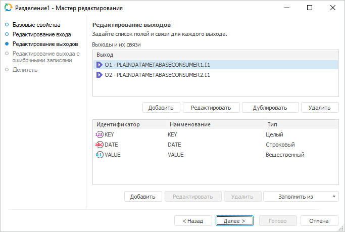
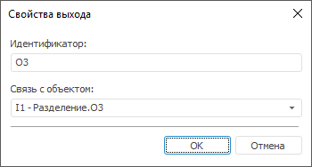
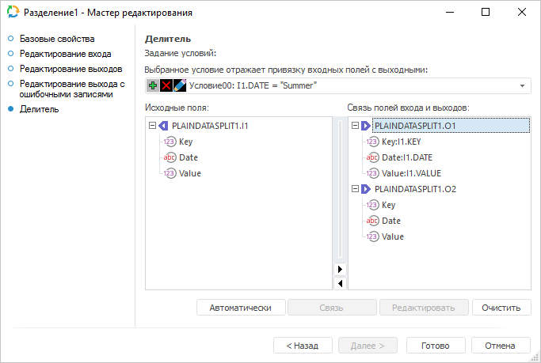
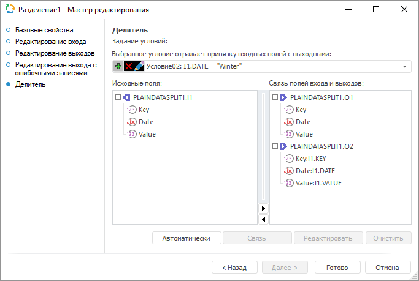

# Преобразователь «Разделение»: Задача ETL, настольное приложение

Преобразователь «Разделение»: Задача ETL, настольное приложение
-

# Разделение

	Преобразователь «Разделение»
	 - объект, выполняющий разделение данных. Объект «Разделение»
	 имеет один вход и произвольное число выходов. Разделение данных между
	 выходами выполняется при помощи условий, задающих привязку входных
	 полей с выходными.

	Упорядоченность и уникальность данных по каким-либо индексам для
	 операции разделения являются несущественными.

	При использовании преобразователя «Разделение»
	 из таблицы:

			 Key
			 Date
			 Value

			 1
			 Summer
			 1111

			 1
			 Winter
			 2222

			 2
			 Summer
			 3333

			 2
			 Winter
			 4444

			 3
			 Summer
			 5555

			 3
			 Winter
			 6666

	можно получить две таблицы:

			 Key
			 Date
			 Value

			 1
			 Summer
			 1111

			 2
			 Summer
			 3333

			 3
			 Summer
			 5555

	и:

			 Key
			 Date
			 Value

			 1
			 Winter
			 2222

			 2
			 Winter
			 4444

			 3
			 Winter
			 6666

## Базовые свойства

В базовых свойствах задаются наименование объекта, идентификатор и примечание.

## Редактирование входа

Для задания списка полей и связи для входа используйте страницу «Редактирование входа».

На странице доступны следующие параметры:

[Идентификатор](javascript:TextPopup(this))

	Укажите идентификатор входа редактируемого объекта. Возможно использование
	 символов латинского алфавита, цифр и специального символа «_».

[Связь с объектом](javascript:TextPopup(this))

	Установите связь с объектом. Для этого из раскрывающегося списка
	 выберите объект задачи ETL. Данные из объекта будут поступать на вход.

[Поля](javascript:TextPopup(this))

	Добавьте необходимые поля объекта задачи ETL в список. В указанные
	 поля будут выгружаться данные.

	Для добавления в список всех полей из связанного со входом объекта,
	 являющегося приёмником:

		- Нажмите кнопку «Заполнить
		 из».

		- В раскрывающемся меню кнопки выберите пункт «Из приёмника».

	Для добавления в список всех полей из связанного с выходом объекта,
	 являющегося источником:

		- Нажмите кнопку «Заполнить
		 из».

		- В раскрывающемся меню кнопки выберите пункт «Из
		 источника».

	Для добавления нового поля нажмите кнопку «Добавить».
	 Будет открыто окно для указания значения атрибутов поля:

	

	Примечание.
	 Вид окна «Свойства поля» зависит
	 от выбранного источника данных.

	Задайте в нем значения атрибутов поля:

		- Идентификатор. Уникальный
		 идентификатор поля;

		- Наименование. Наименование
		 поля;

		- Тип данных. Из раскрывающегося
		 списка выберите тип данных поля;

		- Общая длина. Определите
		 общую длину поля. Доступно только для строкового и вещественного
		 типов данных;

		- Десятичных знаков.
		 Определите количество знаков после запятой. Доступно только для
		 вещественного типа данных;

		- Вычисляемое поле.
		 Для задания формулы, по которой будет вычисляться значение поля,
		 установите данный флажок. После установки флажка введите выражение
		 с помощью клавиатуры или [редактора выражений](UiNav.chm::/GUI/ExpressionEditor.htm),
		 который открывается при нажатии на кнопку .

		Для увеличения значения каждой новой записи на фиксированную величину
		 используйте специальное выражение INCREMENT.

	Примечание.
	 Специальное выражение INCREMENT
	 доступно только для вычисляемого поля целого типа.

	Синтаксис данного выражения: INCREMENT[Value1,
	 Value2], где Value1 - начальное значение, Value2 - шаг, на который
	 значение Value1 должно увеличиваться при каждом вызове выражения.
	 При каждой загрузке данных заполнение будет начинаться с начального
	 значения.

	Для редактирования поля:

		- дважды щелкните по полю кнопкой мыши;

		- выделите необходимое поле и нажмите кнопку «Редактировать».

	Для удаления выбранного поля нажмите кнопку «Удалить».
	 Поле будет удалено без подтверждения выполняемого действия.

	Для перемещения поля, выделенного в списке, используйте кнопки 
	 «Вверх» и 
	 «Вниз».

Примечание.
 Скриншот сделан на примере мастера редактирования приёмника данных «Репозиторий».

## Редактирование выходов

	На странице «Редактирование выходов»
	 задаются связи с объектами-приёмниками, в которые будут выгружаться
	 данные при выполнении задачи ETL.

	

	В разделе «Выходы и их связи»
	 содержится список всех выходов из объекта-преобразователя, связанных
	 с приёмниками данных.

	Возможные операции для выходов:

	[Добавление
	 выхода](javascript:TextPopup(this))

		Для добавления выхода:

			- Нажмите кнопку «Добавить».
			 Будет открыто окно «Свойства
			 выхода»:

		

			- В строке «Идентификатор»
			 определите уникальный идентификатор выхода.

			- Из раскрывающегося списка «Связь
			 с объектом» выберите приёмник, на вход которого будут
			 поступать данные из объекта-преобразователя.

			После выбора объекта будет предложено заполнить список полей
			 из связанного входа.

		Будет создан выход, связанный с указанным объектом.

	[Редактирование
	 выхода](javascript:TextPopup(this))

		Для редактирования выхода:

			- Выберите необходимый выход из списка.

			- Нажмите кнопку «Редактировать».
			 Будет открыто окно «Свойства
			 выхода»:

		

			- Отредактируйте идентификатор.

			- В раскрывающемся списке «Связь
			 с объектом» выберите/смените объект-приёмник, на вход
			 которого будут поступать данные из объекта-преобразователя.
			 После выбора/смены объекта будет предложено заполнить список
			 полей из связанного входа.

		После выполнения действий будут изменены выход из объекта-приёмника
		 и/или его связь с преобразователем.

	[Дублирование
	 выхода](javascript:TextPopup(this))

		Дублирование позволяет создать копию ранее созданного выхода.

		Для дублирования выхода:

			- Выберите существующий выход.

			- Нажмите кнопку «Дублировать».
			 Будет открыто окно «Свойства
			 выхода»:

		

		Будет создана копия указанного выхода.

	[Удаление
	 выхода](javascript:TextPopup(this))

		Для удаления выхода:

			- Выберите необходимый выход.

			- Нажмите кнопку «Удалить».

		Выход будет удален без запроса подтверждения выполняемого действия.

	В разделе «Поля выходов»
	 содержится список полей и их свойств в выбранном выходе преобразователя
	 данных. Поля выхода связывают выходные поля преобразователя данных
	 с входными полями приёмников данных.

	

	Возможные операции для полей выходов:

	[Добавление
	 поля](javascript:TextPopup(this))

		Для создания поля:

			- Выберите необходимый выход. В нижней части окна появятся
			 поля выхода.

			- Добавьте поле в список:

				- нажмите кнопку «Добавить»;

				- нажмите клавишу INSERT;

				- дважды щёлкните по свободному пространству.

		Будет открыто окно:

		

			- Отредактируйте идентификатор и наименование. По умолчанию
			 они совпадают.

			- Выберите из раскрывающегося списка необходимый тип поля
			 в зависимости от типа данных приёмника.

		Будет создано поле с указанными параметрами.

	[Редактирование
	 поля](javascript:TextPopup(this))

		Для редактирования поля:

			- Выберите необходимый выход. В нижней части окна появятся
			 поля выхода.

			- Выберите необходимое поле/поля из списка.

		Совет. Для
		 множественного выделения используйте сочетание клавиш CTRL+A или
		 зажатую клавишу CTRL. Это позволит одновременно поменять тип данных
		 всех выбранных полей.

			- Нажмите кнопку «Редактировать».
			 Будет открыто окно:

		

			- Если необходимо, то отредактируйте идентификатор и наименование.
			 При множественном выделении полей редактирование идентификатора
			 и наименования будет недоступно.

			- Если необходимо, то измените в раскрывающемся списке
			 тип поля/полей.

		Будут изменены параметры поля/полей.

	[Удаление
	 поля](javascript:TextPopup(this))

		Для удаления поля:

			- Выберите необходимый выход. В нижней части окна появятся
			 поля источника/приёмника.

			- Выберите необходимое поле/поля из списка.

		Совет. Для
		 удаления нескольких полей воспользуйтесь множественным выделением
		 с помощью сочетания клавиш CTRL+A или зажатой клавиши CTRL.

			- Нажмите кнопку «Удалить».

		Поле будет удалено без подтверждения запрашиваемого действия.

	[Автоматическое
	 заполнение полей](javascript:TextPopup(this))

		Автоматическое заполнение полей позволяет быстро сформировать
		 список полей на выходе преобразователя «[Разделение](uietl_split.htm)».

		Для автоматического заполнения полей:

			- Выберите необходимый выход.

			- Выполните одну из команд кнопки «Заполнить
			 из»:

				- Из источника.
				 В список будут добавлены поля из источника данных;

				- Из приёмника.
				 В список будут добавлены поля из приёмника данных.

		В список добавятся поля источника или приёмника данных.

## Редактирование выхода с ошибочными записями

На странице «Редактирование выхода
 с ошибочными записями» задаётся связь с объектом-приёмником, в
 который будет экспортироваться информация об ошибочных записях, которые
 не были обработаны преобразователем.

Примечание.
 Страница является общей для всех преобразователей данных, кроме преобразователей
 «[Объединение](../02_Union/uietl_union.htm)»
 и «[Алгоритм пользователя](../09_algorithm/UiEtl_Trfs_Algorithm.htm)». Рассмотрим
 настройку списка полей и связи выхода на примере мастера редактирования
 преобразователя данных «[Разделение](uietl_split.htm)».

На странице доступны следующие настройки:

[Идентификатор](javascript:TextPopup(this))

	Укажите идентификатор выхода с ошибочными записями. Возможно использование
	 символов латинского алфавита, цифр и специального символа «_».

[Связь с объектом](javascript:TextPopup(this))

	Установите связь с объектом-приёмником, в который будет экспортироваться
	 информация об ошибочных записях. Для этого из раскрывающегося списка
	 выберите объект задачи ETL.

[Поля](javascript:TextPopup(this))

	Поля объекта-приёмника, в которые будут выгружаться данные, предназначены
	 для определения формата вывода данных. Список полей заполняется автоматически
	 при настройке связи с объектом-приёмником.

[Дополнительные
 настройки](javascript:TextPopup(this))

	Для задания дополнительных настроек, которые будут применяться при
	 возникновении ошибочных записей, выполните следующие действия:

		- Нажмите кнопку «Настройки».
		 Будет открыто одноимённое окно:

	

		- Задайте настройки:

			- Максимальное
			 количество записей, выводимых в ошибочный выход. Укажите
			 максимальное количество ошибочных записей, информация о которых
			 будет экспортирована. По умолчанию установлено значение «-1»,
			 при этом экспортируется информация обо всех ошибочных записях;

	Примечание.
	 При наличии большого количества ошибочных записей, экспорт информации
	 о них может замедлить выполнение задачи ETL.

			- Действие, выполняемое
			 при превышении максимального количества ошибочных записей.
			 Выберите в раскрывающемся списка действие, которое будет выполняться
			 в случае превышения максимального количества ошибочных записей:

				- Остановка расчёта
				 задачи. При превышении максимального количества
				 ошибочных записей расчёт задачи будет остановлен;

				- Прекратить вывод
				 записей. По умолчанию. При превышении максимального
				 количества ошибочных записей вывод записей будет прекращён.

	После выполнения действий будут заданы настройки, которые будут
	 применяться при возникновении ошибочных записей.

## Делитель

	На странице «Делитель» задайте
	 условия разделения данных. В каждом условии задаётся логическая формула,
	 при истинном значении которой данные из входных полей будут передаваться
	 связанным выходным полям.

	

### Условия привязки входных полей с выходными полями

	Для условий отображаются поля входа, поля выходов и формируются
	 связи между ними. Если объект-разделитель содержит несколько условий,
	 то они рассматриваются как части составного условия, объединяемые
	 логическим оператором ИЛИ.

	Условие по умолчанию имеет вид: «Условие00:
	 True». Это означает, что при наличии настроенных связей данные
	 из входных полей будут экспортированы в выходные поля. Связь может
	 быть настроена как с одним, так и с несколькими выходами приёмников
	 одновременно. Если скорректировать данное условие на «Условие00:
	 False», то даже при наличии настроенных связей данные из входных
	 полей не будут экспортированы в выходные поля.

	Примечание.
	 Если добавлено пользовательское условие, то условие по умолчанию теряет
	 приоритет и может быть удалено.

	Возможные операции с условиями:

	[Добавление
	 условия](javascript:TextPopup(this))

		Для добавления условия:

			- Нажмите кнопку 
			 «Добавить условие».
			 Будет открыто окно «[Редактор
			 выражения](UiNav.chm::/GUI/ExpressionEditor.htm)».

			- Сформируйте необходимое условие, которое будет возвращать
			 логическое значение. Во время выполнения задачи ETL, если
			 условие возвращает значение True,
			 то данные передаются, при значении False
			 данные пропускаются.

		 Например, для разделения указанных выше данных первое
		 условие будет «I1.DATE = "Summer"», а второе «I1.DATE
		 = "Winter"».

	[Редактирование
	 условия](javascript:TextPopup(this))

		Для редактирования условия:

			- Нажмите кнопку 
			 «Редактировать условие».
			 Будет открыто окно «[Редактор
			 выражения](UiNav.chm::/GUI/ExpressionEditor.htm)».

			- Измените условие.

	[Удаление
	 условия](javascript:TextPopup(this))

		Для удаления условия нажмите кнопку  «Удалить условие». Условие будет
		 удалено без запроса подтверждения выполняемого действия. При изменении
		 списка условий их нумерация изменяется автоматически.

### Связи полей входа с полями выходов

	Для каждого условия должна быть установлена связь входных полей
	 с выходными полями, иначе поля на выходе будут пустыми.

	Возможные операции со связями полей:

	[Добавление
	 связи](javascript:TextPopup(this))

		Для добавления связи между полем входа и полем выхода выполните
		 одно из следующих действий:

			- выделите необходимое поле в области «Исходные
			 поля», поле в области «Связь
			 полей входа и выходов» у требуемого выхода и нажмите
			 кнопку «Связь»;

			- перетащите методом Drag&Drop необходимое поле из
			 области «Исходные поля»
			 на одно из полей выходов в области «Связь
			 полей входа и выходов».

		Примечание.
		 Для быстрого добавления связи между всеми полями входа и полями
		 выхода перетащите вход из области «Исходные
		 поля» на один из выходов в области «Связь
		 полей входа и выходов».

		Для автоматического добавления связей нажмите кнопку «Автоматически». При этом будут
		 связаны поля входа со всеми полями всех выходов, имеющих такой
		 же идентификатор и тип данных.

		Например, для указанных выше данных связь для второго условия
		 должна быть настроена следующим образом:

		

	[Редактирование
	 связи](javascript:TextPopup(this))

		Для редактирования связи в области «Связь
		 полей входа и выходов»:

			- Выделите необходимое поле, нажмите кнопку «Редактировать»
			 или дважды щелкните по необходимому полю.

			- Будет открыто окно «[Редактор
			 выражения](UiNav.chm::/GUI/ExpressionEditor.htm)». Измените выражение.

	[Удаление
	 связи](javascript:TextPopup(this))

		Для удаления связи в области «Связь
		 полей входа и выходов»:

			- Выделите необходимое поле
			 или выход.

			- Нажмите кнопку «Очистить»
			 или клавишу DELETE.

		Связь будет удалена без подтверждения запрашиваемого действия.
		 Если был выделен выход, то будут сброшены связи для всего его
		 полей.

См. также:

[Начало
 работы с инструментом «Задача ETL» в веб-приложении](../../../../Web/01_General_Info/UiETL_StartingToWork.htm) | [Преобразователи данных](../UiEtl_Trfs.htm)

		Справочная
		 система на версию 10.9
		 от 18/08/2025,
		 © ООО «ФОРСАЙТ»,
