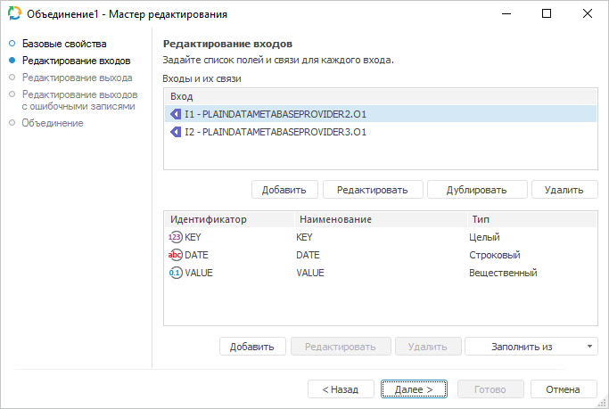
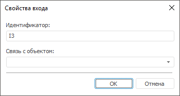
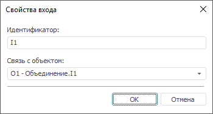
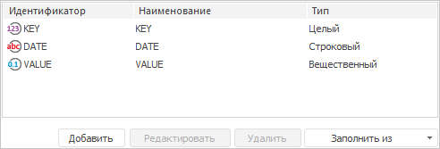
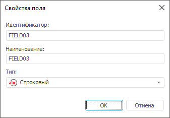
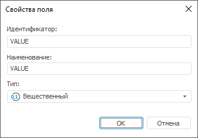
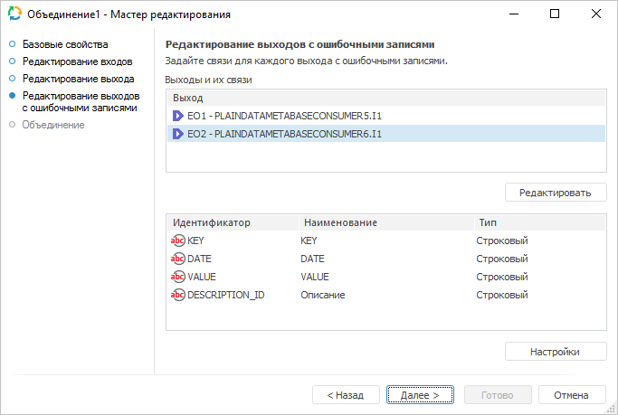
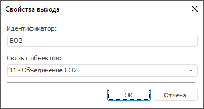
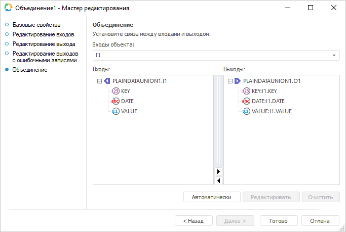

# Преобразователь «Объединение»: Задача ETL, настольное приложение

Преобразователь «Объединение»: Задача ETL, настольное приложение
-

# Объединение

	Преобразователь «Объединение»
	 - объект, предназначенный для слияния данных. Каждый объект имеет
	 несколько входов и один выход. У всех источников должны быть определены
	 уникальные индексы, количество и типы полей. Указанные атрибуты должны
	 быть идентичны для всех источников. Дублирования записей не допускается
	 (в этом случае необходимо провести предварительно операцию [удаления
	 дубликатов](../08_Delete/UiEtl_Trfs_Delete.htm)).

	Для эффективной работы алгоритма должны быть выполнены условия:

		- отсутствие дубликатов по уникальному индексу во всех источниках
		 данных;

		- все источники должны быть упорядочены по уникальному индексу.
		 Порядок полей в уникальном индексе должен совпадать для всех источников.

	При использовании преобразователя «Объединение»
	 из таблиц:

			 Key
			 Date
			 Value

			 1
			 Winter
			 2222

			 2
			 Winter
			 4444

			 3
			 Winter
			 6666

	и:

			 Key
			 Date
			 Value

			 4
			 Summer
			 1111

			 5
			 Summer
			 3333

			 6
			 Summer
			 5555

	можно получить таблицу:

			 Key
			 Date
			 Value

			 4
			 Summer
			 1111

			 1
			 Winter
			 2222

			 5
			 Summer
			 3333

			 2
			 Winter
			 4444

			 6
			 Summer
			 5555

			 3
			 Winter
			 6666

## Базовые свойства

В базовых свойствах задаются наименование объекта, идентификатор и примечание.

## Редактирование входов

	Для определения списка входов преобразователя и списка полей для
	 каждого входа используйте страницу «Редактирование
	 входов».

	

	В разделе «Входы и их связи»
	 содержится список всех входов и их связей объекта-преобразователя.

	Возможные операции для входов:

	[Добавление
	 входа](javascript:TextPopup(this))

		Для добавления входа:

			- Нажмите кнопку «Добавить».
			 Будет открыто окно «Свойства
			 входа»:

		

			- В строке «Идентификатор»
			 определите уникальный идентификатор выхода.

			- Из раскрывающегося списка «Связь
			 с объектом» выберите приёмник, на выходе которого данные
			 будут поступать в создаваемый объект-преобразователь.

			После выбора объекта будет предложено заполнить список полей
			 из связанного выхода.

		Будут созданы вход и его связь с объектом.

	[Редактирование
	 входа](javascript:TextPopup(this))

		Для редактирования входа:

			- Выберите необходимый вход.

			- Нажмите кнопку «Редактировать».
			 Будет открыто окно «Свойства
			 входа»:

		

			- Если необходимо, то отредактируйте идентификатор.

			- Если необходимо, то из раскрывающегося списка «Связь с объектом» выберите/смените
			 приёмник, на выходе которого данные будут поступать в создаваемый
			 объект-преобразователь. После выбора/смены объекта будет предложено
			 заполнить список полей из связанного выхода.

		Будут изменены вход и его связь с объектом.

	[Дублирование
	 входа](javascript:TextPopup(this))

		Дублирование позволяет создать вход с полями ранее созданного
		 входа.

		Для дублирования входа:

			- Выберите существующий вход.

			- Нажмите кнопку «Дублировать».
			 Будет открыто окно «Свойства
			 входа»:

		

		Будет создан вход с полями ранее созданного входа.

	[Удаление
	 входа](javascript:TextPopup(this))

		Для удаления входа:

			- Выберите необходимый вход.

			- Нажмите кнопку «Удалить».

		Будет удален вход без подтверждения.

	В разделе «Поля входов»
	 содержится список полей и их параметров объекта-источника/объекта-приёмника:

	

	Возможные операции для полей входов:

	[Добавление
	 поля](javascript:TextPopup(this))

		Для создания поля:

			- Выберите необходимый вход. В поле в нижней части окна
			 появятся поля источника/приёмника.

			- Добавьте поле в список:

				- нажмите кнопку «Добавить»;

				- клавишу INSERT;

				- щелкните два раза по свободному пространству;

		Будет открыто окно:

		

			- Отредактируйте идентификатор и наименование. По умолчанию
			 они совпадают.

			- Выберите из раскрывающегося списка необходимый тип поля
			 в зависимости от типа данных источника/приёмника.

		Будет создано поле с указанными параметрами.

	[Редактирование
	 поля](javascript:TextPopup(this))

		Для редактирования поля:

			- Выберите необходимый вход. В поле в нижней части окна
			 появятся поля источника/приёмника.

			- Выберите необходимое поле/поля из списка.

		Примечание.
		 Возможно множественное выделение полей с помощью сочетания клавиш
		 CTRL+A или с помощью зажатой клавиши CTRL.

			- Нажмите кнопку «Редактировать».
			 Будет открыто окно:

		

			- Если необходимо, то отредактируйте идентификатор и наименование.
			 При множественном выделении полей редактирование идентификатора
			 и наименования будет не доступно.

			- Если необходимо, то измените в раскрывающемся списке
			 тип поля/полей.

		Будут изменены параметры поля/полей.

	[Удаление
	 поля](javascript:TextPopup(this))

		Для удаления поля:

			- Выберите необходимый вход. В поле в нижней части окна
			 появятся поля источника/приёмника.

			- Выберите необходимое поле/поля из списка.

		Примечание.
		 Возможно множественное выделение полей с помощью сочетания клавиш
		 CTRL+A или с помощью зажатой клавиши CTRL.

			- Нажмите кнопку «Удалить».

		Будет удалено поле/поля без подтверждения.

	[Автоматическое
	 заполнение полей](javascript:TextPopup(this))

		Для автоматического заполнения полей:

			- Выберите необходимый вход.

			- Выполните одну из команд кнопки «Заполнить
			 из»:

				- Из источника.
				 В список будут добавлены поля из источника данных;

				- Из приёмника.
				 В список будут добавлены поля из приёмника данных.

		В список добавятся поля источника/приёмника данных.

## Редактирование выхода

На странице «Редактирование выхода»
 задаётся связь с объектом-приёмником, в который будут выгружаться данные
 при выполнении задачи ETL.

Примечание.
 Страница является общей для всех коннекторов и преобразователей данных,
 кроме преобразователей «[Разделение](../01_Split/uietl_split.htm)»
 и «[Алгоритм пользователя](../09_algorithm/UiEtl_Trfs_Algorithm.htm)». Рассмотрим
 настройку списка полей и связи выхода на примере мастера редактирования
 источника данных «[Репозиторий](../../02_Inputs/UiEtl_Inputs_Repo.htm)».

На странице доступны следующие настройки:

[Идентификатор](javascript:TextPopup(this))

	Укажите идентификатор выхода редактируемого объекта. Возможно использование
	 символов латинского алфавита, цифр и специального символа «_».

[Связь с объектом](javascript:TextPopup(this))

	Установите связь с объектом-приёмником, в который будут выгружаться
	 данные. Для этого из раскрывающегося списка выберите объект задачи
	 ETL.

[Поля](javascript:TextPopup(this))

	Поля объекта-приёмника, в которые будут выгружаться данные, предназначены
	 для определения формата вывода данных.

	Примечание.
	 Редактирование списка полей доступно только для коннекторов к источнику
	 данных. Для коннекторов к приёмнику данных список полей заполняется
	 автоматически.

	Для добавления в список всех полей из связанного объекта-приёмника:

		- Нажмите кнопку «Заполнить
		 из».

		- В раскрывающемся меню кнопки выберите пункт «Из приёмника».

	После выполнения действий в список полей будут добавлены все поля
	 из связанного объекта-приёмника данных.

	Для добавления в список всех полей из связанного объекта-источника:

		- Нажмите кнопку «Заполнить
		 из».

		- В раскрывающемся меню кнопки выберите пункт «Из
		 источника».

	После выполнения действий в список полей будут добавлены все поля
	 из связанного объекта-источника данных.

	Для добавления нового поля:

		- Нажмите кнопку «Добавить».
		 Будет открыто окно «Свойства
		 поля»:

	

		- Задайте в открывшемся окне значения атрибутов поля:

			- Идентификатор.
			 Укажите уникальный идентификатор поля. По умолчанию FIELD<Порядковый номер поля>;

			- Наименование.
			 Укажите наименование поля. По умолчанию FIELD<Порядковый
			 номер поля>;

			- Тип. Из раскрывающегося
			 списка выберите тип данных поля: строковый, целый, вещественный,
			 дата, текстовый. По умолчанию установлен строковый тип данных;

			- Вычисляемое поле.
			 Установите данный флажок для задания формулы, по которой будет
			 вычисляться значение поля. После установки флажка введите
			 выражение с помощью клавиатуры или [редактора выражений](UiNav.chm::/GUI/ExpressionEditor.htm),
			 который открывается при нажатии на кнопку 
			 «Обзор».

			Для увеличения значения каждой новой записи на фиксированную
			 величину используйте специальное выражение INCREMENT.

	Примечание.
	 Специальное выражение INCREMENT
	 доступно только для вычисляемого поля целого типа.

	Синтаксис данного выражения: INCREMENT[Value1,
	 Value2], где Value1 - начальное значение, Value2 - шаг, на который
	 значение Value1 должно увеличиваться при каждом вызове выражения.
	 При каждой загрузке данных заполнение будет начинаться с начального
	 значения.

		- Нажмите кнопку «ОК».

	После выполнения действий будет добавлено новое поле.

	Для редактирования поля:

		- дважды щёлкните по полю кнопкой мыши;

		- выделите необходимое поле и нажмите кнопку «Редактировать».

	После выполнения действий будет открыто окно «Свойства
	 поля», приведённое выше.

	Для удаления выбранного поля нажмите кнопку «Удалить».
	 Поле будет удалено без подтверждения выполняемого действия.

	Для изменения порядка выгрузки данных в коннектор выделите необходимое
	 поле и переместите его в списке полей с помощью кнопок 
	 «Вверх» и 
	 «Вниз».

## Редактирование выходов с ошибочными записями

	На странице «Редактирование выходов
	 с ошибочными записями» задаются связи с объектами-приёмниками,
	 в которые будет экспортироваться информация об ошибочных записях,
	 которые не были обработаны преобразователем:

	

	На странице доступны следующие настройки:

	[Выходы
	 и их связи](javascript:TextPopup(this))

		Здесь содержится список всех выходов из преобразователя, связанных
		 с объектами-приёмниками данных.

		Для редактирования выхода:

			- Выберите необходимый выход из списка.

			- Нажмите кнопку «Редактировать».
			 Будет открыто окно «Свойства
			 выхода»:

		

			- Отредактируйте идентификатор.

			- В раскрывающемся списке «Связь
			 с объектом» выберите/смените объект-приёмник, на вход
			 которого данные будут поступать из объекта-преобразователя.

			После выбора/смены объекта будет предложено заполнить список
			 полей из связанного входа.

		После выполнения действий будут изменены выход из объекта-приёмника
		 и/или его связь с преобразователем.

	[Поля](javascript:TextPopup(this))

		Поля объекта-приёмника, в которые будут выгружаться данные,
		 предназначены для определения формата вывода данных. Список полей
		 заполняется автоматически при настройке связи с объектом-приёмником.

	[Дополнительные
	 настройки](javascript:TextPopup(this))

		Для задания дополнительных настроек, которые будут применяться
		 при возникновении ошибочных записей, выполните следующие действия:

			- Нажмите кнопку «Настройки».
			 Будет открыто одноимённое окно:

		

			- Задайте настройки:

				- Максимальное
				 количество записей, выводимых в ошибочный выход.
				 Укажите максимальное количество ошибочных записей, информация
				 о которых будет экспортирована. По умолчанию установлено
				 значение «-1», при этом экспортируется информация обо
				 всех ошибочных записях;

		Примечание.
		 При наличии большого количества ошибочных записей, экспорт информации
		 о них может замедлить выполнение задачи ETL.

				- Действие, выполняемое
				 при превышении максимального количества ошибочных записей.
				 Выберите в раскрывающемся списка действие, которое будет
				 выполняться в случае превышения максимального количества
				 ошибочных записей:

					- Остановка расчёта
					 задачи. При превышении максимального количества
					 ошибочных записей расчёт задачи будет остановлен;

					- Прекратить
					 вывод записей. По умолчанию. При превышении
					 максимального количества ошибочных записей вывод записей
					 будет прекращён.

		После выполнения действий будут заданы настройки, которые будут
		 применяться при возникновении ошибочных записей.

## Объединение

	На странице «Объединение»
	 устанавливается связь между полями входов и полями выхода.

	

	Связи полей должны быть настроены для каждого входа объекта «Объединение»:

		- Автоматическое создание
		 связей. Для связи полей, имеющих одинаковые идентификаторы,
		 нажмите кнопку «Автоматически»;

		- Ручное создание связей.
		 Перетащите входное поле на поле-выход, либо выделите данные поля
		 и нажмите кнопку «Редактировать»;

		- Удаление связей.
		 Выделите поле-выход и нажмите кнопку «Очистить»
		 либо клавишу DELETE.

См. также:

[Начало
 работы с инструментом «Задача ETL» в веб-приложении](../../../../Web/01_General_Info/UiETL_StartingToWork.htm) | [Преобразователи данных](../UiEtl_Trfs.htm)

		Справочная
		 система на версию 10.9
		 от 18/08/2025,
		 © ООО «ФОРСАЙТ»,
