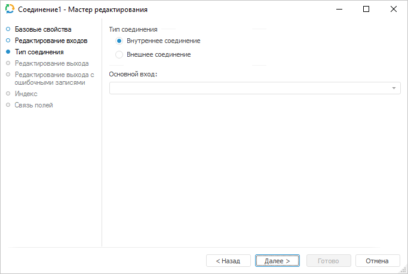
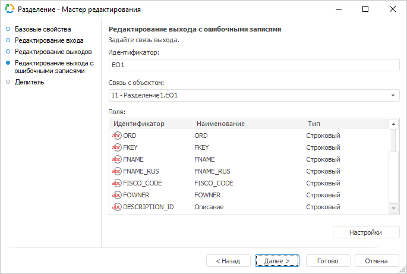
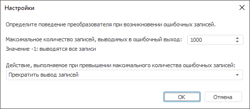
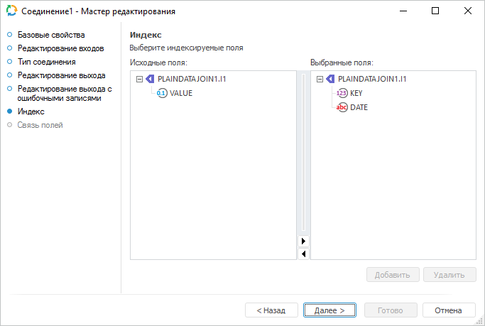
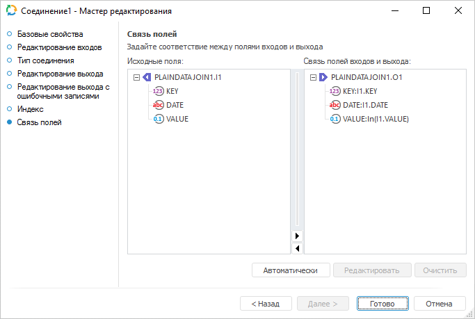

# Преобразователь «Соединение»: Задача ETL, настольное приложение

Преобразователь «Соединение»: Задача ETL, настольное приложение
-

# Соединение

	Преобразователь «Соединение»
	 - объект, предназначенный для слияния данных, при этом перед слиянием
	 данных выполняется проверка заданных условий. С помощью этого преобразователя
	 можно получить в результирующем наборе только те записи, для которых
	 значения в одном из полей связи совпадают, либо все записи одного
	 источника, дополненные значениями из других, если значения этих записей совпадают
	 по ключевым полям.

	Каждый объект имеет несколько входов и один выход. У всех источников
	 должны быть определены уникальные индексы, количество и типы полей.
	 Указанные атрибуты должны быть идентичны для всех источников. Дублирование
	 записей не допускается (в этом случае необходимо провести предварительно
	 операцию [удаления дубликатов](../08_Delete/UiEtl_Trfs_Delete.htm)).

	Для эффективной работы данного алгоритма должны быть выполнены условия:

		- отсутствие дубликатов по уникальному индексу во всех источниках
		 данных;

		- все источники должны быть упорядочены по уникальному индексу.
		 Порядок полей в уникальном индексе должен совпадать для всех источников.

	При использовании преобразователя «Соединение»
	 с типом «Внешнее соединение»
	 из таблиц:

			 Key
			 Date
			 Value

			 1
			 Summer
			 2222

			 2
			 Winter
			 4444

			 3
			 Spring
			 5555

	и:

			 Key
			 Date
			 Value2

			 1
			 Summer
			 1111

			 2
			 Winter
			 3333

	можно получить таблицу:

			 Key
			 Date
			 Value
			 Value2

			 1
			 Summer
			 2222
			 1111

			 2
			 Winter
			 4444
			 3333

			 3
			 Spring
			 5555

## Базовые свойства

В базовых свойствах задаются наименование объекта, идентификатор и примечание.

## Тип соединения

	На странице определяется тип соединения.

	

	Доступен выбор следующих типов соединения:

		- Внутреннее соединение.
		 В объект-приёмник заносятся только те записи из объектов-источников,
		 у которых совпадают значения индексируемых полей;

		- Внешнее соединение.
		 В объект-приёмник заносятся все записи из источника, указанного
		 в поле «Основной вход»,
		 а данные из остальных источников будут их дополнять. Связь объектов
		 источников осуществляется по заданному индексу.

## Редактирование выхода

На странице «Редактирование выхода»
 задаётся связь с объектом-приёмником, в который будут выгружаться данные
 при выполнении задачи ETL.

Примечание.
 Страница является общей для всех коннекторов и преобразователей данных,
 кроме преобразователей «[Разделение](../01_Split/uietl_split.htm)»
 и «[Алгоритм пользователя](../09_algorithm/UiEtl_Trfs_Algorithm.htm)». Рассмотрим
 настройку списка полей и связи выхода на примере мастера редактирования
 источника данных «[Репозиторий](../../02_Inputs/UiEtl_Inputs_Repo.htm)».

На странице доступны следующие настройки:

[Идентификатор](javascript:TextPopup(this))

	Укажите идентификатор выхода редактируемого объекта. Возможно использование
	 символов латинского алфавита, цифр и специального символа «_».

[Связь с объектом](javascript:TextPopup(this))

	Установите связь с объектом-приёмником, в который будут выгружаться
	 данные. Для этого из раскрывающегося списка выберите объект задачи
	 ETL.

[Поля](javascript:TextPopup(this))

	Поля объекта-приёмника, в которые будут выгружаться данные, предназначены
	 для определения формата вывода данных.

	Примечание.
	 Редактирование списка полей доступно только для коннекторов к источнику
	 данных. Для коннекторов к приёмнику данных список полей заполняется
	 автоматически.

	Для добавления в список всех полей из связанного объекта-приёмника:

		- Нажмите кнопку «Заполнить
		 из».

		- В раскрывающемся меню кнопки выберите пункт «Из приёмника».

	После выполнения действий в список полей будут добавлены все поля
	 из связанного объекта-приёмника данных.

	Для добавления в список всех полей из связанного объекта-источника:

		- Нажмите кнопку «Заполнить
		 из».

		- В раскрывающемся меню кнопки выберите пункт «Из
		 источника».

	После выполнения действий в список полей будут добавлены все поля
	 из связанного объекта-источника данных.

	Для добавления нового поля:

		- Нажмите кнопку «Добавить».
		 Будет открыто окно «Свойства
		 поля»:

	

		- Задайте в открывшемся окне значения атрибутов поля:

			- Идентификатор.
			 Укажите уникальный идентификатор поля. По умолчанию FIELD<Порядковый номер поля>;

			- Наименование.
			 Укажите наименование поля. По умолчанию FIELD<Порядковый
			 номер поля>;

			- Тип. Из раскрывающегося
			 списка выберите тип данных поля: строковый, целый, вещественный,
			 дата, текстовый. По умолчанию установлен строковый тип данных;

			- Вычисляемое поле.
			 Установите данный флажок для задания формулы, по которой будет
			 вычисляться значение поля. После установки флажка введите
			 выражение с помощью клавиатуры или [редактора выражений](UiNav.chm::/GUI/ExpressionEditor.htm),
			 который открывается при нажатии на кнопку 
			 «Обзор».

			Для увеличения значения каждой новой записи на фиксированную
			 величину используйте специальное выражение INCREMENT.

	Примечание.
	 Специальное выражение INCREMENT
	 доступно только для вычисляемого поля целого типа.

	Синтаксис данного выражения: INCREMENT[Value1,
	 Value2], где Value1 - начальное значение, Value2 - шаг, на который
	 значение Value1 должно увеличиваться при каждом вызове выражения.
	 При каждой загрузке данных заполнение будет начинаться с начального
	 значения.

		- Нажмите кнопку «ОК».

	После выполнения действий будет добавлено новое поле.

	Для редактирования поля:

		- дважды щёлкните по полю кнопкой мыши;

		- выделите необходимое поле и нажмите кнопку «Редактировать».

	После выполнения действий будет открыто окно «Свойства
	 поля», приведённое выше.

	Для удаления выбранного поля нажмите кнопку «Удалить».
	 Поле будет удалено без подтверждения выполняемого действия.

	Для изменения порядка выгрузки данных в коннектор выделите необходимое
	 поле и переместите его в списке полей с помощью кнопок 
	 «Вверх» и 
	 «Вниз».

## Редактирование выхода с ошибочными записями

На странице «Редактирование выхода
 с ошибочными записями» задаётся связь с объектом-приёмником, в
 который будет экспортироваться информация об ошибочных записях, которые
 не были обработаны преобразователем.

Примечание.
 Страница является общей для всех преобразователей данных, кроме преобразователей
 «[Объединение](../02_Union/uietl_union.htm)»
 и «[Алгоритм пользователя](../09_algorithm/UiEtl_Trfs_Algorithm.htm)». Рассмотрим
 настройку списка полей и связи выхода на примере мастера редактирования
 преобразователя данных «[Разделение](../01_Split/uietl_split.htm)».

На странице доступны следующие настройки:

[Идентификатор](javascript:TextPopup(this))

	Укажите идентификатор выхода с ошибочными записями. Возможно использование
	 символов латинского алфавита, цифр и специального символа «_».

[Связь с объектом](javascript:TextPopup(this))

	Установите связь с объектом-приёмником, в который будет экспортироваться
	 информация об ошибочных записях. Для этого из раскрывающегося списка
	 выберите объект задачи ETL.

[Поля](javascript:TextPopup(this))

	Поля объекта-приёмника, в которые будут выгружаться данные, предназначены
	 для определения формата вывода данных. Список полей заполняется автоматически
	 при настройке связи с объектом-приёмником.

[Дополнительные
 настройки](javascript:TextPopup(this))

	Для задания дополнительных настроек, которые будут применяться при
	 возникновении ошибочных записей, выполните следующие действия:

		- Нажмите кнопку «Настройки».
		 Будет открыто одноимённое окно:

	

		- Задайте настройки:

			- Максимальное
			 количество записей, выводимых в ошибочный выход. Укажите
			 максимальное количество ошибочных записей, информация о которых
			 будет экспортирована. По умолчанию установлено значение «-1»,
			 при этом экспортируется информация обо всех ошибочных записях;

	Примечание.
	 При наличии большого количества ошибочных записей, экспорт информации
	 о них может замедлить выполнение задачи ETL.

			- Действие, выполняемое
			 при превышении максимального количества ошибочных записей.
			 Выберите в раскрывающемся списка действие, которое будет выполняться
			 в случае превышения максимального количества ошибочных записей:

				- Остановка расчёта
				 задачи. При превышении максимального количества
				 ошибочных записей расчёт задачи будет остановлен;

				- Прекратить вывод
				 записей. По умолчанию. При превышении максимального
				 количества ошибочных записей вывод записей будет прекращён.

	После выполнения действий будут заданы настройки, которые будут
	 применяться при возникновении ошибочных записей.

## Индекс

	На странице «Индекс» определите
	 индексируемые поля каждого входа. По значениям индексируемых полей
	 происходит сопоставление данных в источниках.

	

	Для выбора индексируемого поля:

		- перетащите выбранное поле из списка «Исходные
		 поля» на соответствующий вход в списке «Выбранные
		 поля»;

		- в списке «Исходные поля»
		 выберите поле, а в списке «Выбранные
		 поля» - вход. Нажмите кнопку «Добавить».

	При переходе на следующую страницу будет предложено заполнить список
	 полей из связанного выхода.

## Связь полей

	На странице «Связь полей»
	 установите соответствие между полями входов и выхода.

	

	Действия со связями полей:

		- Автоматическое создание
		 связей полей. Позволяет автоматически создать связи между
		 всеми входными полями и выходными полями, имеющими одинаковые
		 идентификаторы. Для автоматического создания связей нажмите кнопку
		 «Автоматически»;

		- Создание связи полей.
		 Позволяет создать связь между входным и выходным полями, имеющими
		 различные идентификаторы. Для создания связи перетащите необходимое
		 поле из области «Исходные поля»
		 в область «Связь полей входа
		 и выхода», используя механизм Drag&Drop.

		- Редактирование связи полей.
		 Позволяет редактировать формулу преобразования выходного значения
		 с помощью [редактора](UiNav.Chm::/GUI/ExpressionEditor.htm).
		 Для редактирования связи в области «Связь
		 полей входа и выхода»:

			- выберите необходимую связь и нажмите кнопку «Редактировать»;

			- дважды щелкните кнопкой мыши по необходимой связи;

		- Удаление связей.
		 Для удаления связи между входным и выходным полями нажмите кнопку
		 «Очистить».

См. также:

[Начало
 работы с инструментом «Задача ETL» в веб-приложении](../../../../Web/01_General_Info/UiETL_StartingToWork.htm) | [Преобразователи данных](../UiEtl_Trfs.htm)

		Справочная
		 система на версию 10.9
		 от 18/08/2025,
		 © ООО «ФОРСАЙТ»,
