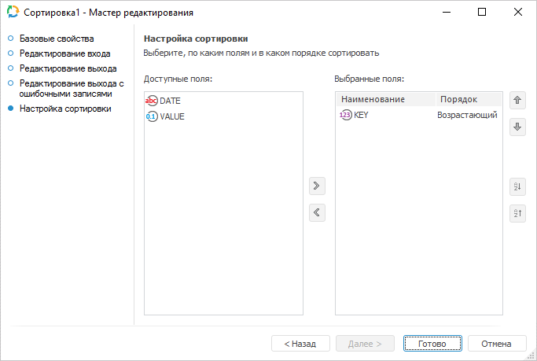

# Преобразователь «Сортировка»: Задача ETL, настольное приложение

Преобразователь «Сортировка»: Задача ETL, настольное приложение
-

# Сортировка

	Преобразователь «Сортировка»
	 - объект, выполняющий сортировку данных. На входе объекта один источник,
	 на выходе - один приёмник. Сортировка выполняется по заданному набору
	 полей. Применение этой операции упрощает применение многих алгоритмов.

	При использовании преобразователя «Сортировка»
	 из таблицы:

			 Key
			 Date
			 Value

			 4
			 Summer
			 1111

			 1
			 Winter
			 2222

			 5
			 Summer
			 3333

			 2
			 Winter
			 4444

			 6
			 Summer
			 5555

			 3
			 Winter
			 6666

	можно получить таблицу:

			 Key
			 Date
			 Value

			 1
			 Winter
			 2222

			 2
			 Winter
			 4444

			 3
			 Winter
			 6666

			 4
			 Summer
			 1111

			 5
			 Summer
			 3333

			 6
			 Summer
			 5555

	Таким образом проводилась сортировка по полю «Key».

## Базовые свойства

В базовых свойствах задаются наименование объекта, идентификатор и примечание.

## Редактирование входа

Для задания списка полей и связи для входа используйте страницу «Редактирование входа».

На странице доступны следующие параметры:

[Идентификатор](javascript:TextPopup(this))

	Укажите идентификатор входа редактируемого объекта. Возможно использование
	 символов латинского алфавита, цифр и специального символа «_».

[Связь с объектом](javascript:TextPopup(this))

	Установите связь с объектом. Для этого из раскрывающегося списка
	 выберите объект задачи ETL. Данные из объекта будут поступать на вход.

[Поля](javascript:TextPopup(this))

	Добавьте необходимые поля объекта задачи ETL в список. В указанные
	 поля будут выгружаться данные.

	Для добавления в список всех полей из связанного со входом объекта,
	 являющегося приёмником:

		- Нажмите кнопку «Заполнить
		 из».

		- В раскрывающемся меню кнопки выберите пункт «Из приёмника».

	Для добавления в список всех полей из связанного с выходом объекта,
	 являющегося источником:

		- Нажмите кнопку «Заполнить
		 из».

		- В раскрывающемся меню кнопки выберите пункт «Из
		 источника».

	Для добавления нового поля нажмите кнопку «Добавить».
	 Будет открыто окно для указания значения атрибутов поля:

	

	Примечание.
	 Вид окна «Свойства поля» зависит
	 от выбранного источника данных.

	Задайте в нем значения атрибутов поля:

		- Идентификатор. Уникальный
		 идентификатор поля;

		- Наименование. Наименование
		 поля;

		- Тип данных. Из раскрывающегося
		 списка выберите тип данных поля;

		- Общая длина. Определите
		 общую длину поля. Доступно только для строкового и вещественного
		 типов данных;

		- Десятичных знаков.
		 Определите количество знаков после запятой. Доступно только для
		 вещественного типа данных;

		- Вычисляемое поле.
		 Для задания формулы, по которой будет вычисляться значение поля,
		 установите данный флажок. После установки флажка введите выражение
		 с помощью клавиатуры или [редактора выражений](UiNav.chm::/GUI/ExpressionEditor.htm),
		 который открывается при нажатии на кнопку .

		Для увеличения значения каждой новой записи на фиксированную величину
		 используйте специальное выражение INCREMENT.

	Примечание.
	 Специальное выражение INCREMENT
	 доступно только для вычисляемого поля целого типа.

	Синтаксис данного выражения: INCREMENT[Value1,
	 Value2], где Value1 - начальное значение, Value2 - шаг, на который
	 значение Value1 должно увеличиваться при каждом вызове выражения.
	 При каждой загрузке данных заполнение будет начинаться с начального
	 значения.

	Для редактирования поля:

		- дважды щелкните по полю кнопкой мыши;

		- выделите необходимое поле и нажмите кнопку «Редактировать».

	Для удаления выбранного поля нажмите кнопку «Удалить».
	 Поле будет удалено без подтверждения выполняемого действия.

	Для перемещения поля, выделенного в списке, используйте кнопки 
	 «Вверх» и 
	 «Вниз».

Примечание.
 Скриншот сделан на примере мастера редактирования приёмника данных «Репозиторий».

## Редактирование выхода

На странице «Редактирование выхода»
 задаётся связь с объектом-приёмником, в который будут выгружаться данные
 при выполнении задачи ETL.

Примечание.
 Страница является общей для всех коннекторов и преобразователей данных,
 кроме преобразователей «[Разделение](../01_Split/uietl_split.htm)»
 и «[Алгоритм пользователя](../09_algorithm/UiEtl_Trfs_Algorithm.htm)». Рассмотрим
 настройку списка полей и связи выхода на примере мастера редактирования
 источника данных «[Репозиторий](../../02_Inputs/UiEtl_Inputs_Repo.htm)».

На странице доступны следующие настройки:

[Идентификатор](javascript:TextPopup(this))

	Укажите идентификатор выхода редактируемого объекта. Возможно использование
	 символов латинского алфавита, цифр и специального символа «_».

[Связь с объектом](javascript:TextPopup(this))

	Установите связь с объектом-приёмником, в который будут выгружаться
	 данные. Для этого из раскрывающегося списка выберите объект задачи
	 ETL.

[Поля](javascript:TextPopup(this))

	Поля объекта-приёмника, в которые будут выгружаться данные, предназначены
	 для определения формата вывода данных.

	Примечание.
	 Редактирование списка полей доступно только для коннекторов к источнику
	 данных. Для коннекторов к приёмнику данных список полей заполняется
	 автоматически.

	Для добавления в список всех полей из связанного объекта-приёмника:

		- Нажмите кнопку «Заполнить
		 из».

		- В раскрывающемся меню кнопки выберите пункт «Из приёмника».

	После выполнения действий в список полей будут добавлены все поля
	 из связанного объекта-приёмника данных.

	Для добавления в список всех полей из связанного объекта-источника:

		- Нажмите кнопку «Заполнить
		 из».

		- В раскрывающемся меню кнопки выберите пункт «Из
		 источника».

	После выполнения действий в список полей будут добавлены все поля
	 из связанного объекта-источника данных.

	Для добавления нового поля:

		- Нажмите кнопку «Добавить».
		 Будет открыто окно «Свойства
		 поля»:

	

		- Задайте в открывшемся окне значения атрибутов поля:

			- Идентификатор.
			 Укажите уникальный идентификатор поля. По умолчанию FIELD<Порядковый номер поля>;

			- Наименование.
			 Укажите наименование поля. По умолчанию FIELD<Порядковый
			 номер поля>;

			- Тип. Из раскрывающегося
			 списка выберите тип данных поля: строковый, целый, вещественный,
			 дата, текстовый. По умолчанию установлен строковый тип данных;

			- Вычисляемое поле.
			 Установите данный флажок для задания формулы, по которой будет
			 вычисляться значение поля. После установки флажка введите
			 выражение с помощью клавиатуры или [редактора выражений](UiNav.chm::/GUI/ExpressionEditor.htm),
			 который открывается при нажатии на кнопку 
			 «Обзор».

			Для увеличения значения каждой новой записи на фиксированную
			 величину используйте специальное выражение INCREMENT.

	Примечание.
	 Специальное выражение INCREMENT
	 доступно только для вычисляемого поля целого типа.

	Синтаксис данного выражения: INCREMENT[Value1,
	 Value2], где Value1 - начальное значение, Value2 - шаг, на который
	 значение Value1 должно увеличиваться при каждом вызове выражения.
	 При каждой загрузке данных заполнение будет начинаться с начального
	 значения.

		- Нажмите кнопку «ОК».

	После выполнения действий будет добавлено новое поле.

	Для редактирования поля:

		- дважды щёлкните по полю кнопкой мыши;

		- выделите необходимое поле и нажмите кнопку «Редактировать».

	После выполнения действий будет открыто окно «Свойства
	 поля», приведённое выше.

	Для удаления выбранного поля нажмите кнопку «Удалить».
	 Поле будет удалено без подтверждения выполняемого действия.

	Для изменения порядка выгрузки данных в коннектор выделите необходимое
	 поле и переместите его в списке полей с помощью кнопок 
	 «Вверх» и 
	 «Вниз».

## Редактирование выхода с ошибочными записями

На странице «Редактирование выхода
 с ошибочными записями» задаётся связь с объектом-приёмником, в
 который будет экспортироваться информация об ошибочных записях, которые
 не были обработаны преобразователем.

Примечание.
 Страница является общей для всех преобразователей данных, кроме преобразователей
 «[Объединение](../02_Union/uietl_union.htm)»
 и «[Алгоритм пользователя](../09_algorithm/UiEtl_Trfs_Algorithm.htm)». Рассмотрим
 настройку списка полей и связи выхода на примере мастера редактирования
 преобразователя данных «[Разделение](../01_Split/uietl_split.htm)».

На странице доступны следующие настройки:

[Идентификатор](javascript:TextPopup(this))

	Укажите идентификатор выхода с ошибочными записями. Возможно использование
	 символов латинского алфавита, цифр и специального символа «_».

[Связь с объектом](javascript:TextPopup(this))

	Установите связь с объектом-приёмником, в который будет экспортироваться
	 информация об ошибочных записях. Для этого из раскрывающегося списка
	 выберите объект задачи ETL.

[Поля](javascript:TextPopup(this))

	Поля объекта-приёмника, в которые будут выгружаться данные, предназначены
	 для определения формата вывода данных. Список полей заполняется автоматически
	 при настройке связи с объектом-приёмником.

[Дополнительные
 настройки](javascript:TextPopup(this))

	Для задания дополнительных настроек, которые будут применяться при
	 возникновении ошибочных записей, выполните следующие действия:

		- Нажмите кнопку «Настройки».
		 Будет открыто одноимённое окно:

	

		- Задайте настройки:

			- Максимальное
			 количество записей, выводимых в ошибочный выход. Укажите
			 максимальное количество ошибочных записей, информация о которых
			 будет экспортирована. По умолчанию установлено значение «-1»,
			 при этом экспортируется информация обо всех ошибочных записях;

	Примечание.
	 При наличии большого количества ошибочных записей, экспорт информации
	 о них может замедлить выполнение задачи ETL.

			- Действие, выполняемое
			 при превышении максимального количества ошибочных записей.
			 Выберите в раскрывающемся списка действие, которое будет выполняться
			 в случае превышения максимального количества ошибочных записей:

				- Остановка расчёта
				 задачи. При превышении максимального количества
				 ошибочных записей расчёт задачи будет остановлен;

				- Прекратить вывод
				 записей. По умолчанию. При превышении максимального
				 количества ошибочных записей вывод записей будет прекращён.

	После выполнения действий будут заданы настройки, которые будут
	 применяться при возникновении ошибочных записей.

## Настройка сортировки

	На странице «Настройка сортировки»
	 задайте поля, по которым будет произведена сортировка.

	

	В списке «Доступные поля»
	 содержатся все входные поля объекта-преобразователя, по которым доступна
	 сортировка. В списке «Выбранные поля»
	 содержатся поля, по которым будет выполняться сортировка.

	Для перемещения выбранного поля между списками:

		- дважды щелкните выбранное поле;

		- перетащите поле в выбранный список;

		- используйте кнопки 
		 «Добавить выделенные поля»
		 и  «Удалить
		 выделенные поля».

	Порядок сортировки значений каждого поля указан в столбце «Порядок». Каждое поле, участвующее
	 в сортировке, по умолчанию будет отсортировано по возрастанию. Для
	 установки убывающего порядка сортировки выбранного поля нажмите кнопку
	 
	 «Сортировать по убыванию»,
	 для возрастающего порядка - 
	 «Сортировать по возрастанию».

	Важен порядок следования полей, так как именно в этом порядке будет
	 проводиться сортировка. Измените порядок следования поля, перетащив
	 его или используя кнопки 
	 «Переместить поле выше» и
	  «Переместить
	 поле ниже».

См. также:

[Начало
 работы с инструментом «Задача ETL» в веб-приложении](../../../../Web/01_General_Info/UiETL_StartingToWork.htm) | [Преобразователи данных](../UiEtl_Trfs.htm)

		Справочная
		 система на версию 10.9
		 от 18/08/2025,
		 © ООО «ФОРСАЙТ»,
