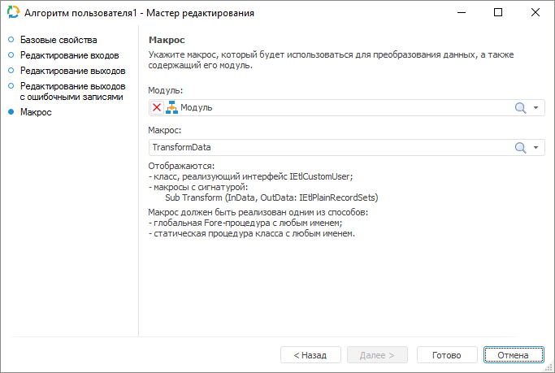

# Преобразователь «Алгоритм пользователя»: Задача ETL, настольное приложение

Преобразователь «Алгоритм пользователя»: Задача ETL, настольное приложение
-

# Алгоритм пользователя

Преобразователь «Алгоритм пользователя»
 - объект, предназначенный для преобразования данных с помощью заданного
 пользователем алгоритма. Данный преобразователь имеет несколько входов
 и выходов.

## Базовые свойства

В базовых свойствах задаются наименование объекта, идентификатор и примечание.

## Макрос

На странице «Макрос» укажите
 модуль и содержащийся в нем макрос, который реализуют пользовательский
 алгоритм преобразования данных из источника.

Макрос - процедура, содержащая два параметра с типом [IEtlPlainRecordSets](KeEtl.chm::/Interface/IEtlPlainRecordSets/IEtlPlainRecordSets.htm).
 Первый параметр содержит входные наборы записей, полученные из источников
 данных. Второй параметр формирует выходной набор записей, которые будут
 выгружены в приёмники данных.

См. также:

[Начало
 работы с инструментом «Задача ETL» в веб-приложении](../../../../Web/01_General_Info/UiETL_StartingToWork.htm) | [Преобразователи данных](../UiEtl_Trfs.htm)

		Справочная
		 система на версию 10.9
		 от 18/08/2025,
		 © ООО «ФОРСАЙТ»,
