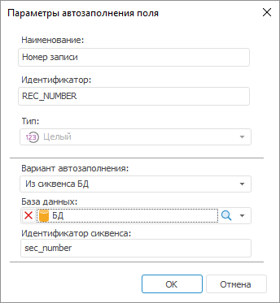

# Автоматическое заполнение полей: Задача ETL, настольное приложение

Автоматическое заполнение полей: Задача ETL, настольное приложение
-

# Автоматическое заполнение полей

Автозаполнение применяется для автоматического формирования значения
 входного поля, если для него [отсутствует
 связь с выходным полем](uietl_links_create.htm). Для настройки
 параметров автозаполнения дважды щелкните по входному полю кнопкой мыши.
 Если входное поле имеет связь с выходным полем, то её необходимо удалить.

Параметры автоматического заполнения различаются в зависимости от типа
 данных входного поля.

Если необходимо, отредактируйте наименование и идентификатор поля. Идентификатор
 должен содержать только буквы латинского алфавита, цифры, знак «_», не
 должен содержать пробелов и не должен начинаться с цифры.

В раскрывающемся списке «Вариант автозаполнения»
 выберите способ формирования значения поля:

	- Нет. Автозаполнение
	 не используется;

	- Константа. Поле заполнятся
	 указанной константой. Тип данных константы соответствует типу данных
	 поля;

	- Из сиквенса БД. Применяется
	 только для полей целого типа. Сиквенс - это упорядоченный список значений.
	 В соответствующих полях укажите базу данных, содержащую сиквенс, и
	 идентификатор сиквенса. Входное поле будет заполнено допустимыми значениями
	 сиквенса. Использование сиквенса доступно в репозиториях на базе следующих
	 СУБД: Oracle, Microsoft SQL Server, PostgreSQL;

	- Автоинкремент. Применяется
	 только для полей целого типа. Укажите начальное значение и приращение,
	 которое будет использоваться для вычисления нового значения для каждой
	 новой записи. При каждой загрузке данных заполнение будет начинаться
	 с начального значения;

	- Текущая дата. Применяется
	 только для полей типа «Дата». Входное поле заполняется текущей датой.

См. также:

[Начало
 работы с инструментом «Задача ETL» в веб-приложении](../../../Web/01_General_Info/UiETL_StartingToWork.htm) | [Связи
 между объектами](uietl_links_create.htm)

		Справочная
		 система на версию 10.9
		 от 18/08/2025,
		 © ООО «ФОРСАЙТ»,
