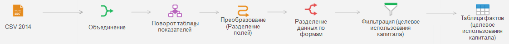
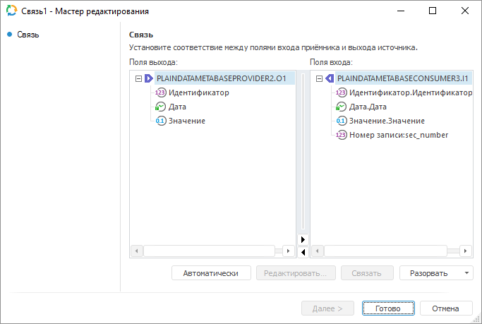

# Связи между объектами: Задача ETL, настольное приложение

Связи между объектами: Задача ETL, настольное приложение
-

# Связи между объектами

Связь - объект задачи ETL, определяющий соответствие между выходными
 полями одного объекта и входными полями другого объекта. Связи устанавливаются
 в процессе редактирования входов и выходов следующих объектов:

	- коннекторы к источникам данных;

	- преобразователь данных;

	- коннекторы к приёмникам данных.

Связи отображаются в виде стрелок:

## Редактирование связи

Для редактирования выбранной связи:

	- выполните команду «Редактировать»
	 в контекстном меню связи;

	- дважды щелкните по связи;

	- выделите связь и нажмите клавишу F4.

Будет открыт мастер редактирования связи:

На данной странице устанавливается связи между полями выхода и входа.
 Действия со связями полей:

	- Автоматически создание связей.
	 Для связи полей, имеющих одинаковые идентификаторы, нажмите кнопку
	 «Автоматически»;

	- Ручное создание связей.
	 Перетащите поле-выход на поле-вход, либо выделите данные поля и нажмите
	 кнопку «Связать»;

	- Редактирование входных полей,
	 не связанных с выходом. Если для входного поля отсутствует
	 связь с выходным полем, то значение входного поля можно формировать
	 автоматически, используя [автозаполнение](UIEtl_Links_Autolink.htm).
	 Для настройки параметров автоматического заполнения поля выделите
	 его и нажмите кнопку «Редактировать»
	 или дважды щелкните наименование поля;

	- Разорвать выделенную/все связи.
	 Выделите поле-вход и нажмите кнопку DELETE для разрыва текущей связи.
	 Также необходимое действие можно произвести, используя всплывающее
	 меню кнопки «Разорвать».

Создание и редактирование связей осуществляется в настольном приложении.

См. также:

[Начало
 работы с инструментом «Задача ETL» в веб-приложении](../../../Web/01_General_Info/UiETL_StartingToWork.htm) | [Автозаполнение полей](UIEtl_Links_Autolink.htm)

		Справочная
		 система на версию 10.9
		 от 18/08/2025,
		 © ООО «ФОРСАЙТ»,
