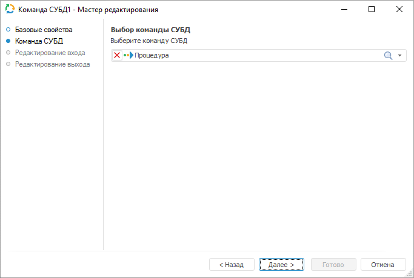

# Команда СУБД: Задача ETL, настольное приложение

Команда СУБД: Задача ETL, настольное приложение
-

# Команда СУБД

«Команда СУБД» - объект, предназначенный
 для преобразования данных при помощи одного из следующих объектов репозитория:
 «[Команда СУБД](UiNavObj.chm::/CUBD/UiDb_relationa_CUBD.htm)» или «[Процедура](UiNavObj.chm::/procedure/UiDb_relationa_procedure.htm)».

## Базовые свойства

В базовых свойствах задаются наименование объекта, идентификатор и примечание.

## Команда СУБД

На странице мастера «Команда СУБД»
 укажите объект репозитория, который необходимо выполнить.

Список входов и выходов может формироваться только на основании выходов
 источника, к которому подключается текущий объект. При этом фактические
 данные в выполняемую команду СУБД передаваться не будут. Они один к одному
 будут переданы со входа на выход. Задание входов/выходов используется
 для включения объекта «Команда СУБД»
 в какую-либо цепочку выполнения.

## Редактирование входа

Для задания списка полей и связи для входа используйте страницу «Редактирование входа».

На странице доступны следующие параметры:

[Идентификатор](javascript:TextPopup(this))

	Укажите идентификатор входа редактируемого объекта. Возможно использование
	 символов латинского алфавита, цифр и специального символа «_».

[Связь с объектом](javascript:TextPopup(this))

	Установите связь с объектом. Для этого из раскрывающегося списка
	 выберите объект задачи ETL. Данные из объекта будут поступать на вход.

[Поля](javascript:TextPopup(this))

	Добавьте необходимые поля объекта задачи ETL в список. В указанные
	 поля будут выгружаться данные.

	Для добавления в список всех полей из связанного со входом объекта,
	 являющегося приёмником:

		- Нажмите кнопку «Заполнить
		 из».

		- В раскрывающемся меню кнопки выберите пункт «Из приёмника».

	Для добавления в список всех полей из связанного с выходом объекта,
	 являющегося источником:

		- Нажмите кнопку «Заполнить
		 из».

		- В раскрывающемся меню кнопки выберите пункт «Из
		 источника».

	Для добавления нового поля нажмите кнопку «Добавить».
	 Будет открыто окно для указания значения атрибутов поля:

	

	Примечание.
	 Вид окна «Свойства поля» зависит
	 от выбранного источника данных.

	Задайте в нем значения атрибутов поля:

		- Идентификатор. Уникальный
		 идентификатор поля;

		- Наименование. Наименование
		 поля;

		- Тип данных. Из раскрывающегося
		 списка выберите тип данных поля;

		- Общая длина. Определите
		 общую длину поля. Доступно только для строкового и вещественного
		 типов данных;

		- Десятичных знаков.
		 Определите количество знаков после запятой. Доступно только для
		 вещественного типа данных;

		- Вычисляемое поле.
		 Для задания формулы, по которой будет вычисляться значение поля,
		 установите данный флажок. После установки флажка введите выражение
		 с помощью клавиатуры или [редактора выражений](UiNav.chm::/GUI/ExpressionEditor.htm),
		 который открывается при нажатии на кнопку .

		Для увеличения значения каждой новой записи на фиксированную величину
		 используйте специальное выражение INCREMENT.

	Примечание.
	 Специальное выражение INCREMENT
	 доступно только для вычисляемого поля целого типа.

	Синтаксис данного выражения: INCREMENT[Value1,
	 Value2], где Value1 - начальное значение, Value2 - шаг, на который
	 значение Value1 должно увеличиваться при каждом вызове выражения.
	 При каждой загрузке данных заполнение будет начинаться с начального
	 значения.

	Для редактирования поля:

		- дважды щелкните по полю кнопкой мыши;

		- выделите необходимое поле и нажмите кнопку «Редактировать».

	Для удаления выбранного поля нажмите кнопку «Удалить».
	 Поле будет удалено без подтверждения выполняемого действия.

	Для перемещения поля, выделенного в списке, используйте кнопки 
	 «Вверх» и 
	 «Вниз».

Примечание.
 Скриншот сделан на примере мастера редактирования приёмника данных «Репозиторий».

## Редактирование выхода

На странице «Редактирование выхода»
 задаётся связь с объектом-приёмником, в который будут выгружаться данные
 при выполнении задачи ETL.

Примечание.
 Страница является общей для всех коннекторов и преобразователей данных,
 кроме преобразователей «[Разделение](../04_Transformers/01_Split/uietl_split.htm)»
 и «[Алгоритм пользователя](../04_Transformers/09_algorithm/UiEtl_Trfs_Algorithm.htm)». Рассмотрим
 настройку списка полей и связи выхода на примере мастера редактирования
 источника данных «[Репозиторий](../02_Inputs/UiEtl_Inputs_Repo.htm)».

На странице доступны следующие настройки:

[Идентификатор](javascript:TextPopup(this))

	Укажите идентификатор выхода редактируемого объекта. Возможно использование
	 символов латинского алфавита, цифр и специального символа «_».

[Связь с объектом](javascript:TextPopup(this))

	Установите связь с объектом-приёмником, в который будут выгружаться
	 данные. Для этого из раскрывающегося списка выберите объект задачи
	 ETL.

[Поля](javascript:TextPopup(this))

	Поля объекта-приёмника, в которые будут выгружаться данные, предназначены
	 для определения формата вывода данных.

	Примечание.
	 Редактирование списка полей доступно только для коннекторов к источнику
	 данных. Для коннекторов к приёмнику данных список полей заполняется
	 автоматически.

	Для добавления в список всех полей из связанного объекта-приёмника:

		- Нажмите кнопку «Заполнить
		 из».

		- В раскрывающемся меню кнопки выберите пункт «Из приёмника».

	После выполнения действий в список полей будут добавлены все поля
	 из связанного объекта-приёмника данных.

	Для добавления в список всех полей из связанного объекта-источника:

		- Нажмите кнопку «Заполнить
		 из».

		- В раскрывающемся меню кнопки выберите пункт «Из
		 источника».

	После выполнения действий в список полей будут добавлены все поля
	 из связанного объекта-источника данных.

	Для добавления нового поля:

		- Нажмите кнопку «Добавить».
		 Будет открыто окно «Свойства
		 поля»:

	

		- Задайте в открывшемся окне значения атрибутов поля:

			- Идентификатор.
			 Укажите уникальный идентификатор поля. По умолчанию FIELD<Порядковый номер поля>;

			- Наименование.
			 Укажите наименование поля. По умолчанию FIELD<Порядковый
			 номер поля>;

			- Тип. Из раскрывающегося
			 списка выберите тип данных поля: строковый, целый, вещественный,
			 дата, текстовый. По умолчанию установлен строковый тип данных;

			- Вычисляемое поле.
			 Установите данный флажок для задания формулы, по которой будет
			 вычисляться значение поля. После установки флажка введите
			 выражение с помощью клавиатуры или [редактора выражений](UiNav.chm::/GUI/ExpressionEditor.htm),
			 который открывается при нажатии на кнопку 
			 «Обзор».

			Для увеличения значения каждой новой записи на фиксированную
			 величину используйте специальное выражение INCREMENT.

	Примечание.
	 Специальное выражение INCREMENT
	 доступно только для вычисляемого поля целого типа.

	Синтаксис данного выражения: INCREMENT[Value1,
	 Value2], где Value1 - начальное значение, Value2 - шаг, на который
	 значение Value1 должно увеличиваться при каждом вызове выражения.
	 При каждой загрузке данных заполнение будет начинаться с начального
	 значения.

		- Нажмите кнопку «ОК».

	После выполнения действий будет добавлено новое поле.

	Для редактирования поля:

		- дважды щёлкните по полю кнопкой мыши;

		- выделите необходимое поле и нажмите кнопку «Редактировать».

	После выполнения действий будет открыто окно «Свойства
	 поля», приведённое выше.

	Для удаления выбранного поля нажмите кнопку «Удалить».
	 Поле будет удалено без подтверждения выполняемого действия.

	Для изменения порядка выгрузки данных в коннектор выделите необходимое
	 поле и переместите его в списке полей с помощью кнопок 
	 «Вверх» и 
	 «Вниз».

Примечание.
 Скриншот сделан на примере мастера редактирования источника данных «Репозиторий».

См. также:

[Начало
 работы с инструментом «Задача ETL» в веб-приложении](../../../Web/01_General_Info/UiETL_StartingToWork.htm) | [Группа
 объектов «Другие»](Other_objects_group.htm)

		Справочная
		 система на версию 10.9
		 от 18/08/2025,
		 © ООО «ФОРСАЙТ»,
