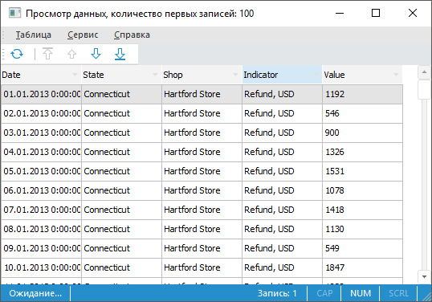
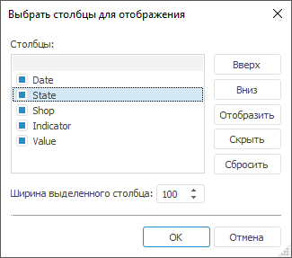
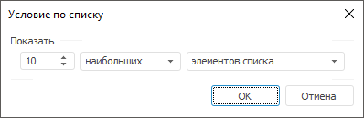
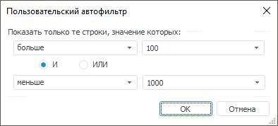

# Просмотр данных: Задача ETL, настольное приложение

Просмотр данных: Задача ETL, настольное приложение
-

# Просмотр данных

Просмотр данных служит только для предварительного просмотра данных
 источника/приёмника задачи
 ETL, отобранных с помощью запросов или необходимых параметров.

Для предварительного просмотра данных источника:

	- нажмите кнопку «Просмотр данных»
	 на странице «[Настройка
	 импорта](02_Inputs/UiEtl_Inputs_Excel.htm)» мастера редактирования объекта;

	- нажмите кнопку «Просмотр данных»
	 на странице «[Класс
	 пользователя](02_Inputs/Uietl_Inputs_User.htm)» мастера редактирования объекта;

	- выполните команду «Просмотр
	 данных» в контекстном меню коннектора.

Примечание.
 Для источника «[Репозиторий](02_Inputs/UiEtl_Inputs_Repo.htm)»
 и приёмника «[Репозиторий](03_Outputs/Repositoriy/UiEtl_Outputs_Repo.htm)»
 просмотр данных возможен только, если источником/приёмником данных является
 объект репозитория «[Документ](UiNavObj.chm::/UiNavObj_document.htm)».
 В веб-приложении просмотр данных возможен, если соответствующая функциональность
 доступна для источника/приёмника (например, если в качестве приёмника
 выбран куб репозитория, то его можно будет просмотреть в веб-версии инструмента
 «Аналитические запросы (OLAP)»).

Будет открыто окно:

Примечание.
 При предварительном просмотре данных будут выведены только первые сто
 строк источника.

## Операции над данными

[Переход
 по записям](javascript:TextPopup(this))

	Для перехода к первой записи:

		- нажмите кнопку  «Перейти
		 к первой записи» на панели инструментов;

		- выполните команду «Таблица
		 > Первая запись»
		 в главном меню.

	Для перехода к последней записи:

		- нажмите кнопку  «Перейти
		 к последней записи» на панели инструментов;

		- выполните команду «Таблица
		 > Последняя запись»
		 в главном меню.

	Для перехода к следующей записи:

		- нажмите кнопку  «Перейти
		 к следующей записи» на панели инструментов;

		- выполните команду «Таблица
		 > Следующая запись»
		 в главном меню.

	Для перехода к предыдущей записи

		- нажмите кнопку  «Перейти
		 к предыдущей записи» на панели инструментов;

		- выполните команду «Таблица
		 > Предыдущая запись»
		 в главном меню.

[Обновление
 записей](javascript:TextPopup(this))

	Для обновления записей:

		- нажмите кнопку  «Обновить»
		 на панели инструментов;

		- выполните команду «Таблица
		 > Обновить»
		 в главном меню;

		- нажмите клавишу F5.

[Выбор
 столбцов](javascript:TextPopup(this))

	Для отображения/скрытия столбцов:

		- с помощью контекстного меню:

			- нажмите правой кнопкой мыши по заголовку столбца и в
			 появившемся контекстном меню установите/cнимите флажки напротив
			 тех столбцов, которые необходимо показать/скрыть;

		- с помощью окна:

			- выполните команду «Таблица
			 > Выбрать столбцы»
			 в главном меню.

	Будет открыто окно «Выбрать
	 столбцы для отображения»:

	

	Установите/снимите флажки напротив тех
	 столбцов, которые необходимо показать/скрыть.

	Для установки всех флажков нажмите кнопку
	 «Сбросить». При нажатии на
	 кнопку кнопку «OK» в окне
	 «Просмотр данных» будут отображены
	 все столбцы.

	Для перемещения столбцов на необходимые
	 позиции используйте кнопки «Вверх» и
	 «Вниз». Для каждого столбца
	 можно указать ширину в пикселях.

[Выбор
 строк](javascript:TextPopup(this))

	Для отображения/скрытия строк:

		- Нажмите на элемент 
		 в заголовке необходимого столбца.

		- В появившемся контекстном меню установите/снимите флажки
		 с необходимых значений.

[Сортировка](javascript:TextPopup(this))

	Сортировка
	 позволяет изменить порядок записей, отображаемых при предварительном
	 просмотре данных источника/приёмника задачи ETL.

	Для сортировки записей по убыванию/возрастанию:

		- щелкните кнопкой мыши по заголовку необходимого столбца;

		- нажмите по элементу  в заголовке необходимого
		 столбца и выберите тип сортировки;

		- выполните команду «Сортировка»
		 в контекстном меню столбца. В появившемся окне выберите столбцы
		 и тип сортировки значений в них.

	Отсортированные столбцы обозначаются специальными знаками:

		- 
		 - сортировка записей по возрастанию;

		- 
		 - сортировка записей по убыванию.

[Фильтрация](javascript:TextPopup(this))

	Фильтрация данных позволяет
	 отобразить только те записи, которые соответствуют заданным условиям.

	Для числовых значений существует возможность задать условие по списку.
	 Для этого:

		- Нажмите на элемент 
		 в заголовке необходимого столбца и выполните команду «Первые
		 N» в контекстном меню. Будет открыто окно:

	

		- Задайте параметры фильтрации.

	Для сброса условия по списку:

		- Нажмите на элемент 
		 в заголовке необходимого столбца.

		- В появившемся контекстном меню выполните команду «Сбросить фильтр».

	В отличие от условия по списку пользовательский автофильтр позволяет
	 фильтровать записи, используя большее количество условий.

	Для пользовательской фильтрации данных:

		- Нажмите на элемент 
		 в заголовке необходимого столбца и выполните команду «Настроить
		 фильтр» в контекстном меню. Будет открыто окно:

	

		- Задайте параметры фильтрации.

	Для сброса пользовательской фильтрации:

		- Нажмите на элемент 
		 в заголовке необходимого столбца.

		- В появившемся контекстном меню выполните команду «Сбросить фильтр».

См. также:

[Начало
 работы с инструментом «Задача ETL» в веб-приложении](../../Web/01_General_Info/UiETL_StartingToWork.htm) | [Коннекторы
 к исходным данным](02_Inputs/UiEtl_Inputs.htm) | [Коннекторы
 к приёмнику данных](03_Outputs/UiEtl_Outputs.htm)

		Справочная
		 система на версию 10.9
		 от 18/08/2025,
		 © ООО «ФОРСАЙТ»,
