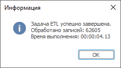

# Настройка протоколирования операций: Задача ETL, настольное приложение

Настройка протоколирования операций: Задача ETL, настольное приложение
-

# Настройка протоколирования операций

Журнал - объект репозитория,
 предназначенный для протоколирования операций, производимых при [выполнении
 задачи ETL](../../05_PropertyETL/UIEtl_WorkVisualisation.htm).

Журнал представляет собой таблицу, изначально содержащую набор полей,
 необходимых для протоколирования. Добавление дополнительных полей возможно
 при создании и редактировании [журнала](uinavobj.chm::/journal/UiDb_relational_journal.htm)
 в навигаторе объектов.

Для протоколирования операций в свойствах задачи ETL укажите журнал.

[Для открытия
 окна](javascript:TextPopup(this))

	Для вызова свойств задачи ETL выполните одно из следующих действий:

		- В главном меню задачи ETL выполните команду «Задача
		 > Свойства».

		- Нажмите сочетание клавиш CTRL+P.

	Нажимая кнопку «Далее»,
	 перейдите к странице мастера «Параметры
	 задачи».

	- Журнал. В раскрывающемся
	 списке объектов репозитория выберите журнал, в который будут
	 записываться системные сообщения о ходе процессов импорта/экспорта
	 данных в задаче ETL. Кнопка «Создать»
	 позволяет создать новый журнал и отредактировать его структуру;

	- Использовать пакетную обработку
	 данных. Пакетная обработка данных производит обработку записей
	 импорта/экспорта частями (пакетами). Количество записей обрабатываемых
	 в одном пакете указывается в поле «Размер
	 пакета».

	- Показывать окно с результатами
	 выполнения задачи. Включает отображение окна с результатами
	 после выполнения задачи:

Протоколируемые операции задачи ETL:

	- начало выполнения;

	- ошибка выполнения;

	- пропуск записей;

	- добавление записей;

	- окончание выполнения.

Для просмотра журнала выполните команду главного меню «Задача
 > Просмотр журнала».

См. также:

[Начало
 работы с инструментом «Задача ETL» в веб-приложении](../../../Web/01_General_Info/UiETL_StartingToWork.htm) | [Выполнение
 задачи ETL](../../05_PropertyETL/UIEtl_WorkVisualisation.htm)

		Справочная
		 система на версию 10.9
		 от 18/08/2025,
		 © ООО «ФОРСАЙТ»,
