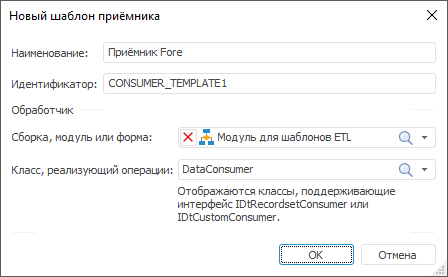

# Шаблон приёмника: Задача ETL, настольное приложение

Шаблон приёмника: Задача ETL, настольное приложение
-

# Шаблон приёмника

Шаблон приёмника содержит настройки
 пользовательского объекта-приёмника, который будет доступен для использования
 при разработке задач ETL. В настройках шаблона указывается макрос на языке
 Fore, содержащий реализацию объекта-приёмника. После создания и настройки
 шаблона, на вкладке «[Приёмники](../../03_ETLObjects/03_Outputs/UiEtl_Outputs.htm)»
 будет доступен соответствующий объект. Для объекта доступны те же [операции](../UiEtl_ObjWork.htm#operations_objetl),
 какие доступны для основных объектов задачи ETL.

[Для открытия
 окна с параметрами шаблона](javascript:TextPopup(this))

	Для открытия окна настройки параметров шаблона:

		- выполните команду главного меню «Вставка
		 > Приёмник > Создать новый шаблон»;

		- в области панели «Приёмники»
		 выполните команду «Редактировать»
		 в контекстном меню для необходимого шаблона.

Задайте следующие параметры шаблона:

	- Наименование. Любое
	 наименование, описывающее назначение приёмника. Данное наименование
	 будет отображаться на вкладке «[Приёмники](../../03_ETLObjects/03_Outputs/UiEtl_Outputs.htm)»;

	- Идентификатор. Уникальный
	 идентификатор шаблона, используется при сохранении параметров в репозиторий.
	 Идентификатор должен содержать только буквы латинского алфавита, цифры,
	 знак «_», не должен содержать пробелов и не должен начинаться с цифры;

	- Обработчик. В раскрывающихся
	 списках выберите объект среды разработки (сборку, модуль или форму)
	 и класс, содержащий реализацию приёмника. В список допустимых классов
	 входят все классы, реализующие интерфейсы [IDtRecordsetConsumer](KeDt.chm::/Interface/IDtRecordsetConsumer/IDtRecordsetConsumer.htm)
	 или [IDtCustomConsumer](KeDt.chm::/Interface/IDtCustomConsumer/IDtCustomConsumer.htm).

[Пример кода
 класса, реализующего пользовательский приёмник](javascript:TextPopup(this))

	Приёмник, реализующий интерфейс [IDtRecordsetConsumer](KeDt.chm::/Interface/IDtRecordsetConsumer/IDtRecordsetConsumer.htm):

		Class DataConsumer: Object, IDtRecordsetConsumer

		    Public Sub Put(Value: Array);

		    Begin

		    End Sub Put;

		    Public Sub Clear;

		    Begin

		    End Sub Clear;

		End Class DataConsumer;

	Приёмник, реализующий интерфейс [IDtCustomConsumer](KeDt.chm::/Interface/IDtCustomConsumer/IDtCustomConsumer.htm):

	Class DataConsumer: Object, IDtCustomConsumer

	    _Metabase: IMetabase;

	    _KeepCalcFields: Boolean;

	    Public Sub Clear;

	    Begin

	    End Sub Clear;

	    Public Function ImplementPut: Boolean;

	    Var

	        Result: Boolean;

	    Begin

	        Return Result;

	    End Function ImplementPut;

	    Public Sub Put(Value: Array);

	    Begin

	    End Sub Put;

	    Public Sub PutRow(Values: Array);

	    Begin

	    End Sub PutRow;

	    Public Function WritingRowsCount: Integer;

	    Var

	        Result: Integer;

	    Begin

	        Return Result;

	    End Function WritingRowsCount;

	    Public Sub Open;

	    Begin

	    End Sub Open;

	    Public Sub Close;

	    Begin

	    End Sub Close;

	    Public Sub Save(Element: IXMLDOMElement);

	    Begin

	    End Sub Save;

	    Public Sub Load(Element: IXMLDOMElement);

	    Begin

	    End Sub Load;

	    Public Sub FieldsFromFile;

	    Begin

	    End Sub FieldsFromFile;

	    Public Sub ClearFields;

	    Begin

	    End Sub ClearFields;

	    Public Function get_Active: boolean;

	    Var

	        Result: Boolean;

	    Begin

	        Return Result;

	    End Function get_active;

	    Public Function get_fields: IDtFieldDefinitions;

	    Var

	        Result: IDtFieldDefinitions;

	    Begin

	        Return Result;

	    End Function get_fields;

	    Public Function get_GetType: DtObjectType;

	    Begin

	        Return DtObjectType.TDtUserConsumerEx

	    End Function get_GetType;

	    Public Function get_Metabase: IMetabase;

	    Begin

	        Return _Metabase;

	    End Function get_Metabase;

	    Public Sub set_Metabase(Value: IMetabase);

	    Begin

	        _Metabase := Value;

	    End Sub set_Metabase;

	    Public Function get_KeepCalcFields: Boolean;

	    Begin

	        Return _KeepCalcFields;

	    End Function get_KeepCalcFields;

	    Public Sub set_KeepCalcFields(Value: Boolean);

	    Begin

	        _KeepCalcFields:=Value;

	    End Sub set_KeepCalcFields;

	End Class DataConsumer;

См. также:

[Начало
 работы с инструментом «Задача ETL» в веб-приложении](../../../Web/01_General_Info/UiETL_StartingToWork.htm) | [Шаблоны пользовательских преобразователей](../ETL_Templates.htm)

		Справочная
		 система на версию 10.9
		 от 18/08/2025,
		 © ООО «ФОРСАЙТ»,
