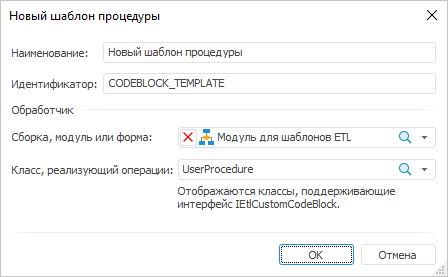

# Шаблон процедуры: Задача ETL, настольное приложение

Шаблон процедуры: Задача ETL, настольное приложение
-

# Шаблон процедуры

Шаблон процедуры содержит настройки
 пользовательского объекта группы «Другие», который будет доступен для
 использования при разработке задач ETL. В настройках шаблона указывается
 макрос на языке Fore, содержащий реализацию процедуры. После создания
 и настройки шаблона, на вкладке «[Группа
 объектов «Другие»](../../03_ETLObjects/Other/Other_objects_group.htm)» будет доступен соответствующий объект. Для объекта
 доступны те же [операции](../UiEtl_ObjWork.htm#operations_objetl),
 какие доступны для основных объектов задачи ETL

[Для открытия
 окна с параметрами шаблона](javascript:TextPopup(this))

	Для открытия окна настройки параметров шаблона:

		- выполните команду главного меню «Вставка
		 > Другие > Создать новый шаблон процедуры»;

		- в области панели «Другие»
		 выполните команду «Редактировать»
		 в контекстном меню для необходимого шаблона.

Задайте следующие параметры шаблона:

	- Наименование. Любое
	 наименование, описывающее назначение преобразователя. Данное наименование
	 будет отображаться на вкладке «[Группа
	 объектов «Другие»](../../03_ETLObjects/Other/Other_objects_group.htm)»;

	- Идентификатор. Уникальный
	 идентификатор шаблона, используется при сохранении параметров в репозиторий.
	 Идентификатор должен содержать только буквы латинского алфавита, цифры,
	 знак «_», не должен содержать пробелов и не должен начинаться с цифры;

	- Обработчик. В раскрывающихся
	 списках выберите объект среды разработки (сборку, модуль, форму Fore)
	 и класс, содержащий реализацию интерфейса [IEtlCustomCodeBlock](KeEtl.chm::/Interface/IEtlCustomCodeBlock/IEtlCustomCodeBlock.htm).,
	 при этом в мастере на базе шаблона будут добавлены дополнительные
	 страницы. Интерфейс каждой страницы формируется на отдельной прикладной
	 форме, которая также должна реализовывать интерфейс [IEtlForeWizardPage](KeEtl.chm::/Interface/IEtlForeWizardPage/IEtlForeWizardPage.htm).

[Пример кода класса, реализующего пользовательский
 шаблон процедуры](javascript:TextPopup(this))

		Class UserProcedure: Object, IEtlCustomCodeBlock

		    Sub Execute;

		    Begin

		        Debug.WriteLine("Execute...");

		        //...

		        //
		 Реализация пользовательской процедуры или вызов кода с алгоритмом процедуры

		        //...

		    End Sub Execute;

		    Sub Read(Element: IXMLDOMElement);

		    Begin

		        Debug.WriteLine("Read...");

		        If Element <> Null Then

		            Debug.WriteLine("Element: " + Element.xml);

		        End If;

		    End Sub Read;

		End Class UserProcedure;

См. также:

[Начало
 работы с инструментом «Задача ETL» в веб-приложении](../../../Web/01_General_Info/UiETL_StartingToWork.htm) | [Шаблоны пользовательских преобразователей](../ETL_Templates.htm)

		Справочная
		 система на версию 10.9
		 от 18/08/2025,
		 © ООО «ФОРСАЙТ»,
