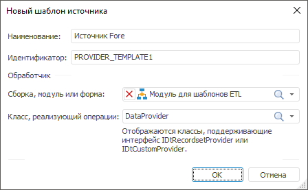

# Шаблон источника: Задача ETL, настольное приложение

Шаблон источника: Задача ETL, настольное приложение
-

# Шаблон источника

Шаблон источника содержит настройки
 пользовательского объекта-источник, который будет доступен для использования
 при разработке задач ETL. В настройках шаблона указывается макрос на языке
 Fore, содержащий реализацию объекта-источника. После создания и настройки
 шаблона, на вкладке «[Источники](../../03_ETLObjects/02_Inputs/UiEtl_Inputs.htm)»
 будет доступен соответствующий объект. Для объекта доступны те же [операции](../UiEtl_ObjWork.htm#operations_objetl),
 какие доступны для основных объектов задачи ETL.

[Для открытия
 окна с параметрами шаблона](javascript:TextPopup(this))

	Для открытия окна настройки параметров шаблона:

		- выполните команду главного меню «Вставка
		 > Источник > Создать новый шаблон»;

		- в области панели «Источники»
		 выполните команду «Редактировать»
		 в контекстном меню для необходимого шаблона.

Задайте следующие параметры шаблона:

	- Наименование. Любое
	 наименование, описывающее назначение источника. Данное наименование
	 будет отображаться на вкладке «[Источники](../../03_ETLObjects/02_Inputs/UiEtl_Inputs.htm)»;

	- Идентификатор. Уникальный
	 идентификатор шаблона, используется при сохранении параметров в репозиторий.
	 Идентификатор должен содержать только буквы латинского алфавита, цифры,
	 знак «_», не должен содержать пробелов и не должен начинаться с цифры;

	- Обработчик. В раскрывающихся
	 списках выберите объект среды разработки (сборку, модуль или форму)
	 и класс, содержащий реализацию источника. В список допустимых классов
	 входят все классы, реализующие интерфейсы [IDtRecordsetProvider](KeDt.chm::/Interface/IDtRecordsetProvider/IDtRecordsetProvider.htm)
	 или [IDtCustomProvider](KeDt.chm::/Interface/IDtCustomProvider/IDtCustomProvider.htm).

[Пример кода
 класса, реализующего пользовательский источник](javascript:TextPopup(this))

	Источник, реализующий интерфейс [IDtRecordsetProvider](KeDt.chm::/Interface/IDtRecordsetProvider/IDtRecordsetProvider.htm):

		Class DataProvider: Object, IDtRecordsetProvider

		    Public Function Fetch: Array Of Variant;

		    Var

		        Result: Array Of Variant;

		    Begin

		        //...

		        //
		 Получение данных и сохранение их в массиве Result

		        //...

		        Return Result;

		    End Function Fetch;

		End Class DataProvider;

	Источник, реализующий интерфейс [IDtCustomProvider](KeDt.chm::/Interface/IDtCustomProvider/IDtCustomProvider.htm):

		Class DataProvider: Object, IDtCustomProvider

		    _Metabase: IMetabase;

		    _KeepCalcFields: Boolean;

		    Public Function get_Eof: Boolean;

		    Var

		        Result: Boolean;

		    Begin

		        Return Result

		    End Function get_Eof;

		    Public Sub Fetch(Var Values: Array);

		    Begin

		    End Sub Fetch;

		    Public Function FetchRows(Count: Integer; Var Values: Array): Integer;

		    Var

		        Result: Integer;

		    Begin

		        Return Result;

		    End Function FetchRows;

		    Public Function ImplementFetchRows: Boolean;

		    Var

		        Result: Boolean;

		    Begin

		        Return Result;

		    End Function ImplementFetchRows;

		    Public Function ReadingRowsCount: Integer;

		    Var

		        Result: Integer;

		    Begin

		        Return Result;

		    End Function ReadingRowsCount;

		    Public Sub Open;

		    Begin

		    End Sub Open;

		    Public Sub Close;

		    Begin

		    End Sub Close;

		    Public Sub Save(Element: IXMLDOMElement);

		    Begin

		    End Sub Save;

		    Public Sub Load(Element: IXMLDOMElement);

		    Begin

		    End Sub Load;

		    Public Sub FieldsFromFile;

		    Begin

		    End Sub FieldsFromFile;

		    Public Sub ClearFields;

		    Begin

		    End Sub ClearFields;

		    Public Function get_Active: boolean;

		    Var

		        Result: Boolean;

		    Begin

		        Return Result;

		    End Function get_active;

		    Public Function get_fields: IDtFieldDefinitions;

		    Var

		        Result: IDtFieldDefinitions;

		    Begin

		        Return Result;

		    End Function get_fields;

		    Public Function get_GetType: DtObjectType;

		    Begin

		        Return DtObjectType.TDtUserProviderEx

		    End Function get_GetType;

		    Public Function get_Metabase: IMetabase;

		    Begin

		        Return _Metabase;

		    End Function get_Metabase;

		    Public Sub set_Metabase(Value: IMetabase);

		    Begin

		        _Metabase := Value;

		    End Sub set_Metabase;

		    Public Function get_KeepCalcFields: Boolean;

		    Begin

		        Return _KeepCalcFields;

		    End Function get_KeepCalcFields;

		    Public Sub set_KeepCalcFields(Value: Boolean);

		    Begin

		        _KeepCalcFields := Value;

		    End Sub set_KeepCalcFields;

		End Class DataProvider;

См. также:

[Начало
 работы с инструментом «Задача ETL» в веб-приложении](../../../Web/01_General_Info/UiETL_StartingToWork.htm) | [Шаблоны пользовательских преобразователей](../ETL_Templates.htm)

		Справочная
		 система на версию 10.9
		 от 18/08/2025,
		 © ООО «ФОРСАЙТ»,
