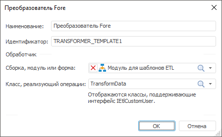

# Шаблон преобразователя: Задача ETL, настольное приложение

Шаблон преобразователя: Задача ETL, настольное приложение
-

# Шаблон преобразователя

Шаблон преобразователя содержит
 настройки пользовательского объекта-преобразователя, который будет доступен
 для использования при разработке задач ETL. В настройках шаблона указывается
 макрос на языке Fore, содержащий реализацию объекта-преобразователя. После
 создания и настройки шаблона, на вкладке «[Преобразователи
 данных](../../03_ETLObjects/04_Transformers/UiEtl_Trfs.htm)» будет доступен соответствующий объект. Для объекта доступны
 те же [операции](../UiEtl_ObjWork.htm#operations_objetl), какие
 доступны для основных объектов задачи ETL.

[Для открытия
 окна с параметрами шаблона](javascript:TextPopup(this))

	Для открытия окна настройки параметров шаблона:

		- выполните команду главного меню «Вставка
		 > Преобразователь > Создать новый шаблон»;

		- в области панели «Преобразователи»
		 выполните команду «Редактировать»
		 в контекстном меню для необходимого шаблона.

Задайте следующие параметры шаблона:

	- Наименование. Любое
	 наименование, описывающее назначение преобразователя. Данное наименование
	 будет отображаться на вкладке «[Преобразователи](../../03_ETLObjects/04_Transformers/UiEtl_Trfs.htm)»;

	- Идентификатор. Уникальный
	 идентификатор шаблона, используется при сохранении параметров в репозиторий.
	 Идентификатор должен содержать только буквы латинского алфавита, цифры,
	 знак «_», не должен содержать пробелов и не должен начинаться с цифры;

	- Обработчик. В раскрывающихся
	 списках выберите объект среды разработки (сборку, модуль или форму)
	 и класс, содержащий реализацию преобразователя. В список допустимых
	 классов входят все классы, реализующие интерфейс IEtlCustomUser.

[Пример кода
 класса, реализующего пользовательский преобразователь](javascript:TextPopup(this))

		Class TransformData: Object, IEtlCustomUser

		    Public Sub Transform(Input: IEtlPlainRecordSets; Output: IEtlPlainRecordSets);

		    Begin

		    End Sub Transform;

		    Public Sub Read(pNode: IXMLDOMElement);

		    Begin

		    End Sub Read;

		End Class TransformData;

См. также:

[Начало
 работы с инструментом «Задача ETL» в веб-приложении](../../../Web/01_General_Info/UiETL_StartingToWork.htm) | [Шаблоны пользовательских преобразователей](../ETL_Templates.htm)

		Справочная
		 система на версию 10.9
		 от 18/08/2025,
		 © ООО «ФОРСАЙТ»,
