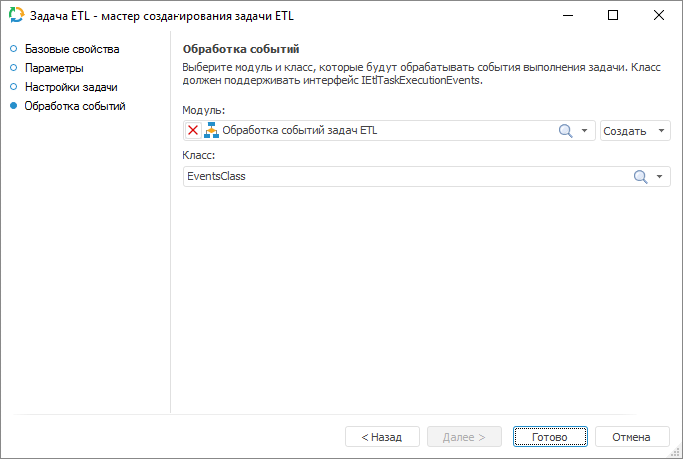

# Настройка обработки событий: Задача ETL, настольное приложение

Настройка обработки событий: Задача ETL, настольное приложение
-

# Настройка обработки событий

На странице «Обработка событий»
 указывается объект среды разработки и класс, содержащий реализацию обработчиков
 событий для задачи ETL.

[Для открытия
 окна](javascript:TextPopup(this))

	Для вызова свойств задачи ETL выполните одно из следующих действий:

		- В главном меню задачи ETL выполните команду «Задача
		 > Свойства».

		- Нажмите сочетание клавиш CTRL+P.

	Нажимая кнопку «Далее»,
	 перейдите к странице мастера «Обработка
	 событий».

В раскрывающемся списке «Модуль»
 выберите объект среды разработки, а в списке «Класс»
 выберите класс, содержащий реализацию обработчиков событий задачи ETL.
 Список классов-обработчиков содержит все классы, унаследованные от класса
 [EtlTaskExecutionEvents](KeEtl.chm::/Class/EtlTaskExecutionEvents/EtlTaskExecutionEvents.htm).

При необходимости обработчик событий можно создать автоматически, нажав
 кнопку «Создать». При этом создается
 Fore-модуль. Код модуля будет сгенерирован автоматически и открыт в среде
 разработки.

Класс для обработки событий может иметь конструктор, который будет вызываться
 при каждой инициализации класса. Конструктор должен быть без параметров.
 Если в классе несколько конструкторов без параметров, то будет вызываться
 самый первый (расположенный в коде выше других).

Примечание.
 Инициализация класс-обработчика происходит каждый раз, когда происходит
 выполнение задачи ETL.

[Пример кода
 обработчика событий](javascript:TextPopup(this))

		Class EventsClass: EtlTaskExecutionEvents

		    Public Sub OnStartTask(Task: IEtlTask);

		    Begin

		    End Sub OnStartTask;

		    Public Sub OnEndTask(Task: IEtlTask; Duration, TotalRec, ErrorRec: Integer);

		    Begin

		    End Sub OnEndTask;

		    Public Sub OnStartBlock(Task: IEtlTask; Object: IEtlObject);

		    Begin

		    End Sub OnStartBlock;

		    Public Sub OnEndBlock(Task: IEtlTask; Object: IEtlObject; Duration: Integer; TotalRecIn, TotalRecOut, ErrorRec: IDictionary);

		    Begin

		    End Sub OnEndBlock;

		    Public Sub OnProgress(Task: IEtlTask; Progress: Integer);

		    Begin

		    End Sub OnProgress;

		    Public Sub OnError(Task: IEtlTask; Object: IEtlObject; Excep: IException);

		    Begin

		    End Sub OnError;

		End Class EventsClass;

См. также:

[Начало
 работы с инструментом «Задача ETL» в веб-приложении](../../Web/01_General_Info/UiETL_StartingToWork.htm) | [Выполнение
 задачи ETL](../05_PropertyETL/UIEtl_WorkVisualisation.htm)

		Справочная
		 система на версию 10.9
		 от 18/08/2025,
		 © ООО «ФОРСАЙТ»,
