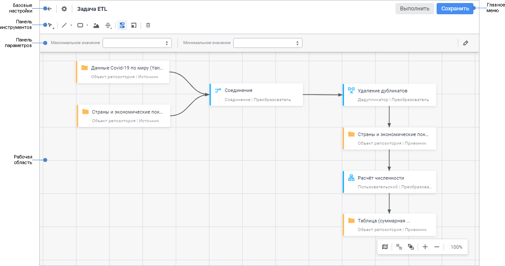
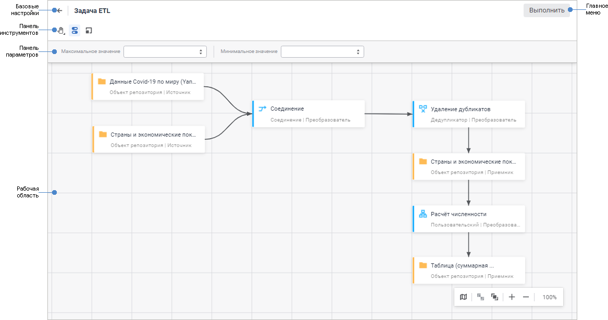

# Начало работы с инструментом «Задача ETL» в веб-приложении

Начало работы с инструментом «Задача ETL» в веб-приложении
-

# Начало работы с инструментом «Задача
 ETL» в веб-приложении

Для начала работы с инструментом создайте новую или откройте готовую
 задачу ETL.

[Создание
 новой задачи ETL](javascript:TextPopup(this))

	Для создания новой задачи ETL в [навигаторе
	 объектов](GetStarted.chm::/Interface/Interface_Navigator.htm) нажмите кнопку  «Создать» в главном меню и выберите
	 тип объекта на боковой панели «[Новый объект](UiNav.chm::/02_Navigator/General_Principles_of_Work.htm#add_object)».

[Открытие
 готовой задачи ETL](javascript:TextPopup(this))

	Для открытия на редактирования готовой задачи ETL в [навигаторе
	 объектов](GetStarted.chm::/Interface/Interface_Navigator.htm) выполните одно из действий:

		- выполните команду «Редактировать»
		 в контекстном меню задачи ETL;

		- выполните команду «Редактировать
		 в новой вкладке» в контекстном меню задачи ETL;

		- выполните команду «Редактировать
		 в новом окне» в контекстном меню задачи ETL;

		- выделите задачу ETL и нажмите клавишу F4.

	Для открытия на просмотр готовой задачи ETL в [навигаторе
	 объектов](GetStarted.chm::/Interface/Interface_Navigator.htm) выполните одно из действий:

		- выполните команду «Открыть»
		 в контекстном меню задачи ETL;

		- выполните команду «Открыть
		 в новой вкладке» в контекстном меню задачи ETL;

		- выполните команду «Открыть
		 в новом окне» в контекстном меню задачи ETL;

		- дважды щёлкните по задаче ETL;

		- выделите задачу ETL и нажмите клавишу ENTER.

Для построения задачи ETL смотрите
 статью «[Построение
 задачи ETL](../03_ETLObjects/Construction_ETL.htm)».

Для работы с готовой задачей ETL
 смотрите статью «[Работа
 с готовой задачей ETL](../05_PropertyETL/UIEtl_WorkVisualisation.htm)».

Пользовательский интерфейс задачи ETL:

	 В режиме редактирования В режиме просмотра

		

		

[Элементы
 пользовательского интерфейса задачи ETL](javascript:TextPopup(this))

		- Базовые настройки.
		 В режиме редактирования содержит поле для редактирования наименования
		 задачи ETL, а также кнопки для возвращения в навигатор объектов,
		 [настройки
		 параметров задачи ETL](../06_CreateETL/Relational_ETL_master.htm). В режиме просмотра доступно только
		 возвращение в режим редактирования или в навигатор объектов, если
		 задача ETL открыта на просмотр.

		- Главное меню. Содержит
		 кнопки для выполнения и сохранения задачи ETL. При открытии готовой
		 задачи ETL на просмотр доступно только её выполнение.

		- Панель инструментов.
		 Содержит кнопки для [настройки
		 рабочей области](../04_Work/UiEtl_ObjWork.htm). Набор кнопок в режиме редактирования и в
		 режиме просмотра отличается.

		- Панель параметров.
		 Предназначена для задания значений [параметров](../06_CreateETL/Relational_ETL_master_Param.htm)
		 задачи ETL. Для отображения/скрытия панели параметров используйте
		 кнопку  «Параметры»
		 на панели инструментов.

		- Рабочая область.
		 Предназначена для построения цепочки экспорта/импорта данных задачи
		 ETL.

		- Панель коннекторов и преобразователей.
		 Отображается при вызове контекстного меню и только в режиме редактирования
		 задачи ETL. Панель предназначена для добавления объектов определенного
		 типа на рабочую область:

			- [источники](../03_ETLObjects/02_Inputs/UiEtl_Inputs.htm);

			- [приёмники](../03_ETLObjects/03_Outputs/UiEtl_Outputs.htm);

			- [преобразователи](../03_ETLObjects/04_Transformers/UiEtl_Trfs.htm);

			- [другие](../03_ETLObjects/Other/Other_objects_group.htm).

Для сохранения новой задачи ETL или при редактировании
 готовой:

	- нажмите кнопку «Сохранить»
	 [в главном меню](UiETL_StartingToWork.htm#elements_etl);

	- подтвердите производимое действие в информационном окне при
	 переходе в [навигатор
	 объектов](getstarted.chm::/Interface/Interface_Navigator.htm)/[мастер
	 редактирования задачи ETL](../06_CreateETL/Relational_ETL_master.htm).

Переименование задачи ETL доступно в [режиме
 редактирования](UiETL_StartingToWork.htm#edit_etl). Для этого:

	- Щёлкните по наименованию задачи ETL в области «Базовые
	 настройки». Наименование будет переведено в режим редактирования.

	- Внесите требуемые изменения.

	- Щёлкните за пределами наименования задачи ETL.

	- [Сохраните изменения](UiETL_StartingToWork.htm#save_etl).

См. также:

[Импорт,
 экспорт и преобразование данных](../../Desktop/01_General_Info/UiETL_General.htm) | [Построение
 задачи ETL](../03_ETLObjects/Construction_ETL.htm) | [Работа
 с готовой задачей ETL](../05_PropertyETL/UIEtl_WorkVisualisation.htm)

		Справочная
		 система на версию 10.9
		 от 18/08/2025,
		 © ООО «ФОРСАЙТ»,
