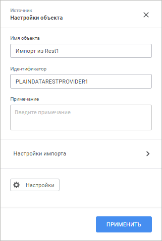
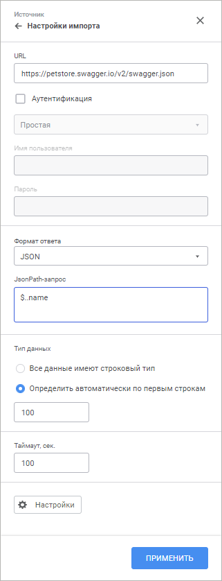

# Коннектор к источнику данных «REST»: Задача ETL, веб-приложение

Коннектор к источнику данных «REST»: Задача ETL, веб-приложение
-

# REST

	Коннектор «REST» - объект,
	 предназначенный для извлечения данных, которые предоставляют различные
	 REST-сервисы.

	После добавления коннектора на рабочее пространство задачи ETL задайте
	 [настройки импорта](#import) и отредактируйте [выход
	 коннектора](#output).

	Для работы с REST-сервисом по протоколу HTTPS используйте сертификат
	 безопасности в формате PEM:

		- в ОС Linux выполните одно из действий:

			- добавьте содержимое сертификата в файл /etc/ssl/certs/ca-certificates.crt
			 в Debian-подобных дистрибутивах, /etc/pki/tls/certs/ca-bundle.crt
			 в RedHat-подобных дистрибутивах и ALT Linux;

			- добавьте сертификат с расширением *.pem в папку /etc/ssl/certs
			 в Debian-подобных дистрибутивах, /etc/pki/tls/certs в RedHat-подобных
			 дистрибутивах и ALT Linux;

		- в ОС Windows:

			- Запустите встроенное приложение «Управление
			 сертификатами компьютеров».

			- Добавьте сертификат в папку «Доверенные
			 корневые центры сертификации > Сертификаты».

## Настройка импорта

	На панели свойств указываются параметры подключения к REST-сервису
	 и запрос, в соответствии с которым извлекаются данные.

[Для отображения
 панели свойств](javascript:TextPopup(this))

		- добавьте новый коннектор на рабочую область. Панель свойств
		 отобразится автоматически;

		- выделите готовый коннектор на рабочей области.

	

	На панели свойств доступны следующие настройки:

	- Имя объекта. При необходимости
	 измените наименование коннектора;

	- Идентификатор. При необходимости
	 измените идентификатор объекта. Идентификатор должен быть уникальным в рамках задачи ETL. Допускается использование
	 букв латинского алфавита, цифр и знаков «_». Идентификатор должен
	 начинаться с буквы;

	- Примечание. При необходимости
	 введите аннотацию к объекту. Примечание может содержать любую информацию по
	 усмотрению пользователя;

		- Настройки импорта.
		 Перейдите к группе параметров для настройки импорта:

	

	Задайте параметры:

			- URL. Укажите
			 адрес REST-сервиса, который предоставляет данные (поддерживается
			 подключение к REST-сервисам, предоставляющим данные в форматах
			 JSON и XML);

	Примечание. С помощью языка Fore
	 список доступных для указания REST-сервисов может быть ограничен.
	 Более подробно смотрите описание свойства [IMetabasePolicy.HostWhiteList](KeSom.chm::/Interface/IMetabasePolicy/IMetabasePolicy.HostWhiteList.htm).

			- Аутентификация.
			 Установите флажок, если для подключения к REST-сервису требуется
			 аутентификация пользователя, и выберите метод проверки пользователя
			 в раскрывающемся списке:

				- Простая.
				 Метод основан на использовании многоразовых паролях;

				- Дайджест.
				 Метод основан на применении шифрования с использованием
				 случайных значений на уровне протокола HTTP.

	Укажите учётные данные пользователя:

				- Имя пользователя.
				 Введите имя пользователя;

				- Пароль.
				 Введите пароль пользователя.

	Важно.
	 Если для доступа к REST-сервису требуется подключение к сети Интернет,
	 а оно осуществляется через прокси-сервер, то предварительно адрес
	 прокси-сервера необходимо указать в [параметрах
	 репозитория](UiNav.chm::/02_Navigator/CommonSettings/ProxyServer.htm).

	Указанные параметры аутентификации будут
	 переданы в ядро, обработаны необходимым образом и использованы при
	 подключении к REST-сервису.

			- Формат ответа.
			 Выберите в раскрывающемся списке формат, в котором будут получены
			 данные с REST-сервиса. В зависимости от выбранного формата
			 укажите дополнительные настройки:

				- JSON. В
				 поле «JSONPath-запрос»
				 укажите запрос, в соответствии с которым будут отбираться
				 импортируемые данные;

				- XML. В поле
				 «Формат» выберите
				 каким образом организовано хранение данных в XML-файле
				 (поля с данными представлены в виде атрибутов вершин или
				 отдельных дочерних вершин). В поле «X-Path
				 запрос» укажите запрос, в соответствии с которым
				 будут отбираться импортируемые данные.

	Примечание.
	 Более подробную информацию о формировании JSONPath или X-Path запросов
	 можно найти в специализированной документации, например, в MSDN.

			- Тип данных.
			 Установите переключатель для определения типа данных полей:

				- Все данные имеют
				 строковый тип. Все данные будут рассматриваться
				 как строковые и импортироваться будут также в строковые
				 поля;

				- Определить автоматически
				 по первым строкам. Укажите количество строк, по
				 которым будет определяться тип данных;

			- Таймаут, сек.
			 Задайте время выполнения запроса в секундах. Если запрос не
			 будет выполнен за указанное время, то его выполнение будет
			 остановлено.

	Примечание.
	 Параметр доступен только при выборе формата JSON.

			- Формат данных.
			 Выберите в раскрывающемся списке разделитель целой и дробной
			 части для идентификации вещественных чисел:

				- , (запятая). Используется по умолчанию;

				- . (точка).

	Примечание.
	 Параметр доступен только при выборе формата XML. Выбранный разделитель
	 будет применяться к строковым типам полей провайдера.

	- Настройки. Кнопка позволяет
	 перейти к редактированию выхода коннектора.

Для сохранения внесённых изменений нажмите кнопку «Применить».

Для закрытия панели свойств коннектора без сохранения нажмите кнопку  «Закрыть».

## Редактирование выхода

[Для отображения
 вкладки редактирования выходов](javascript:TextPopup(this))

		- Откройте панель свойств объекта.

		- Нажмите кнопку  «Настройки».

		- На панели дополнительных настроек объекта перейдите на вкладку
		 «Редактор выходов».

На странице доступны следующие настройки:

[Идентификатор](javascript:TextPopup(this))

	Для изменения идентификатора выхода дважды щёлкните в его области
	 и задайте новое значение. Возможно использование символов латинского
	 алфавита, цифр и специального символа «_». По умолчанию идентификаторы
	 выходов объектов генерируются автоматически в формате: O<номер
	 выхода>.

[Связь с объектом](javascript:TextPopup(this))

	Установите связь с объектом. Для этого нажмите кнопку  «Создать
	 связь» и выберите вход какого-либо
	 объекта. Если список полей источника и приёмника полностью совпадает,
	 то все поля будут связаны автоматически. Также связь полей может быть
	 настроена в группе настроек «[Настройка
	 связей](../05_Links/uietl_links_create.htm)».

[Поля](javascript:TextPopup(this))

	Добавьте необходимые поля объекта задачи ETL в список. Из указанных
	 полей будут выгружаться данные.

	Для добавления в список всех полей из файла-источника, нажмите кнопку
	 
	 «Действия» и выполните команду
	 «Заполнить из источника».

	Для добавления нового поля нажмите кнопку 
	 «Добавить». Будет открыто
	 окно «Свойства поля»:

	

	Примечание.
	 Вид окна «Свойства поля» зависит
	 от выбранного источника данных.

	Задайте в нем значения атрибутов поля:

		- Наименование. Наименование
		 поля;

		- Идентификатор. Уникальный
		 идентификатор поля;

		- Тип. Из раскрывающегося
		 списка выберите тип данных поля;

		- Вычисляемое поле.
		 Для задания формулы, по которой будет вычисляться значение поля,
		 установите данный флажок. После установки флажка введите выражение
		 с помощью клавиатуры.

		Для увеличения значения каждой новой записи на фиксированную величину
		 используйте специальное выражение INCREMENT.

	Примечание.
	 Специальное выражение INCREMENT
	 доступно только для вычисляемого поля целого типа.

	Синтаксис данного выражения: INCREMENT[Value1,
	 Value2], где Value1 - начальное значение, Value2 - шаг, на который
	 значение Value1 должно увеличиваться при каждом вызове выражения.
	 При каждой загрузке данных заполнение будет начинаться с начального
	 значения.

	Для редактирования поля выполните для него команду контекстного
	 меню «Редактировать».

См. также:

[Создание
 коннекторов к исходным данным](UiEtl_Inputs.htm)

		Справочная
		 система на версию 10.9
		 от 18/08/2025,
		 © ООО «ФОРСАЙТ»,
