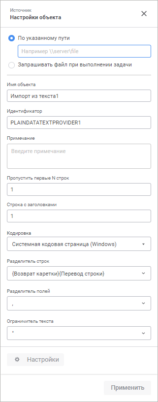

# Коннектор к источнику данных «Текст (txt, csv)»: Задача ETL, веб-приложение

Коннектор к источнику данных «Текст (txt, csv)»: Задача ETL, веб-приложение
-

# Текст (txt, csv)

	Коннектор «Текст (txt, csv)»
	 - объект, предназначенный для извлечения данных из текстовых файлов
	 (*.txt, *.csv).

	После добавления коннектора на рабочее пространство задачи ETL задайте
	 [настройки импорта](#import) и отредактируйте [выход
	 коннектора](#output).

## Настройка импорта

	На панели свойств указывается файл с импортируемыми данными и параметры,
	 которые используются для определения диапазона с данными.

[Для отображения
 панели свойств](javascript:TextPopup(this))

		- добавьте новый коннектор на рабочую область. Панель свойств
		 отобразится автоматически;

		- выделите готовый коннектор на рабочей области.

	

	На панели свойств доступны следующие настройки:

	- Способ импорта файла.
	 Выберите способ получения файла:

		- По указанному пути.
		 По умолчанию переключатель включен, активно поле ввода пути к
		 файлу. После ввода пути файл будет импортирован и появится возможность
		 производить дальнейшие настройки с использованием структуры файла.
		 При выполнении задачи ETL поиск файла будет осуществляться также
		 по указанному пути;

		- Запрашивать файл при выполнении
		 задачи. Установите данный флажок, если требуется выбирать
		 файл непосредственно при каждом выполнении задачи ETL. Для проведения
		 первоначальной настройки источника в области «Файл
		 для настройки» нажмите кнопку  «Добавить»:

Отобразится диалог выбора файла на компьютере.
 Порядок работы с диалогом определяется используемым браузером. После выбора
 файл будет сохранён во временную папку в операционной системе пользователя.
 Файл будет использоваться только во время текущей работы с экземпляром
 задачи ETL, после закрытия задачи файл будет удалён из временной папки.

При выполнении задачи ETL будет отображен
 диалог выбора файла. Если структура выбранного файла не соответствует
 структуре того файла, который использовался при настройке, то будет сгенерирована
 исключительная ситуация.

	- Имя объекта. При необходимости
	 измените наименование коннектора;

	- Идентификатор. При необходимости
	 измените идентификатор объекта. Идентификатор должен быть уникальным в рамках задачи ETL. Допускается использование
	 букв латинского алфавита, цифр и знаков «_». Идентификатор должен
	 начинаться с буквы;

	- Примечание. При необходимости
	 введите аннотацию к объекту. Примечание может содержать любую информацию по
	 усмотрению пользователя;

		- Параметры импорта данных
		 из текстового файла. Укажите номер строки с заголовками
		 и разделитель:

			- Пропустить
			 первые N строк. Укажите количество строк, которые будут
			 пропущены;

			- Строка
			 с заголовками. По умолчанию установлено значение «1»,
			 наименования заголовков формируются на основе данных из первой
			 строки документа. Для использования другой строки установите
			 соответствующий номер строки, из которой будут получены наименования
			 заголовков;

	Примечание.
	 Если в поле указана нулевая строка, то считается, что заголовки отсутствуют.

			- Кодировка.
			 Укажите кодировку, которая будет использоваться при разборе
			 файла. В списке доступен ряд системных кодовых страниц, при
			 их выборе будут использоваться следующие кодировки:

				- Системная кодовая
				 страница (Windows). Используется кодировка ASCII;

				- Системная кодовая
				 страница (UNICODE). Используется кодировка UTF-16
				 (LE);

				- Системная кодовая
				 страница (DOS). Используется кодировка OEM;

			- Разделитель
			 строк. Выберите из списка или укажите свой разделитель
			 строк в исходном файле;

			- Разделитель
			 полей. Ограничитель
			 текста. Каждая строка файла рассматривается как набор
			 полей, отделяемых друг от друга символом-разделителем. Начало
			 и окончание текста каждого поля обозначается символом-ограничителем.
			 В соответствующих комбинированных списках выберите или введите
			 символы для разделения полей и ограничения текста;

	- Настройки. Кнопка позволяет
	 перейти к редактированию выхода коннектора.

Для сохранения внесённых изменений нажмите кнопку «Применить».

Для закрытия панели свойств коннектора без сохранения нажмите кнопку  «Закрыть».

## Редактирование выхода

[Для отображения
 вкладки редактирования выходов](javascript:TextPopup(this))

		- Откройте панель свойств объекта.

		- Нажмите кнопку  «Настройки».

		- На панели дополнительных настроек объекта перейдите на вкладку
		 «Редактор выходов».

На странице доступны следующие настройки:

[Идентификатор](javascript:TextPopup(this))

	Для изменения идентификатора выхода дважды щёлкните в его области
	 и задайте новое значение. Возможно использование символов латинского
	 алфавита, цифр и специального символа «_». По умолчанию идентификаторы
	 выходов объектов генерируются автоматически в формате: O<номер
	 выхода>.

[Связь с объектом](javascript:TextPopup(this))

	Установите связь с объектом. Для этого нажмите кнопку  «Создать
	 связь» и выберите вход какого-либо
	 объекта. Если список полей источника и приёмника полностью совпадает,
	 то все поля будут связаны автоматически. Также связь полей может быть
	 настроена в группе настроек «[Настройка
	 связей](../05_Links/uietl_links_create.htm)».

[Поля](javascript:TextPopup(this))

	Добавьте необходимые поля объекта задачи ETL в список. Из указанных
	 полей будут выгружаться данные.

	Для добавления в список всех полей из файла-источника, нажмите кнопку
	 
	 «Действия» и выполните команду
	 «Заполнить из источника».

	Для добавления нового поля нажмите кнопку 
	 «Добавить». Будет открыто
	 окно «Свойства поля»:

	

	Примечание.
	 Вид окна «Свойства поля» зависит
	 от выбранного источника данных.

	Задайте в нем значения атрибутов поля:

		- Наименование. Наименование
		 поля;

		- Идентификатор. Уникальный
		 идентификатор поля;

		- Тип. Из раскрывающегося
		 списка выберите тип данных поля;

		- Вычисляемое поле.
		 Для задания формулы, по которой будет вычисляться значение поля,
		 установите данный флажок. После установки флажка введите выражение
		 с помощью клавиатуры.

		Для увеличения значения каждой новой записи на фиксированную величину
		 используйте специальное выражение INCREMENT.

	Примечание.
	 Специальное выражение INCREMENT
	 доступно только для вычисляемого поля целого типа.

	Синтаксис данного выражения: INCREMENT[Value1,
	 Value2], где Value1 - начальное значение, Value2 - шаг, на который
	 значение Value1 должно увеличиваться при каждом вызове выражения.
	 При каждой загрузке данных заполнение будет начинаться с начального
	 значения.

	Для редактирования поля выполните для него команду контекстного
	 меню «Редактировать».

См. также:

[Создание коннекторов к исходным данным](UiEtl_Inputs.htm)

		Справочная
		 система на версию 10.9
		 от 18/08/2025,
		 © ООО «ФОРСАЙТ»,
