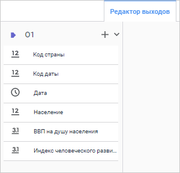
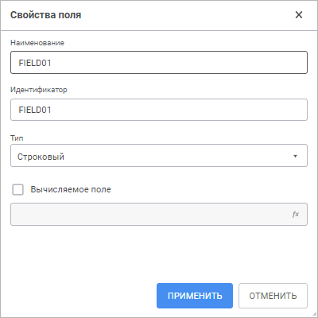

# Коннектор к источнику данных «Пользовательский»: Задача ETL, веб-приложение

Коннектор к источнику данных «Пользовательский»: Задача ETL, веб-приложение
-

# Пользовательский

	Коннектор «Пользовательский»
	 - объект, предназначенный для извлечения данных из источника при помощи
	 пользовательского алгоритма. Алгоритм должен быть реализован на языке
	 Fore и содержаться в модуле в текущем репозитории.

	После добавления коннектора на рабочее пространство задачи ETL задайте
	 базовые свойства и выберите класс с реализацией импорта данных. Также
	 можно отредактировать выход коннектора.

## Настройка коннектора

	На панели свойств указываются объект среды разработки, в котором
	 реализован импортёр данных.

[Для отображения
 панели свойств](javascript:TextPopup(this))

		- добавьте новый коннектор на рабочую область. Панель свойств
		 отобразится автоматически;

		- выделите готовый коннектор на рабочей области.

	

	На панели свойств доступны следующие настройки:

	- Имя объекта. При необходимости
	 измените наименование коннектора;

	- Идентификатор. При необходимости
	 измените идентификатор объекта. Идентификатор должен быть уникальным в рамках задачи ETL. Допускается использование
	 букв латинского алфавита, цифр и знаков «_». Идентификатор должен
	 начинаться с буквы;

	- Примечание. При необходимости
	 введите аннотацию к объекту. Примечание может содержать любую информацию по
	 усмотрению пользователя;

		- Модуль. В раскрывающемся
		 списке выберите модуль/сборку репозитория;

		- Класс. В раскрывающемся
		 списке выберите класс, в котором содержится реализация пользовательского
		 алгоритма извлечения данных. Класс должен быть унаследован и содержать
		 реализацию интерфейса [IDtRecordsetProvider](KeDt.chm::/Interface/IDtRecordsetProvider/IDtRecordsetProvider.htm)
		 или [IDtCustomProvider](KeDt.chm::/Interface/IDtCustomProvider/IDtCustomProvider.htm);

	- Настройки. Кнопка позволяет
	 перейти к редактированию выхода коннектора.

Для сохранения внесённых изменений нажмите кнопку «Применить».

Для закрытия панели свойств коннектора без сохранения нажмите кнопку  «Закрыть».

## Редактирование выхода

[Для отображения
 вкладки редактирования выходов](javascript:TextPopup(this))

		- Откройте панель свойств объекта.

		- Нажмите кнопку  «Настройки».

		- На панели дополнительных настроек объекта перейдите на вкладку
		 «Редактор выходов».

На странице доступны следующие настройки:

[Идентификатор](javascript:TextPopup(this))

	Для изменения идентификатора выхода дважды щёлкните в его области
	 и задайте новое значение. Возможно использование символов латинского
	 алфавита, цифр и специального символа «_». По умолчанию идентификаторы
	 выходов объектов генерируются автоматически в формате: O<номер
	 выхода>.

[Связь с объектом](javascript:TextPopup(this))

	Установите связь с объектом. Для этого нажмите кнопку  «Создать
	 связь» и выберите вход какого-либо
	 объекта. Если список полей источника и приёмника полностью совпадает,
	 то все поля будут связаны автоматически. Также связь полей может быть
	 настроена в группе настроек «[Настройка
	 связей](../05_Links/uietl_links_create.htm)».

[Поля](javascript:TextPopup(this))

	Добавьте необходимые поля объекта задачи ETL в список. Из указанных
	 полей будут выгружаться данные.

	Для добавления в список всех полей из файла-источника, нажмите кнопку
	 
	 «Действия» и выполните команду
	 «Заполнить из источника».

	Для добавления нового поля нажмите кнопку 
	 «Добавить». Будет открыто
	 окно «Свойства поля»:

	

	Примечание.
	 Вид окна «Свойства поля» зависит
	 от выбранного источника данных.

	Задайте в нем значения атрибутов поля:

		- Наименование. Наименование
		 поля;

		- Идентификатор. Уникальный
		 идентификатор поля;

		- Тип. Из раскрывающегося
		 списка выберите тип данных поля;

		- Вычисляемое поле.
		 Для задания формулы, по которой будет вычисляться значение поля,
		 установите данный флажок. После установки флажка введите выражение
		 с помощью клавиатуры.

		Для увеличения значения каждой новой записи на фиксированную величину
		 используйте специальное выражение INCREMENT.

	Примечание.
	 Специальное выражение INCREMENT
	 доступно только для вычисляемого поля целого типа.

	Синтаксис данного выражения: INCREMENT[Value1,
	 Value2], где Value1 - начальное значение, Value2 - шаг, на который
	 значение Value1 должно увеличиваться при каждом вызове выражения.
	 При каждой загрузке данных заполнение будет начинаться с начального
	 значения.

	Для редактирования поля выполните для него команду контекстного
	 меню «Редактировать».

См. также:

[Коннекторы к исходным данным](UiEtl_Inputs.htm)

		Справочная
		 система на версию 10.9
		 от 18/08/2025,
		 © ООО «ФОРСАЙТ»,
